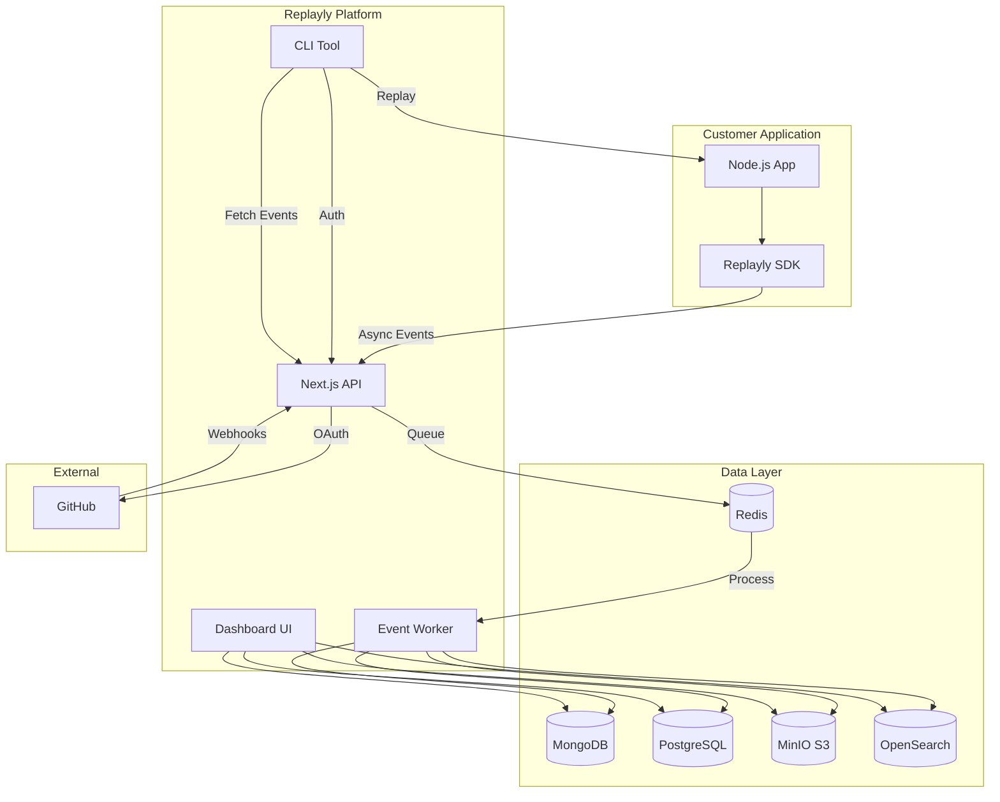

# Replayly MVP - Phase Documentation

## Overview

This directory contains detailed phase-by-phase documentation for building Replayly as a SaaS product. The MVP is broken down into 7 phases, each building on the previous one.

**Tech Stack:**
- **Frontend & Backend**: Next.js 14+ (App Router)
- **UI**: shadcn/ui + Tailwind CSS
- **Databases**: MongoDB (metadata), PostgreSQL (analytics), Redis (queue)
- **Storage**: MinIO (S3-compatible, Dockerized)
- **Search**: OpenSearch (Dockerized)
- **Queue**: BullMQ + Redis
- **Infrastructure**: Docker Compose for local development

---

## Phase Overview

### [Phase 1: Foundation & Infrastructure Setup](./phase-1-foundation.md)
**Status**: Foundation  
**Duration**: ~2-3 weeks

**Key Deliverables:**
- Next.js project with App Router
- Docker Compose with all services (MongoDB, PostgreSQL, Redis, MinIO, OpenSearch)
- User authentication (email/password + JWT)
- Multi-tenant database schemas
- Basic dashboard UI with shadcn/ui
- Organization & Project management

**Critical Path**: Blocking for all other phases

---

### [Phase 2: SDK Development & Instrumentation](./phase-2-sdk.md)
**Status**: Core Product  
**Duration**: ~3-4 weeks

**Key Deliverables:**
- `@replayly/sdk` npm package
- AsyncLocalStorage context tracking
- Express/Next.js middleware
- Instrumentation for:
  - HTTP requests/responses
  - MongoDB (native + Mongoose)
  - PostgreSQL (pg)
  - Redis (ioredis)
  - Axios/fetch calls
- PII masking engine
- Async payload transport

**Critical Path**: Required for Phase 3

---

### [Phase 3: Ingestion API & Event Processing](./phase-3-ingestion.md)
**Status**: Core Backend  
**Duration**: ~2-3 weeks

**Key Deliverables:**
- Ingestion API endpoint (`/api/ingest`)
- API key validation & rate limiting
- BullMQ queue setup
- Event processor worker
- Storage pipeline:
  - MongoDB (metadata)
  - MinIO (raw payloads)
  - PostgreSQL (analytics)
  - OpenSearch (search index)
- Multi-tenant isolation

**Critical Path**: Required for Phase 4

---

### [Phase 4: Dashboard & Event Viewer](./phase-4-dashboard.md)
**Status**: Primary UI  
**Duration**: ~3-4 weeks

**Key Deliverables:**
- Event list with filtering
- Event detail viewer (request/response/operations)
- Full-text search (OpenSearch)
- Error grouping by hash
- Performance metrics dashboard
- API key management UI
- Event timeline visualization

**Critical Path**: Required for Phase 5

---

### [Phase 5: Replay Engine & CLI Tool](./phase-5-replay.md)
**Status**: Core Differentiator  
**Duration**: ~3-4 weeks

**Key Deliverables:**
- `@replayly/cli` npm package
- CLI authentication (device flow)
- Event fetching from API
- Replay engine (hybrid mode)
- Request reconstruction
- Local server injection
- Lifecycle trace output
- Response comparison

**Critical Path**: Core value proposition

---

### [Phase 6: Release Monitoring & Git Integration](./phase-6-releases.md)
**Status**: Enhanced Context  
**Duration**: ~2-3 weeks

**Key Deliverables:**
- GitHub OAuth integration
- Webhook handler for deployments
- Release tracking system
- Deployment timeline
- Error spike detection
- Version comparison
- Commit SHA correlation

**Critical Path**: High value, can be done in parallel with Phase 5

---

### [Phase 7: Polish, Testing & Documentation](./phase-7-polish.md)
**Status**: Production Ready  
**Duration**: ~2-3 weeks

**Key Deliverables:**
- Comprehensive testing (unit, integration, E2E)
- Performance optimization
- Security hardening
- Complete documentation
- Example projects
- Monitoring & alerting
- Load testing
- Launch preparation

**Critical Path**: Required before launch

---

## Total Timeline

**Estimated Duration**: 17-24 weeks (~4-6 months)

**Breakdown:**
- Phase 1: 2-3 weeks
- Phase 2: 3-4 weeks
- Phase 3: 2-3 weeks
- Phase 4: 3-4 weeks
- Phase 5: 3-4 weeks
- Phase 6: 2-3 weeks (can overlap with Phase 5)
- Phase 7: 2-3 weeks

**Parallelization Opportunities:**
- Phase 6 can start once Phase 4 is complete (doesn't need Phase 5)
- Some Phase 7 work (documentation, examples) can happen throughout

---

## MVP Scope

### ✅ Included in MVP

**Core Features:**
- Request/response capture
- Database query tracking (MongoDB, PostgreSQL)
- External API call tracking (Axios, fetch)
- Redis operation tracking
- Error capture with stack traces
- Event storage and retrieval
- Full-text search
- Error grouping
- Local replay (hybrid mode)
- Release tracking
- GitHub integration
- Multi-tenant architecture

**Infrastructure:**
- Docker Compose for local dev
- All databases containerized
- BullMQ for event processing
- MinIO for S3-compatible storage
- OpenSearch for search

**Authentication:**
- Email/password (JWT)
- API key authentication for SDK
- Device flow for CLI

### ❌ Excluded from MVP (V1 Features)

**AI Features:**
- Error similarity detection
- Root cause analysis
- Automatic suggestions

**Advanced Replay:**
- Dry mode (no external calls)
- Mock mode (recorded responses)
- Database snapshot replay

**Integrations:**
- OAuth providers (Google, GitHub login)
- Slack/Discord notifications
- Jira integration
- PagerDuty integration

**Enterprise:**
- SSO (SAML, OIDC)
- Dedicated VPC
- On-premise deployment
- Advanced PII detection

**Other:**
- Frontend error capture (browser SDK)
- Distributed tracing
- Team collaboration features
- Advanced analytics

---

## Architecture Diagram



---

## Data Flow

### 1. Event Capture Flow

```
Customer App (SDK)
  → Capture request/response
  → Capture DB queries, API calls, Redis ops
  → Mask PII
  → Send async to Ingestion API
  → API validates & queues
  → Worker processes:
    - Compress payload → MinIO
    - Store metadata → MongoDB
    - Store analytics → PostgreSQL
    - Index search → OpenSearch
```

### 2. Event Viewing Flow

```
User opens Dashboard
  → Query MongoDB (metadata)
  → Display event list
  → User clicks event
  → Fetch full payload from MinIO
  → Display request/response/operations
```

### 3. Replay Flow

```
Developer runs CLI
  → Authenticate via device flow
  → List/search events
  → Select event to replay
  → CLI fetches event data
  → Reconstruct HTTP request
  → Send to localhost server
  → Capture response
  → Compare with original
  → Display differences
```

### 4. Release Tracking Flow

```
Developer deploys code
  → GitHub webhook fires
  → Replayly receives deployment event
  → Store release record
  → SDK sends events with commit SHA
  → Dashboard correlates errors with releases
  → Show error spike after deploy
```

---

## Key Design Decisions

### 1. Next.js for Frontend + Backend
**Why**: Single codebase, API routes, great DX, easy deployment

### 2. Docker Compose for Local Dev
**Why**: No local setup required, consistent environments, easy onboarding

### 3. MongoDB for Event Metadata
**Why**: Flexible schema, fast queries, good for time-series data

### 4. MinIO for Payload Storage
**Why**: S3-compatible, self-hosted, cost-effective, Docker-friendly

### 5. BullMQ for Event Processing
**Why**: Reliable, Redis-based, good for MVP, can scale to Kafka later

### 6. AsyncLocalStorage for Context
**Why**: Industry standard, no monkey patching required for context

### 7. Hybrid Replay Only (MVP)
**Why**: Simpler implementation, still valuable, can add modes later

### 8. Simple Auth (MVP)
**Why**: Faster to build, OAuth can be added in V1

---

## Success Metrics

### MVP Launch Criteria

- [ ] 10+ beta users signed up
- [ ] 1,000+ events captured daily
- [ ] < 1% error rate
- [ ] < 2s average dashboard load time
- [ ] < 100ms SDK overhead
- [ ] Positive user feedback
- [ ] No critical bugs

### V1 Goals (Post-MVP)

- 100+ paying customers
- 1M+ events captured daily
- 99.9% uptime SLA
- < 50ms ingestion latency
- NPS > 50
- $10k+ MRR

---

## Getting Started

### For Development

1. **Read Phase 1**: Start with [Phase 1: Foundation](./phase-1-foundation.md)
2. **Set up environment**: Follow Docker setup instructions
3. **Complete phases sequentially**: Each phase builds on the previous
4. **Test thoroughly**: Use acceptance criteria in each phase
5. **Document as you go**: Keep docs updated

### For Understanding the Product

1. **Read requirements**: See [requirements.md](../requirements.md)
2. **Review architecture**: See Phase 1 for system design
3. **Understand data flow**: See diagrams above
4. **Try examples**: See Phase 7 for example projects

---

## Questions & Support

### Common Questions

**Q: Can I skip phases?**  
A: No, each phase depends on previous phases. Follow sequentially.

**Q: Can I change the tech stack?**  
A: Yes, but you'll need to adapt the implementation details. The architecture principles remain the same.

**Q: How long will this take?**  
A: 4-6 months for a solo developer, 2-3 months for a small team.

**Q: What if I want to add features?**  
A: Complete the MVP first, then add features in V1. Don't scope creep!

**Q: Can I deploy to production after Phase 6?**  
A: Technically yes, but Phase 7 (testing, security, docs) is critical for production readiness.

---

## Contributing

When working on phases:

1. **Follow the acceptance criteria** in each phase document
2. **Test thoroughly** before moving to next phase
3. **Update documentation** as you make changes
4. **Keep phases independent** where possible
5. **Document deviations** from the plan

---

## License

[Your License Here]

---

## Contact

[Your Contact Information]
