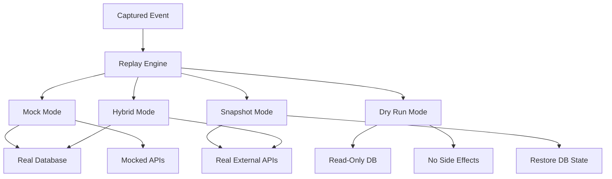

# Phase 11: Enhanced Replay & Debugging

## Overview

Transform the replay engine from basic request replay into a powerful debugging tool with mock mode, dry run, database snapshots, and interactive debugging capabilities. This phase makes replay deterministic and enables true "time-travel" debugging.

**Duration Estimate**: 4-5 weeks  
**Priority**: Medium-High - Core differentiator  
**Dependencies**: Phase 5 (basic replay), Phase 10 (advanced SDK)

---

## Goals

1. Implement mock mode for external API calls
2. Build dry run mode to prevent side effects
3. Create database snapshot capture and restore
4. Add interactive debugger with breakpoints
5. Implement time-travel debugging
6. Build advanced diff viewer for responses
7. Create replay history tracking
8. Add replay success metrics and analytics

---

## Technical Architecture

### Replay Modes



---

## Part 1: Mock Mode

### 1.1 Mock Data Storage

**Database Schema (prisma/schema.prisma additions):**

```prisma
model EventMock {
  id          String   @id @default(cuid())
  eventId     String
  projectId   String
  mockType    String   // 'external_api', 'database', 'redis'
  identifier  String   // URL, query, key
  request     Json?    // Request data
  response    Json     // Mocked response
  createdAt   DateTime @default(now())
  updatedAt   DateTime @updatedAt
  
  @@index([eventId])
  @@index([projectId, mockType])
}
```

### 1.2 Mock Capture During Event Processing

**workers/event-processor.ts (enhancement):**

```typescript
async function processEvent(event: any) {
  // ... existing processing ...

  // Extract external API calls for mocking
  const externalCalls = event.operations?.filter(
    (op: any) => op.type === 'axios' || op.type === 'fetch'
  ) || []

  for (const call of externalCalls) {
    await prisma.eventMock.create({
      data: {
        eventId: event._id,
        projectId: event.projectId,
        mockType: 'external_api',
        identifier: call.url,
        request: {
          method: call.method,
          url: call.url,
          headers: call.headers,
          body: call.body,
        },
        response: {
          statusCode: call.statusCode,
          headers: call.responseHeaders,
          body: call.responseBody,
        },
      },
    })
  }

  // Extract database queries for mocking
  const dbQueries = event.operations?.filter(
    (op: any) => op.type === 'mongodb' || op.type === 'postgres' || op.type === 'prisma'
  ) || []

  for (const query of dbQueries) {
    await prisma.eventMock.create({
      data: {
        eventId: event._id,
        projectId: event.projectId,
        mockType: 'database',
        identifier: query.query || query.collection,
        request: {
          query: query.query,
          params: query.params,
        },
        response: {
          result: query.result,
          rowCount: query.rowCount,
        },
      },
    })
  }
}
```

### 1.3 Mock Mode Implementation

**packages/cli/src/replay/mock-mode.ts:**

```typescript
import axios from 'axios'
import { EventMock } from '@prisma/client'

export interface MockConfig {
  externalAPIs: boolean
  database: boolean
  redis: boolean
  selectiveMocks?: {
    urls?: string[]
    queries?: string[]
  }
}

export class MockMode {
  private mocks: Map<string, EventMock> = new Map()

  constructor(
    private eventId: string,
    private config: MockConfig
  ) {}

  async loadMocks() {
    // Fetch mocks from API
    const response = await axios.get(
      `${process.env.REPLAYLY_API_URL}/api/events/${this.eventId}/mocks`
    )

    const mocks: EventMock[] = response.data.mocks

    for (const mock of mocks) {
      this.mocks.set(this.getMockKey(mock), mock)
    }
  }

  private getMockKey(mock: EventMock): string {
    return `${mock.mockType}:${mock.identifier}`
  }

  shouldMock(type: string, identifier: string): boolean {
    if (type === 'external_api' && !this.config.externalAPIs) return false
    if (type === 'database' && !this.config.database) return false
    if (type === 'redis' && !this.config.redis) return false

    // Check selective mocks
    if (this.config.selectiveMocks) {
      if (type === 'external_api' && this.config.selectiveMocks.urls) {
        return this.config.selectiveMocks.urls.some(url => identifier.includes(url))
      }
      if (type === 'database' && this.config.selectiveMocks.queries) {
        return this.config.selectiveMocks.queries.some(q => identifier.includes(q))
      }
    }

    return true
  }

  getMock(type: string, identifier: string): EventMock | undefined {
    const key = `${type}:${identifier}`
    return this.mocks.get(key)
  }

  /**
   * Create mock HTTP interceptor
   */
  createHTTPInterceptor() {
    const originalFetch = global.fetch

    global.fetch = async (url: string | URL, options?: any) => {
      const urlString = url.toString()

      if (this.shouldMock('external_api', urlString)) {
        const mock = this.getMock('external_api', urlString)

        if (mock) {
          console.log(`[Mock] Using mocked response for ${urlString}`)

          return new Response(
            JSON.stringify(mock.response.body),
            {
              status: mock.response.statusCode,
              headers: mock.response.headers,
            }
          )
        }
      }

      // Fall back to real request
      return originalFetch(url, options)
    }

    return () => {
      global.fetch = originalFetch
    }
  }

  /**
   * Create mock database interceptor
   */
  createDatabaseInterceptor(dbClient: any) {
    // This would need to be implemented per database type
    // For Prisma:
    if (dbClient.$use) {
      return dbClient.$use(async (params: any, next: any) => {
        const identifier = `${params.model}.${params.action}`

        if (this.shouldMock('database', identifier)) {
          const mock = this.getMock('database', identifier)

          if (mock) {
            console.log(`[Mock] Using mocked result for ${identifier}`)
            return mock.response.result
          }
        }

        return next(params)
      })
    }
  }
}
```

### 1.4 Mock Editor UI

**app/dashboard/[projectId]/events/[eventId]/mocks/page.tsx:**

```typescript
'use client'

import { useState, useEffect } from 'react'
import { Card } from '@/components/ui/card'
import { Button } from '@/components/ui/button'
import { Badge } from '@/components/ui/badge'
import { Tabs, TabsContent, TabsList, TabsTrigger } from '@/components/ui/tabs'
import { Edit, Save, X } from 'lucide-react'
import Editor from '@monaco-editor/react'

export default function EventMocksPage({
  params,
}: {
  params: { projectId: string; eventId: string }
}) {
  const [mocks, setMocks] = useState<any[]>([])
  const [editingMock, setEditingMock] = useState<any>(null)
  const [editedResponse, setEditedResponse] = useState('')

  useEffect(() => {
    fetchMocks()
  }, [])

  async function fetchMocks() {
    const res = await fetch(`/api/events/${params.eventId}/mocks`)
    const data = await res.json()
    setMocks(data.mocks)
  }

  async function saveMock() {
    await fetch(`/api/events/${params.eventId}/mocks/${editingMock.id}`, {
      method: 'PATCH',
      headers: { 'Content-Type': 'application/json' },
      body: JSON.stringify({
        response: JSON.parse(editedResponse),
      }),
    })

    setEditingMock(null)
    fetchMocks()
  }

  const externalAPIMocks = mocks.filter(m => m.mockType === 'external_api')
  const databaseMocks = mocks.filter(m => m.mockType === 'database')

  return (
    <div className="space-y-6">
      <div>
        <h1 className="text-2xl font-bold">Mock Data Editor</h1>
        <p className="text-gray-600">
          Edit mocked responses for replay testing
        </p>
      </div>

      <Tabs defaultValue="api">
        <TabsList>
          <TabsTrigger value="api">
            External APIs ({externalAPIMocks.length})
          </TabsTrigger>
          <TabsTrigger value="database">
            Database ({databaseMocks.length})
          </TabsTrigger>
        </TabsList>

        <TabsContent value="api" className="space-y-4">
          {externalAPIMocks.map(mock => (
            <Card key={mock.id} className="p-4">
              <div className="flex items-start justify-between mb-4">
                <div className="flex-1">
                  <div className="flex items-center gap-2 mb-2">
                    <Badge>{mock.request.method}</Badge>
                    <code className="text-sm">{mock.request.url}</code>
                  </div>
                  <div className="text-sm text-gray-600">
                    Status: {mock.response.statusCode}
                  </div>
                </div>
                <Button
                  variant="ghost"
                  size="sm"
                  onClick={() => {
                    setEditingMock(mock)
                    setEditedResponse(JSON.stringify(mock.response.body, null, 2))
                  }}
                >
                  <Edit className="w-4 h-4" />
                </Button>
              </div>

              {editingMock?.id === mock.id ? (
                <div className="space-y-4">
                  <Editor
                    height="300px"
                    language="json"
                    value={editedResponse}
                    onChange={value => setEditedResponse(value || '')}
                    options={{
                      minimap: { enabled: false },
                      fontSize: 14,
                    }}
                  />
                  <div className="flex gap-2">
                    <Button onClick={saveMock}>
                      <Save className="w-4 h-4 mr-2" />
                      Save
                    </Button>
                    <Button
                      variant="outline"
                      onClick={() => setEditingMock(null)}
                    >
                      <X className="w-4 h-4 mr-2" />
                      Cancel
                    </Button>
                  </div>
                </div>
              ) : (
                <pre className="bg-gray-50 p-4 rounded text-sm overflow-auto">
                  {JSON.stringify(mock.response.body, null, 2)}
                </pre>
              )}
            </Card>
          ))}
        </TabsContent>

        <TabsContent value="database" className="space-y-4">
          {databaseMocks.map(mock => (
            <Card key={mock.id} className="p-4">
              <div className="mb-2">
                <Badge>{mock.mockType}</Badge>
              </div>
              <div className="text-sm mb-2">
                <strong>Query:</strong>
                <pre className="bg-gray-50 p-2 rounded mt-1 overflow-auto">
                  {mock.request.query}
                </pre>
              </div>
              <div className="text-sm">
                <strong>Result:</strong>
                <pre className="bg-gray-50 p-2 rounded mt-1 overflow-auto">
                  {JSON.stringify(mock.response.result, null, 2)}
                </pre>
              </div>
            </Card>
          ))}
        </TabsContent>
      </Tabs>
    </div>
  )
}
```

---

## Part 2: Dry Run Mode

### 2.1 Dry Run Implementation

**packages/cli/src/replay/dry-run.ts:**

```typescript
import { PrismaClient } from '@prisma/client'
import { MongoClient } from 'mongodb'

export class DryRunMode {
  private originalMethods: Map<string, any> = new Map()

  /**
   * Enable dry run mode for Prisma
   */
  enablePrismaDryRun(prisma: PrismaClient) {
    // Intercept write operations
    prisma.$use(async (params, next) => {
      const writeOperations = ['create', 'update', 'delete', 'upsert', 'createMany', 'updateMany', 'deleteMany']

      if (writeOperations.includes(params.action)) {
        console.log(`[Dry Run] Skipping ${params.model}.${params.action}`)
        console.log(`[Dry Run] Would have executed:`, params.args)
        
        // Return mock result
        return { id: 'dry-run-mock-id' }
      }

      // Allow read operations
      return next(params)
    })
  }

  /**
   * Enable dry run mode for MongoDB
   */
  async enableMongoDryRun(mongoClient: MongoClient) {
    const db = mongoClient.db()

    // Wrap collection methods
    const originalCollection = db.collection.bind(db)
    
    db.collection = function(name: string) {
      const collection = originalCollection(name)

      // Wrap write methods
      const writeMethodsToWrap = [
        'insertOne',
        'insertMany',
        'updateOne',
        'updateMany',
        'deleteOne',
        'deleteMany',
        'replaceOne',
        'findOneAndUpdate',
        'findOneAndReplace',
        'findOneAndDelete',
      ]

      for (const method of writeMethodsToWrap) {
        const original = collection[method].bind(collection)
        
        collection[method] = function(...args: any[]) {
          console.log(`[Dry Run] Skipping ${name}.${method}`)
          console.log(`[Dry Run] Would have executed:`, args)
          
          // Return mock result
          return Promise.resolve({
            acknowledged: true,
            insertedId: 'dry-run-mock-id',
            modifiedCount: 1,
            deletedCount: 1,
          })
        }
      }

      return collection
    }
  }

  /**
   * Prevent external side effects
   */
  preventSideEffects() {
    // Prevent email sending
    if (typeof require !== 'undefined') {
      try {
        const nodemailer = require('nodemailer')
        const originalCreateTransport = nodemailer.createTransport
        
        nodemailer.createTransport = function(...args: any[]) {
          const transport = originalCreateTransport(...args)
          
          transport.sendMail = async function(mailOptions: any) {
            console.log('[Dry Run] Skipping email send')
            console.log('[Dry Run] Would have sent:', mailOptions)
            return { messageId: 'dry-run-mock-id' }
          }
          
          return transport
        }
      } catch (e) {
        // nodemailer not installed
      }
    }

    // Prevent HTTP requests (except to Replayly API)
    const originalFetch = global.fetch
    
    global.fetch = async function(url: string | URL, options?: any) {
      const urlString = url.toString()
      
      // Allow Replayly API calls
      if (urlString.includes('replayly.dev') || urlString.includes('localhost:3000')) {
        return originalFetch(url, options)
      }
      
      console.log('[Dry Run] Skipping external HTTP request')
      console.log('[Dry Run] Would have called:', urlString)
      
      return new Response(JSON.stringify({ dryRun: true }), {
        status: 200,
        headers: { 'Content-Type': 'application/json' },
      })
    }
  }

  /**
   * Restore original behavior
   */
  disable() {
    // Restore methods
    for (const [key, value] of this.originalMethods) {
      // Restore logic here
    }
  }
}
```

### 2.2 CLI Dry Run Command

**packages/cli/src/commands/replay.ts (enhancement):**

```typescript
export function createReplayCommand() {
  return new Command('replay')
    .description('Replay a captured event')
    .option('-e, --event-id <id>', 'Event ID to replay')
    .option('--dry-run', 'Run in dry-run mode (no side effects)')
    .option('--mock', 'Use mocked external API responses')
    .option('--snapshot', 'Restore database snapshot before replay')
    .action(async (options) => {
      // ... existing code ...

      if (options.dryRun) {
        console.log(chalk.yellow('🔒 Dry run mode enabled - no side effects will occur'))
        
        const dryRun = new DryRunMode()
        dryRun.preventSideEffects()
        
        // If user's app uses Prisma or MongoDB, they need to pass instances
        // This would be configured in replayly.config.js
      }

      // ... replay logic ...
    })
}
```

---

## Part 3: Database Snapshots

### 3.1 Snapshot Capture

**lib/replay/snapshot-capture.ts:**

```typescript
import { PrismaClient } from '@prisma/client'
import { MongoClient } from 'mongodb'
import { createHash } from 'crypto'

export interface DatabaseSnapshot {
  id: string
  eventId: string
  database: 'postgres' | 'mongodb'
  tables: {
    [tableName: string]: {
      schema: any
      data: any[]
      checksum: string
    }
  }
  createdAt: Date
}

export class SnapshotCapture {
  /**
   * Capture PostgreSQL snapshot
   */
  async capturePostgresSnapshot(
    prisma: PrismaClient,
    tables: string[]
  ): Promise<DatabaseSnapshot['tables']> {
    const snapshot: DatabaseSnapshot['tables'] = {}

    for (const table of tables) {
      try {
        // Get table data
        const data = await (prisma as any)[table].findMany()

        // Get table schema
        const schema = await prisma.$queryRaw`
          SELECT column_name, data_type, is_nullable
          FROM information_schema.columns
          WHERE table_name = ${table}
        `

        // Calculate checksum
        const checksum = createHash('sha256')
          .update(JSON.stringify(data))
          .digest('hex')

        snapshot[table] = {
          schema,
          data,
          checksum,
        }

        console.log(`Captured ${data.length} rows from ${table}`)
      } catch (error) {
        console.error(`Failed to capture ${table}:`, error)
      }
    }

    return snapshot
  }

  /**
   * Capture MongoDB snapshot
   */
  async captureMongoSnapshot(
    mongoClient: MongoClient,
    collections: string[]
  ): Promise<DatabaseSnapshot['tables']> {
    const db = mongoClient.db()
    const snapshot: DatabaseSnapshot['tables'] = {}

    for (const collectionName of collections) {
      try {
        const collection = db.collection(collectionName)

        // Get collection data
        const data = await collection.find({}).toArray()

        // Get collection indexes (as schema)
        const indexes = await collection.indexes()

        // Calculate checksum
        const checksum = createHash('sha256')
          .update(JSON.stringify(data))
          .digest('hex')

        snapshot[collectionName] = {
          schema: { indexes },
          data,
          checksum,
        }

        console.log(`Captured ${data.length} documents from ${collectionName}`)
      } catch (error) {
        console.error(`Failed to capture ${collectionName}:`, error)
      }
    }

    return snapshot
  }

  /**
   * Store snapshot
   */
  async storeSnapshot(snapshot: DatabaseSnapshot) {
    // Store in MinIO/S3
    const response = await fetch(
      `${process.env.REPLAYLY_API_URL}/api/snapshots`,
      {
        method: 'POST',
        headers: {
          'Content-Type': 'application/json',
          Authorization: `Bearer ${process.env.REPLAYLY_API_KEY}`,
        },
        body: JSON.stringify(snapshot),
      }
    )

    return response.json()
  }
}
```

### 3.2 Snapshot Restore

**packages/cli/src/replay/snapshot.ts:**

```typescript
import { PrismaClient } from '@prisma/client'
import { MongoClient } from 'mongodb'
import axios from 'axios'

export class SnapshotMode {
  /**
   * Restore PostgreSQL snapshot
   */
  async restorePostgresSnapshot(
    prisma: PrismaClient,
    snapshot: any
  ) {
    console.log('Restoring PostgreSQL snapshot...')

    for (const [table, tableData] of Object.entries(snapshot.tables)) {
      try {
        // Delete existing data
        await (prisma as any)[table].deleteMany({})

        // Insert snapshot data
        if (tableData.data.length > 0) {
          await (prisma as any)[table].createMany({
            data: tableData.data,
          })
        }

        console.log(`Restored ${tableData.data.length} rows to ${table}`)
      } catch (error) {
        console.error(`Failed to restore ${table}:`, error)
      }
    }

    console.log('Snapshot restored successfully')
  }

  /**
   * Restore MongoDB snapshot
   */
  async restoreMongoSnapshot(
    mongoClient: MongoClient,
    snapshot: any
  ) {
    console.log('Restoring MongoDB snapshot...')

    const db = mongoClient.db()

    for (const [collectionName, collectionData] of Object.entries(snapshot.tables)) {
      try {
        const collection = db.collection(collectionName)

        // Delete existing data
        await collection.deleteMany({})

        // Insert snapshot data
        if (collectionData.data.length > 0) {
          await collection.insertMany(collectionData.data)
        }

        console.log(`Restored ${collectionData.data.length} documents to ${collectionName}`)
      } catch (error) {
        console.error(`Failed to restore ${collectionName}:`, error)
      }
    }

    console.log('Snapshot restored successfully')
  }

  /**
   * Fetch snapshot from API
   */
  async fetchSnapshot(eventId: string) {
    const response = await axios.get(
      `${process.env.REPLAYLY_API_URL}/api/events/${eventId}/snapshot`,
      {
        headers: {
          Authorization: `Bearer ${process.env.REPLAYLY_API_KEY}`,
        },
      }
    )

    return response.data.snapshot
  }
}
```

---

## Part 4: Interactive Debugger

### 4.1 Debugger Implementation

**packages/cli/src/replay/debugger.ts:**

```typescript
import readline from 'readline'
import chalk from 'chalk'

export interface Breakpoint {
  type: 'operation' | 'line' | 'condition'
  target: string
  condition?: string
}

export class InteractiveDebugger {
  private breakpoints: Breakpoint[] = []
  private currentStep: number = 0
  private operations: any[] = []
  private paused: boolean = false
  private rl: readline.Interface

  constructor(operations: any[]) {
    this.operations = operations
    this.rl = readline.createInterface({
      input: process.stdin,
      output: process.stdout,
    })
  }

  /**
   * Add breakpoint
   */
  addBreakpoint(breakpoint: Breakpoint) {
    this.breakpoints.push(breakpoint)
    console.log(chalk.green(`✓ Breakpoint added: ${breakpoint.type} ${breakpoint.target}`))
  }

  /**
   * Check if should break at current step
   */
  private shouldBreak(): boolean {
    const operation = this.operations[this.currentStep]
    if (!operation) return false

    for (const bp of this.breakpoints) {
      if (bp.type === 'operation' && operation.type === bp.target) {
        return true
      }

      if (bp.type === 'condition' && bp.condition) {
        // Evaluate condition (simplified)
        try {
          const result = eval(bp.condition.replace(/\$operation/g, 'operation'))
          if (result) return true
        } catch (e) {
          // Invalid condition
        }
      }
    }

    return false
  }

  /**
   * Execute step
   */
  async executeStep(): Promise<boolean> {
    if (this.currentStep >= this.operations.length) {
      console.log(chalk.green('✓ Replay complete'))
      return false
    }

    const operation = this.operations[this.currentStep]

    // Check breakpoints
    if (this.shouldBreak()) {
      await this.pause(operation)
    }

    // Display operation
    this.displayOperation(operation)

    // Execute operation
    await this.runOperation(operation)

    this.currentStep++
    return true
  }

  /**
   * Pause execution
   */
  private async pause(operation: any) {
    this.paused = true

    console.log(chalk.yellow('\n⏸  Breakpoint hit'))
    this.displayOperation(operation)

    await this.showDebugPrompt()
  }

  /**
   * Show debug prompt
   */
  private async showDebugPrompt() {
    return new Promise<void>((resolve) => {
      this.rl.question(
        chalk.cyan('\nDebugger> '),
        async (input) => {
          const command = input.trim().toLowerCase()

          switch (command) {
            case 'c':
            case 'continue':
              this.paused = false
              resolve()
              break

            case 'n':
            case 'next':
              resolve()
              break

            case 's':
            case 'step':
              resolve()
              break

            case 'i':
            case 'inspect':
              this.inspectCurrentOperation()
              await this.showDebugPrompt()
              break

            case 'b':
            case 'backtrace':
              this.showBacktrace()
              await this.showDebugPrompt()
              break

            case 'l':
            case 'list':
              this.listOperations()
              await this.showDebugPrompt()
              break

            case 'h':
            case 'help':
              this.showHelp()
              await this.showDebugPrompt()
              break

            default:
              console.log(chalk.red('Unknown command. Type "help" for available commands.'))
              await this.showDebugPrompt()
          }
        }
      )
    })
  }

  /**
   * Display operation
   */
  private displayOperation(operation: any) {
    console.log(chalk.blue(`\n[${this.currentStep + 1}/${this.operations.length}] ${operation.type}`))

    if (operation.type === 'mongodb' || operation.type === 'postgres') {
      console.log(chalk.gray(`  Query: ${operation.query}`))
      console.log(chalk.gray(`  Duration: ${operation.durationMs}ms`))
    } else if (operation.type === 'axios' || operation.type === 'fetch') {
      console.log(chalk.gray(`  ${operation.method} ${operation.url}`))
      console.log(chalk.gray(`  Status: ${operation.statusCode}`))
    }
  }

  /**
   * Inspect current operation
   */
  private inspectCurrentOperation() {
    const operation = this.operations[this.currentStep]
    console.log(chalk.yellow('\nOperation Details:'))
    console.log(JSON.stringify(operation, null, 2))
  }

  /**
   * Show backtrace
   */
  private showBacktrace() {
    console.log(chalk.yellow('\nBacktrace:'))
    for (let i = 0; i <= this.currentStep && i < this.operations.length; i++) {
      const op = this.operations[i]
      const marker = i === this.currentStep ? '→' : ' '
      console.log(`${marker} [${i + 1}] ${op.type} (${op.durationMs}ms)`)
    }
  }

  /**
   * List operations
   */
  private listOperations() {
    console.log(chalk.yellow('\nOperations:'))
    for (let i = 0; i < this.operations.length; i++) {
      const op = this.operations[i]
      const marker = i === this.currentStep ? '→' : ' '
      console.log(`${marker} [${i + 1}] ${op.type}`)
    }
  }

  /**
   * Show help
   */
  private showHelp() {
    console.log(chalk.yellow('\nAvailable Commands:'))
    console.log('  c, continue  - Continue execution')
    console.log('  n, next      - Execute next operation')
    console.log('  s, step      - Step into operation')
    console.log('  i, inspect   - Inspect current operation')
    console.log('  b, backtrace - Show execution history')
    console.log('  l, list      - List all operations')
    console.log('  h, help      - Show this help')
  }

  /**
   * Run operation (placeholder)
   */
  private async runOperation(operation: any) {
    // Simulate operation execution
    await new Promise(resolve => setTimeout(resolve, 100))
  }

  /**
   * Run all steps
   */
  async run() {
    while (await this.executeStep()) {
      if (!this.paused) {
        // Small delay between steps
        await new Promise(resolve => setTimeout(resolve, 50))
      }
    }

    this.rl.close()
  }
}
```

---

## Part 5: Replay History & Analytics

### 5.1 Database Schema

**prisma/schema.prisma (additions):**

```prisma
model ReplayHistory {
  id          String   @id @default(cuid())
  eventId     String
  projectId   String
  userId      String
  mode        String   // hybrid, mock, dry-run, snapshot
  success     Boolean
  duration    Int      // ms
  differences Json?    // Differences from original
  error       String?
  createdAt   DateTime @default(now())
  
  project     Project  @relation(fields: [projectId], references: [id], onDelete: Cascade)
  user        User     @relation(fields: [userId], references: [id])
  
  @@index([eventId])
  @@index([projectId, createdAt])
  @@index([userId])
}
```

### 5.2 Replay Tracking

**packages/cli/src/replay/history.ts:**

```typescript
import axios from 'axios'

export interface ReplayResult {
  eventId: string
  mode: string
  success: boolean
  duration: number
  differences?: {
    statusCode?: { original: number; replayed: number }
    responseBody?: any
    duration?: { original: number; replayed: number }
  }
  error?: string
}

export async function trackReplay(result: ReplayResult, token: string) {
  try {
    await axios.post(
      `${process.env.REPLAYLY_API_URL}/api/replays`,
      result,
      {
        headers: {
          Authorization: `Bearer ${token}`,
        },
      }
    )
  } catch (error) {
    console.error('Failed to track replay:', error)
  }
}

export async function getReplayHistory(eventId: string, token: string) {
  const response = await axios.get(
    `${process.env.REPLAYLY_API_URL}/api/events/${eventId}/replays`,
    {
      headers: {
        Authorization: `Bearer ${token}`,
      },
    }
  )

  return response.data.replays
}
```

---

## Acceptance Criteria

- [ ] Mock mode capturing and using external API responses
- [ ] Mock editor UI for editing responses
- [ ] Dry run mode preventing all side effects
- [ ] Database snapshot capture for PostgreSQL and MongoDB
- [ ] Snapshot restore working correctly
- [ ] Interactive debugger with breakpoints
- [ ] Step-by-step execution working
- [ ] Time-travel debugging functional
- [ ] Replay history tracking
- [ ] Replay success metrics dashboard
- [ ] Advanced diff viewer showing detailed differences
- [ ] All tests passing

---

## Testing Strategy

### Unit Tests
- Mock data capture and retrieval
- Dry run interceptors
- Snapshot capture and restore
- Debugger command parsing

### Integration Tests
- Full replay with mocks
- Dry run preventing writes
- Snapshot restore accuracy
- Interactive debugger flow

### E2E Tests
- Complete replay workflow with each mode
- Mock editing and replay
- Snapshot-based replay

---

## Deployment Notes

1. Add database migrations for new tables
2. Configure snapshot storage in MinIO
3. Test each replay mode thoroughly
4. Document replay modes for users
5. Create video tutorials for advanced features

---

## Next Steps

After completing Phase 11, proceed to **Phase 12: Source Maps & Stack Trace Enhancement** to add source map support and stack trace symbolication.
