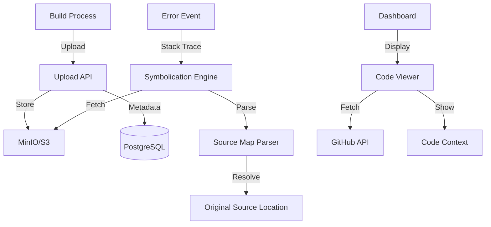

# Phase 12: Source Maps & Stack Trace Enhancement

## Overview

Transform cryptic production stack traces into readable, actionable debugging information by implementing source map upload, stack trace symbolication, and code context display. This phase makes debugging production errors as easy as debugging in development.

**Duration Estimate**: 3-4 weeks  
**Priority**: High - Critical for production debugging  
**Dependencies**: Phase 1 (storage), Phase 4 (dashboard)

---

## Goals

1. Create source map upload API and CLI command
2. Build source map storage and versioning system
3. Implement stack trace symbolication engine
4. Add code context display with syntax highlighting
5. Integrate with GitHub for source code linking
6. Create CI/CD integration examples
7. Build source map management UI
8. Add automatic source map detection

---

## Technical Architecture

### System Flow



---

## Part 1: Source Map Upload

### 1.1 Database Schema

**prisma/schema.prisma (additions):**

```prisma
model SourceMap {
  id          String   @id @default(cuid())
  projectId   String
  releaseId   String?
  version     String   // Git commit SHA or version number
  filename    String   // e.g., "main.js.map"
  originalFile String  // e.g., "src/index.ts"
  s3Key       String   // Path in MinIO/S3
  size        Int      // File size in bytes
  uploadedBy  String
  uploadedAt  DateTime @default(now())
  
  project     Project  @relation(fields: [projectId], references: [id], onDelete: Cascade)
  release     Release? @relation(fields: [releaseId], references: [id], onDelete: SetNull)
  uploader    User     @relation(fields: [uploadedBy], references: [id])
  
  @@unique([projectId, version, filename])
  @@index([projectId, version])
  @@index([releaseId])
}
```

### 1.2 Upload API

**app/api/projects/[projectId]/sourcemaps/route.ts:**

```typescript
import { NextRequest, NextResponse } from 'next/server'
import { verifyAuth } from '@/lib/auth/verify'
import { prisma } from '@/lib/db/postgres'
import { requireProjectPermission, Permission } from '@/lib/auth/permissions'
import { getMinioClient } from '@/lib/storage/minio'
import { v4 as uuidv4 } from 'uuid'

export async function POST(
  req: NextRequest,
  { params }: { params: { projectId: string } }
) {
  const user = await verifyAuth(req)
  if (!user) {
    return NextResponse.json({ error: 'Unauthorized' }, { status: 401 })
  }

  try {
    await requireProjectPermission(
      user.userId,
      params.projectId,
      Permission.PROJECT_MANAGE_SETTINGS
    )

    const formData = await req.formData()
    const file = formData.get('file') as File
    const version = formData.get('version') as string
    const releaseId = formData.get('releaseId') as string | null

    if (!file || !version) {
      return NextResponse.json(
        { error: 'Missing file or version' },
        { status: 400 }
      )
    }

    // Validate file is a source map
    if (!file.name.endsWith('.map')) {
      return NextResponse.json(
        { error: 'File must be a source map (.map)' },
        { status: 400 }
      )
    }

    // Read file content
    const buffer = await file.arrayBuffer()
    const content = Buffer.from(buffer)

    // Parse source map to extract original filename
    let originalFile: string
    try {
      const sourceMap = JSON.parse(content.toString())
      originalFile = sourceMap.file || file.name.replace('.map', '')
    } catch (e) {
      return NextResponse.json(
        { error: 'Invalid source map format' },
        { status: 400 }
      )
    }

    // Generate S3 key
    const s3Key = `sourcemaps/${params.projectId}/${version}/${file.name}`

    // Upload to MinIO
    const minioClient = getMinioClient()
    await minioClient.putObject(
      process.env.MINIO_BUCKET!,
      s3Key,
      content,
      content.length,
      {
        'Content-Type': 'application/json',
      }
    )

    // Store metadata in database
    const sourceMap = await prisma.sourceMap.create({
      data: {
        projectId: params.projectId,
        releaseId,
        version,
        filename: file.name,
        originalFile,
        s3Key,
        size: content.length,
        uploadedBy: user.userId,
      },
    })

    return NextResponse.json({ sourceMap })
  } catch (error: any) {
    console.error('Source map upload error:', error)
    return NextResponse.json(
      { error: error.message || 'Failed to upload source map' },
      { status: 500 }
    )
  }
}

export async function GET(
  req: NextRequest,
  { params }: { params: { projectId: string } }
) {
  const user = await verifyAuth(req)
  if (!user) {
    return NextResponse.json({ error: 'Unauthorized' }, { status: 401 })
  }

  try {
    await requireProjectPermission(
      user.userId,
      params.projectId,
      Permission.PROJECT_VIEW_EVENTS
    )

    const { searchParams } = req.nextUrl
    const version = searchParams.get('version')

    const where: any = { projectId: params.projectId }
    if (version) {
      where.version = version
    }

    const sourceMaps = await prisma.sourceMap.findMany({
      where,
      include: {
        uploader: {
          select: {
            name: true,
            email: true,
          },
        },
      },
      orderBy: {
        uploadedAt: 'desc',
      },
    })

    return NextResponse.json({ sourceMaps })
  } catch (error: any) {
    return NextResponse.json(
      { error: error.message || 'Failed to fetch source maps' },
      { status: 500 }
    )
  }
}
```

### 1.3 CLI Upload Command

**packages/cli/src/commands/sourcemaps.ts:**

```typescript
import { Command } from 'commander'
import { glob } from 'glob'
import FormData from 'form-data'
import fs from 'fs'
import path from 'path'
import chalk from 'chalk'
import ora from 'ora'
import { getAuthManager } from '../auth/auth-manager'
import axios from 'axios'

export function createSourcemapsCommand() {
  const command = new Command('sourcemaps')
    .description('Manage source maps')

  command
    .command('upload')
    .description('Upload source maps')
    .option('-p, --project <id>', 'Project ID')
    .option('-v, --version <version>', 'Version (git SHA or version number)')
    .option('-d, --dir <directory>', 'Directory containing source maps', './dist')
    .option('--pattern <pattern>', 'Glob pattern for source map files', '**/*.map')
    .option('-r, --release <id>', 'Release ID to associate with')
    .action(async (options) => {
      const authManager = getAuthManager()
      const credentials = await authManager.getCredentials()

      if (!credentials) {
        console.error(chalk.red('Not logged in. Run `replayly login` first.'))
        process.exit(1)
      }

      if (!options.project || !options.version) {
        console.error(chalk.red('Project ID and version are required'))
        process.exit(1)
      }

      const spinner = ora('Finding source maps...').start()

      // Find source map files
      const files = await glob(options.pattern, {
        cwd: options.dir,
        absolute: true,
      })

      if (files.length === 0) {
        spinner.fail('No source maps found')
        process.exit(1)
      }

      spinner.succeed(`Found ${files.length} source map(s)`)

      // Upload each file
      let uploaded = 0
      let failed = 0

      for (const file of files) {
        const uploadSpinner = ora(`Uploading ${path.basename(file)}...`).start()

        try {
          const formData = new FormData()
          formData.append('file', fs.createReadStream(file))
          formData.append('version', options.version)
          if (options.release) {
            formData.append('releaseId', options.release)
          }

          await axios.post(
            `${process.env.REPLAYLY_API_URL}/api/projects/${options.project}/sourcemaps`,
            formData,
            {
              headers: {
                ...formData.getHeaders(),
                Authorization: `Bearer ${credentials.accessToken}`,
              },
            }
          )

          uploadSpinner.succeed(`Uploaded ${path.basename(file)}`)
          uploaded++
        } catch (error: any) {
          uploadSpinner.fail(`Failed to upload ${path.basename(file)}: ${error.message}`)
          failed++
        }
      }

      console.log(
        chalk.green(`\n✓ Uploaded ${uploaded} source map(s)`) +
        (failed > 0 ? chalk.red(` (${failed} failed)`) : '')
      )
    })

  command
    .command('list')
    .description('List uploaded source maps')
    .option('-p, --project <id>', 'Project ID')
    .option('-v, --version <version>', 'Filter by version')
    .action(async (options) => {
      const authManager = getAuthManager()
      const credentials = await authManager.getCredentials()

      if (!credentials) {
        console.error(chalk.red('Not logged in. Run `replayly login` first.'))
        process.exit(1)
      }

      if (!options.project) {
        console.error(chalk.red('Project ID is required'))
        process.exit(1)
      }

      const spinner = ora('Fetching source maps...').start()

      try {
        const url = new URL(
          `${process.env.REPLAYLY_API_URL}/api/projects/${options.project}/sourcemaps`
        )
        if (options.version) {
          url.searchParams.set('version', options.version)
        }

        const response = await axios.get(url.toString(), {
          headers: {
            Authorization: `Bearer ${credentials.accessToken}`,
          },
        })

        spinner.succeed('Source maps fetched')

        const sourceMaps = response.data.sourceMaps

        if (sourceMaps.length === 0) {
          console.log(chalk.yellow('No source maps found'))
          return
        }

        console.log(chalk.bold('\nSource Maps:\n'))

        for (const sm of sourceMaps) {
          console.log(chalk.cyan(`${sm.version} - ${sm.filename}`))
          console.log(chalk.gray(`  Original: ${sm.originalFile}`))
          console.log(chalk.gray(`  Size: ${(sm.size / 1024).toFixed(2)} KB`))
          console.log(chalk.gray(`  Uploaded: ${new Date(sm.uploadedAt).toLocaleString()}`))
          console.log()
        }
      } catch (error: any) {
        spinner.fail('Failed to fetch source maps')
        console.error(chalk.red(error.message))
        process.exit(1)
      }
    })

  return command
}
```

### 1.4 CI/CD Integration Example

**examples/github-actions-sourcemaps.yml:**

```yaml
name: Deploy with Source Maps

on:
  push:
    branches: [main]

jobs:
  deploy:
    runs-on: ubuntu-latest
    
    steps:
      - uses: actions/checkout@v3
      
      - name: Setup Node.js
        uses: actions/setup-node@v3
        with:
          node-version: '18'
      
      - name: Install dependencies
        run: npm ci
      
      - name: Build
        run: npm run build
        env:
          # Ensure source maps are generated
          GENERATE_SOURCEMAP: true
      
      - name: Install Replayly CLI
        run: npm install -g @replayly/cli
      
      - name: Upload source maps
        run: |
          replayly sourcemaps upload \
            --project ${{ secrets.REPLAYLY_PROJECT_ID }} \
            --version ${{ github.sha }} \
            --dir ./dist
        env:
          REPLAYLY_API_KEY: ${{ secrets.REPLAYLY_API_KEY }}
      
      - name: Deploy
        run: npm run deploy
```

---

## Part 2: Stack Trace Symbolication

### 2.1 Source Map Parser

**lib/sourcemaps/parser.ts:**

```typescript
import { SourceMapConsumer } from 'source-map'
import { getMinioClient } from '@/lib/storage/minio'

export interface OriginalPosition {
  source: string
  line: number
  column: number
  name?: string
}

export interface StackFrame {
  file: string
  line: number
  column: number
  functionName?: string
}

export class SourceMapParser {
  private consumers: Map<string, SourceMapConsumer> = new Map()

  /**
   * Load source map from storage
   */
  async loadSourceMap(s3Key: string): Promise<SourceMapConsumer> {
    // Check cache
    if (this.consumers.has(s3Key)) {
      return this.consumers.get(s3Key)!
    }

    // Fetch from MinIO
    const minioClient = getMinioClient()
    const stream = await minioClient.getObject(process.env.MINIO_BUCKET!, s3Key)

    // Read stream
    const chunks: Buffer[] = []
    for await (const chunk of stream) {
      chunks.push(chunk)
    }
    const content = Buffer.concat(chunks).toString()

    // Parse source map
    const sourceMap = JSON.parse(content)
    const consumer = await new SourceMapConsumer(sourceMap)

    // Cache
    this.consumers.set(s3Key, consumer)

    return consumer
  }

  /**
   * Resolve original position from minified position
   */
  async resolvePosition(
    s3Key: string,
    line: number,
    column: number
  ): Promise<OriginalPosition | null> {
    try {
      const consumer = await this.loadSourceMap(s3Key)

      const original = consumer.originalPositionFor({
        line,
        column,
      })

      if (!original.source) {
        return null
      }

      return {
        source: original.source,
        line: original.line || 0,
        column: original.column || 0,
        name: original.name || undefined,
      }
    } catch (error) {
      console.error('Failed to resolve position:', error)
      return null
    }
  }

  /**
   * Get source content
   */
  async getSourceContent(
    s3Key: string,
    sourcePath: string
  ): Promise<string | null> {
    try {
      const consumer = await this.loadSourceMap(s3Key)
      return consumer.sourceContentFor(sourcePath)
    } catch (error) {
      console.error('Failed to get source content:', error)
      return null
    }
  }

  /**
   * Cleanup
   */
  destroy() {
    for (const consumer of this.consumers.values()) {
      consumer.destroy()
    }
    this.consumers.clear()
  }
}
```

### 2.2 Symbolication Engine

**lib/sourcemaps/symbolicate.ts:**

```typescript
import { prisma } from '@/lib/db/postgres'
import { SourceMapParser, StackFrame, OriginalPosition } from './parser'

export interface SymbolicatedFrame extends StackFrame {
  original?: OriginalPosition
  sourceContent?: string[]
}

export class SymbolicationEngine {
  private parser: SourceMapParser

  constructor() {
    this.parser = new SourceMapParser()
  }

  /**
   * Symbolicate stack trace
   */
  async symbolicateStackTrace(
    projectId: string,
    version: string,
    stackTrace: string
  ): Promise<SymbolicatedFrame[]> {
    // Parse stack trace
    const frames = this.parseStackTrace(stackTrace)

    // Symbolicate each frame
    const symbolicated: SymbolicatedFrame[] = []

    for (const frame of frames) {
      const symbolicatedFrame = await this.symbolicateFrame(
        projectId,
        version,
        frame
      )
      symbolicated.push(symbolicatedFrame)
    }

    return symbolicated
  }

  /**
   * Symbolicate single frame
   */
  private async symbolicateFrame(
    projectId: string,
    version: string,
    frame: StackFrame
  ): Promise<SymbolicatedFrame> {
    try {
      // Find source map for this file
      const sourceMap = await prisma.sourceMap.findFirst({
        where: {
          projectId,
          version,
          originalFile: {
            contains: frame.file,
          },
        },
      })

      if (!sourceMap) {
        return frame
      }

      // Resolve original position
      const original = await this.parser.resolvePosition(
        sourceMap.s3Key,
        frame.line,
        frame.column
      )

      if (!original) {
        return frame
      }

      // Get source content (5 lines before and after)
      const sourceContent = await this.getSourceContext(
        sourceMap.s3Key,
        original.source,
        original.line,
        5
      )

      return {
        ...frame,
        original,
        sourceContent,
      }
    } catch (error) {
      console.error('Failed to symbolicate frame:', error)
      return frame
    }
  }

  /**
   * Parse stack trace string into frames
   */
  private parseStackTrace(stackTrace: string): StackFrame[] {
    const frames: StackFrame[] = []
    const lines = stackTrace.split('\n')

    for (const line of lines) {
      // Match various stack trace formats
      // V8 format: "    at functionName (file:line:column)"
      const v8Match = line.match(/at\s+(?:(.+?)\s+\()?(.+?):(\d+):(\d+)\)?/)
      if (v8Match) {
        frames.push({
          functionName: v8Match[1] || undefined,
          file: v8Match[2],
          line: parseInt(v8Match[3]),
          column: parseInt(v8Match[4]),
        })
        continue
      }

      // Firefox format: "functionName@file:line:column"
      const firefoxMatch = line.match(/(.+?)@(.+?):(\d+):(\d+)/)
      if (firefoxMatch) {
        frames.push({
          functionName: firefoxMatch[1] || undefined,
          file: firefoxMatch[2],
          line: parseInt(firefoxMatch[3]),
          column: parseInt(firefoxMatch[4]),
        })
      }
    }

    return frames
  }

  /**
   * Get source code context around a line
   */
  private async getSourceContext(
    s3Key: string,
    sourcePath: string,
    line: number,
    contextLines: number
  ): Promise<string[]> {
    try {
      const content = await this.parser.getSourceContent(s3Key, sourcePath)
      if (!content) return []

      const lines = content.split('\n')
      const start = Math.max(0, line - contextLines - 1)
      const end = Math.min(lines.length, line + contextLines)

      return lines.slice(start, end)
    } catch (error) {
      console.error('Failed to get source context:', error)
      return []
    }
  }

  /**
   * Cleanup
   */
  destroy() {
    this.parser.destroy()
  }
}
```

### 2.3 Symbolication Worker

**workers/symbolication.ts:**

```typescript
import { Worker } from 'bullmq'
import { prisma } from '@/lib/db/postgres'
import { connectMongo } from '@/lib/db/mongodb'
import { SymbolicationEngine } from '@/lib/sourcemaps/symbolicate'
import { getRedisConnection } from '@/lib/db/redis'

export async function startSymbolicationWorker() {
  const engine = new SymbolicationEngine()

  const worker = new Worker(
    'symbolication',
    async (job) => {
      const { eventId } = job.data

      console.log(`Symbolicating event ${eventId}`)

      try {
        // Fetch event
        const db = await connectMongo()
        const event = await db.collection('events').findOne({
          _id: eventId,
        })

        if (!event || !event.error?.stack) {
          console.log('No stack trace to symbolicate')
          return
        }

        // Get version from event (git commit SHA or release version)
        const version = event.gitCommitSha || event.version
        if (!version) {
          console.log('No version information in event')
          return
        }

        // Symbolicate stack trace
        const symbolicated = await engine.symbolicateStackTrace(
          event.projectId,
          version,
          event.error.stack
        )

        // Update event with symbolicated stack trace
        await db.collection('events').updateOne(
          { _id: eventId },
          {
            $set: {
              'error.symbolicatedStack': symbolicated,
              symbolicatedAt: new Date(),
            },
          }
        )

        console.log(`Successfully symbolicated event ${eventId}`)
      } catch (error) {
        console.error(`Failed to symbolicate event ${eventId}:`, error)
        throw error
      }
    },
    {
      connection: getRedisConnection(),
      concurrency: 5,
      attempts: 3,
      backoff: {
        type: 'exponential',
        delay: 2000,
      },
    }
  )

  console.log('Symbolication worker started')

  return worker
}
```

---

## Part 3: Code Context Display

### 3.1 Stack Trace Viewer Component

**components/stack-trace-viewer.tsx:**

```typescript
'use client'

import { useState } from 'react'
import { Card } from '@/components/ui/card'
import { Badge } from '@/components/ui/badge'
import { Button } from '@/components/ui/button'
import { ChevronDown, ChevronRight, ExternalLink } from 'lucide-react'
import { Prism as SyntaxHighlighter } from 'react-syntax-highlighter'
import { vscDarkPlus } from 'react-syntax-highlighter/dist/esm/styles/prism'

interface StackFrame {
  file: string
  line: number
  column: number
  functionName?: string
  original?: {
    source: string
    line: number
    column: number
    name?: string
  }
  sourceContent?: string[]
}

interface StackTraceViewerProps {
  frames: StackFrame[]
  githubUrl?: string
}

export function StackTraceViewer({ frames, githubUrl }: StackTraceViewerProps) {
  const [expandedFrames, setExpandedFrames] = useState<Set<number>>(new Set([0]))

  const toggleFrame = (index: number) => {
    const newExpanded = new Set(expandedFrames)
    if (newExpanded.has(index)) {
      newExpanded.delete(index)
    } else {
      newExpanded.add(index)
    }
    setExpandedFrames(newExpanded)
  }

  const getLanguage = (filename: string): string => {
    if (filename.endsWith('.ts') || filename.endsWith('.tsx')) return 'typescript'
    if (filename.endsWith('.js') || filename.endsWith('.jsx')) return 'javascript'
    if (filename.endsWith('.py')) return 'python'
    if (filename.endsWith('.go')) return 'go'
    return 'javascript'
  }

  const getGitHubLink = (frame: StackFrame): string | null => {
    if (!githubUrl || !frame.original) return null
    
    // Extract repo URL and construct file link
    // Example: https://github.com/user/repo/blob/main/src/file.ts#L10
    const source = frame.original.source.replace(/^webpack:\/\/\//, '')
    return `${githubUrl}/blob/main/${source}#L${frame.original.line}`
  }

  return (
    <div className="space-y-2">
      {frames.map((frame, index) => {
        const isExpanded = expandedFrames.has(index)
        const hasOriginal = !!frame.original
        const githubLink = getGitHubLink(frame)

        return (
          <Card key={index} className="overflow-hidden">
            <div
              className="p-4 cursor-pointer hover:bg-gray-50 transition-colors"
              onClick={() => toggleFrame(index)}
            >
              <div className="flex items-start justify-between">
                <div className="flex items-start gap-2 flex-1">
                  {isExpanded ? (
                    <ChevronDown className="w-5 h-5 mt-0.5 flex-shrink-0" />
                  ) : (
                    <ChevronRight className="w-5 h-5 mt-0.5 flex-shrink-0" />
                  )}
                  <div className="flex-1 min-w-0">
                    {frame.functionName && (
                      <div className="font-mono font-semibold text-sm mb-1">
                        {frame.functionName}
                      </div>
                    )}
                    <div className="flex items-center gap-2 flex-wrap">
                      {hasOriginal ? (
                        <>
                          <code className="text-sm text-gray-600">
                            {frame.original.source}:{frame.original.line}:{frame.original.column}
                          </code>
                          <Badge variant="success">Symbolicated</Badge>
                        </>
                      ) : (
                        <>
                          <code className="text-sm text-gray-600">
                            {frame.file}:{frame.line}:{frame.column}
                          </code>
                          <Badge variant="secondary">Minified</Badge>
                        </>
                      )}
                    </div>
                  </div>
                </div>
                {githubLink && (
                  <Button
                    variant="ghost"
                    size="sm"
                    onClick={(e) => {
                      e.stopPropagation()
                      window.open(githubLink, '_blank')
                    }}
                  >
                    <ExternalLink className="w-4 h-4" />
                  </Button>
                )}
              </div>
            </div>

            {isExpanded && frame.sourceContent && frame.sourceContent.length > 0 && (
              <div className="border-t">
                <SyntaxHighlighter
                  language={getLanguage(frame.original?.source || frame.file)}
                  style={vscDarkPlus}
                  showLineNumbers
                  startingLineNumber={
                    frame.original
                      ? frame.original.line - Math.floor(frame.sourceContent.length / 2)
                      : frame.line - Math.floor(frame.sourceContent.length / 2)
                  }
                  wrapLines
                  lineProps={(lineNumber) => {
                    const isErrorLine = frame.original
                      ? lineNumber === frame.original.line
                      : lineNumber === frame.line

                    return {
                      style: {
                        backgroundColor: isErrorLine ? 'rgba(239, 68, 68, 0.1)' : undefined,
                        display: 'block',
                      },
                    }
                  }}
                  customStyle={{
                    margin: 0,
                    borderRadius: 0,
                    fontSize: '14px',
                  }}
                >
                  {frame.sourceContent.join('\n')}
                </SyntaxHighlighter>
              </div>
            )}
          </Card>
        )
      })}
    </div>
  )
}
```

### 3.2 Enhanced Event Detail Page

**app/dashboard/[projectId]/events/[eventId]/page.tsx (enhancement):**

```typescript
'use client'

import { useEffect, useState } from 'react'
import { StackTraceViewer } from '@/components/stack-trace-viewer'
import { Card } from '@/components/ui/card'
import { Tabs, TabsContent, TabsList, TabsTrigger } from '@/components/ui/tabs'

export default function EventDetailPage({
  params,
}: {
  params: { projectId: string; eventId: string }
}) {
  const [event, setEvent] = useState<any>(null)
  const [loading, setLoading] = useState(true)

  useEffect(() => {
    fetchEvent()
  }, [])

  async function fetchEvent() {
    const res = await fetch(`/api/projects/${params.projectId}/events/${params.eventId}`)
    const data = await res.json()
    setEvent(data.event)
    setLoading(false)
  }

  if (loading) {
    return <div>Loading...</div>
  }

  const hasSymbolicatedStack = event.error?.symbolicatedStack?.length > 0
  const hasRawStack = event.error?.stack

  return (
    <div className="space-y-6">
      <div>
        <h1 className="text-2xl font-bold">Event Details</h1>
        <p className="text-gray-600">{event.route}</p>
      </div>

      {event.error && (
        <Card className="p-6">
          <h2 className="text-lg font-semibold mb-4">Error</h2>
          <div className="mb-4">
            <div className="text-red-600 font-semibold">{event.error.message}</div>
            <div className="text-sm text-gray-600 mt-1">{event.error.name}</div>
          </div>

          {hasSymbolicatedStack ? (
            <div>
              <h3 className="text-md font-semibold mb-3">Stack Trace</h3>
              <StackTraceViewer
                frames={event.error.symbolicatedStack}
                githubUrl={event.project?.githubUrl}
              />
            </div>
          ) : hasRawStack ? (
            <Tabs defaultValue="formatted">
              <TabsList>
                <TabsTrigger value="formatted">Formatted</TabsTrigger>
                <TabsTrigger value="raw">Raw</TabsTrigger>
              </TabsList>
              <TabsContent value="formatted">
                <div className="text-sm text-gray-600 mb-2">
                  Upload source maps to see symbolicated stack traces
                </div>
                <pre className="bg-gray-50 p-4 rounded overflow-auto text-sm">
                  {event.error.stack}
                </pre>
              </TabsContent>
              <TabsContent value="raw">
                <pre className="bg-gray-50 p-4 rounded overflow-auto text-sm">
                  {event.error.stack}
                </pre>
              </TabsContent>
            </Tabs>
          ) : (
            <div className="text-sm text-gray-600">No stack trace available</div>
          )}
        </Card>
      )}

      {/* Rest of event details */}
    </div>
  )
}
```

---

## Part 4: Source Map Management UI

**app/dashboard/[projectId]/settings/sourcemaps/page.tsx:**

```typescript
'use client'

import { useState, useEffect } from 'react'
import { Card } from '@/components/ui/card'
import { Button } from '@/components/ui/button'
import { Badge } from '@/components/ui/badge'
import { Upload, Trash2, Download } from 'lucide-react'
import { formatDistanceToNow } from 'date-fns'

export default function SourceMapsPage({
  params,
}: {
  params: { projectId: string }
}) {
  const [sourceMaps, setSourceMaps] = useState<any[]>([])
  const [loading, setLoading] = useState(true)
  const [uploading, setUploading] = useState(false)

  useEffect(() => {
    fetchSourceMaps()
  }, [])

  async function fetchSourceMaps() {
    const res = await fetch(`/api/projects/${params.projectId}/sourcemaps`)
    const data = await res.json()
    setSourceMaps(data.sourceMaps)
    setLoading(false)
  }

  async function handleUpload(e: React.ChangeEvent<HTMLInputElement>) {
    const files = e.target.files
    if (!files || files.length === 0) return

    setUploading(true)

    for (const file of Array.from(files)) {
      const formData = new FormData()
      formData.append('file', file)
      formData.append('version', 'manual-upload')

      try {
        await fetch(`/api/projects/${params.projectId}/sourcemaps`, {
          method: 'POST',
          body: formData,
        })
      } catch (error) {
        console.error('Upload failed:', error)
      }
    }

    setUploading(false)
    fetchSourceMaps()
  }

  async function handleDelete(id: string) {
    if (!confirm('Are you sure you want to delete this source map?')) return

    await fetch(`/api/projects/${params.projectId}/sourcemaps/${id}`, {
      method: 'DELETE',
    })

    fetchSourceMaps()
  }

  // Group by version
  const groupedByVersion = sourceMaps.reduce((acc, sm) => {
    if (!acc[sm.version]) {
      acc[sm.version] = []
    }
    acc[sm.version].push(sm)
    return acc
  }, {} as Record<string, any[]>)

  if (loading) {
    return <div>Loading...</div>
  }

  return (
    <div className="space-y-6">
      <div className="flex items-center justify-between">
        <div>
          <h1 className="text-2xl font-bold">Source Maps</h1>
          <p className="text-gray-600">
            Upload source maps to symbolicate production stack traces
          </p>
        </div>
        <div>
          <input
            type="file"
            id="upload"
            multiple
            accept=".map"
            className="hidden"
            onChange={handleUpload}
            disabled={uploading}
          />
          <Button
            onClick={() => document.getElementById('upload')?.click()}
            disabled={uploading}
          >
            <Upload className="w-4 h-4 mr-2" />
            {uploading ? 'Uploading...' : 'Upload Source Maps'}
          </Button>
        </div>
      </div>

      {Object.keys(groupedByVersion).length === 0 ? (
        <Card className="p-12 text-center">
          <p className="text-gray-500 mb-4">No source maps uploaded</p>
          <p className="text-sm text-gray-400 mb-6">
            Upload source maps to see symbolicated stack traces in your errors
          </p>
          <Button onClick={() => document.getElementById('upload')?.click()}>
            Upload Your First Source Map
          </Button>
        </Card>
      ) : (
        <div className="space-y-6">
          {Object.entries(groupedByVersion).map(([version, maps]) => (
            <Card key={version} className="p-6">
              <div className="flex items-center justify-between mb-4">
                <div>
                  <h3 className="text-lg font-semibold">{version}</h3>
                  <p className="text-sm text-gray-600">
                    {maps.length} source map(s)
                  </p>
                </div>
                <Badge>{maps[0].release ? 'Release' : 'Manual'}</Badge>
              </div>

              <div className="space-y-2">
                {maps.map((sm) => (
                  <div
                    key={sm.id}
                    className="flex items-center justify-between p-3 bg-gray-50 rounded"
                  >
                    <div className="flex-1">
                      <div className="font-mono text-sm">{sm.filename}</div>
                      <div className="text-xs text-gray-600 mt-1">
                        {sm.originalFile} • {(sm.size / 1024).toFixed(2)} KB •
                        Uploaded {formatDistanceToNow(new Date(sm.uploadedAt), { addSuffix: true })}
                      </div>
                    </div>
                    <div className="flex gap-2">
                      <Button
                        variant="ghost"
                        size="sm"
                        onClick={() => handleDelete(sm.id)}
                      >
                        <Trash2 className="w-4 h-4" />
                      </Button>
                    </div>
                  </div>
                ))}
              </div>
            </Card>
          ))}
        </div>
      )}

      <Card className="p-6 bg-blue-50 border-blue-200">
        <h3 className="font-semibold mb-2">Automatic Upload with CI/CD</h3>
        <p className="text-sm text-gray-700 mb-4">
          Automatically upload source maps during your build process using the Replayly CLI.
        </p>
        <pre className="bg-white p-4 rounded text-sm overflow-auto">
          {`# Install CLI
npm install -g @replayly/cli

# Upload source maps
replayly sourcemaps upload \\
  --project ${params.projectId} \\
  --version $GIT_SHA \\
  --dir ./dist`}
        </pre>
      </Card>
    </div>
  )
}
```

---

## Acceptance Criteria

- [ ] Source map upload API working
- [ ] CLI upload command functional
- [ ] Source maps stored in MinIO with versioning
- [ ] Stack trace symbolication engine working
- [ ] Symbolicated stack traces displayed in dashboard
- [ ] Code context showing with syntax highlighting
- [ ] GitHub integration linking to source code
- [ ] Source map management UI complete
- [ ] CI/CD integration examples documented
- [ ] Automatic symbolication worker running
- [ ] All tests passing

---

## Testing Strategy

### Unit Tests
- Source map parsing
- Stack trace parsing
- Position resolution
- Source content extraction

### Integration Tests
- Full upload and symbolication flow
- Multiple source map versions
- Different stack trace formats

### E2E Tests
- Upload source maps via CLI
- Trigger error with stack trace
- Verify symbolication in dashboard

---

## Deployment Notes

1. Configure MinIO bucket for source maps
2. Start symbolication worker
3. Test with sample source maps
4. Document upload process for users
5. Create video tutorial

---

## Next Steps

After completing Phase 12, proceed to **Phase 13: Export, Reporting & Analytics** to add data export and custom reporting capabilities.
