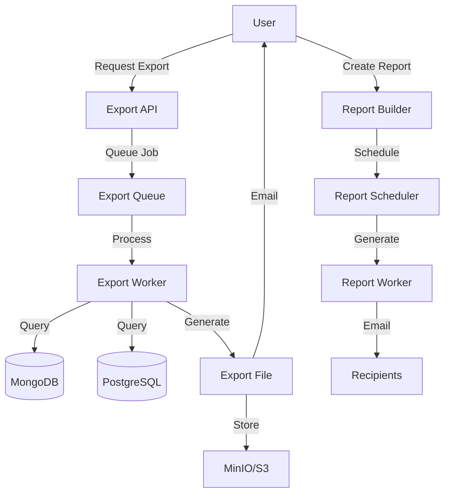

# Phase 13: Export, Reporting & Analytics

## Overview

Enable data export, custom reporting, and advanced analytics to help teams analyze trends, generate compliance reports, and make data-driven decisions. This phase transforms Replayly from a debugging tool into a comprehensive analytics platform.

**Duration Estimate**: 3-4 weeks  
**Priority**: Medium - Important for compliance and analysis  
**Dependencies**: Phase 4 (dashboard), Phase 8 (analytics)

---

## Goals

1. Implement data export in multiple formats (JSON, CSV, PDF, Excel)
2. Build custom report builder with drag-and-drop interface
3. Create scheduled reports with email delivery
4. Add funnel analysis for user journeys
5. Implement cohort analysis for user segmentation
6. Build custom dashboard builder
7. Create export job queue for large datasets
8. Add data retention and archival policies

---

## Technical Architecture

### System Flow



---

## Part 1: Data Export

### 1.1 Database Schema

**prisma/schema.prisma (additions):**

```prisma
enum ExportFormat {
  JSON
  CSV
  PDF
  EXCEL
}

enum ExportStatus {
  PENDING
  PROCESSING
  COMPLETED
  FAILED
}

model Export {
  id          String       @id @default(cuid())
  projectId   String
  userId      String
  format      ExportFormat
  status      ExportStatus @default(PENDING)
  filters     Json         // Export filters
  totalRecords Int?
  fileSize    Int?         // Bytes
  s3Key       String?
  downloadUrl String?
  expiresAt   DateTime?
  error       String?
  createdAt   DateTime     @default(now())
  completedAt DateTime?
  
  project     Project      @relation(fields: [projectId], references: [id], onDelete: Cascade)
  user        User         @relation(fields: [userId], references: [id])
  
  @@index([projectId, createdAt])
  @@index([userId])
  @@index([status])
}
```

### 1.2 Export API

**app/api/projects/[projectId]/export/route.ts:**

```typescript
import { NextRequest, NextResponse } from 'next/server'
import { verifyAuth } from '@/lib/auth/verify'
import { prisma } from '@/lib/db/postgres'
import { requireProjectPermission, Permission } from '@/lib/auth/permissions'
import { Queue } from 'bullmq'
import { getRedisConnection } from '@/lib/db/redis'

const exportQueue = new Queue('exports', {
  connection: getRedisConnection()
})

export async function POST(
  req: NextRequest,
  { params }: { params: { projectId: string } }
) {
  const user = await verifyAuth(req)
  if (!user) {
    return NextResponse.json({ error: 'Unauthorized' }, { status: 401 })
  }

  try {
    await requireProjectPermission(
      user.userId,
      params.projectId,
      Permission.PROJECT_VIEW_EVENTS
    )

    const body = await req.json()
    const { format, filters } = body

    if (!['JSON', 'CSV', 'PDF', 'EXCEL'].includes(format)) {
      return NextResponse.json(
        { error: 'Invalid export format' },
        { status: 400 }
      )
    }

    // Create export record
    const exportRecord = await prisma.export.create({
      data: {
        projectId: params.projectId,
        userId: user.userId,
        format,
        filters: filters || {},
        expiresAt: new Date(Date.now() + 7 * 24 * 60 * 60 * 1000), // 7 days
      },
    })

    // Queue export job
    await exportQueue.add('generate-export', {
      exportId: exportRecord.id,
      projectId: params.projectId,
      format,
      filters,
    })

    return NextResponse.json({ export: exportRecord })
  } catch (error: any) {
    console.error('Export error:', error)
    return NextResponse.json(
      { error: error.message || 'Failed to create export' },
      { status: 500 }
    )
  }
}

export async function GET(
  req: NextRequest,
  { params }: { params: { projectId: string } }
) {
  const user = await verifyAuth(req)
  if (!user) {
    return NextResponse.json({ error: 'Unauthorized' }, { status: 401 })
  }

  try {
    await requireProjectPermission(
      user.userId,
      params.projectId,
      Permission.PROJECT_VIEW_EVENTS
    )

    const exports = await prisma.export.findMany({
      where: {
        projectId: params.projectId,
        userId: user.userId,
      },
      orderBy: {
        createdAt: 'desc',
      },
      take: 50,
    })

    return NextResponse.json({ exports })
  } catch (error: any) {
    return NextResponse.json(
      { error: error.message || 'Failed to fetch exports' },
      { status: 500 }
    )
  }
}
```

### 1.3 Export Worker

**workers/export.ts:**

```typescript
import { Worker } from 'bullmq'
import { prisma } from '@/lib/db/postgres'
import { connectMongo } from '@/lib/db/mongodb'
import { getMinioClient } from '@/lib/storage/minio'
import { getRedisConnection } from '@/lib/db/redis'
import { 
  exportToJSON, 
  exportToCSV, 
  exportToPDF, 
  exportToExcel 
} from '@/lib/export/formatters'

export async function startExportWorker() {
  const worker = new Worker(
    'exports',
    async (job) => {
      if (job.name === 'generate-export') {
        const { exportId, projectId, format, filters } = job.data

        console.log(`Generating ${format} export for ${exportId}`)

        try {
          // Update status to processing
          await prisma.export.update({
            where: { id: exportId },
            data: { status: 'PROCESSING' },
          })

          // Fetch data from MongoDB
          const db = await connectMongo()
          const query: any = { projectId }

          // Apply filters
          if (filters.startDate) {
            query.timestamp = { $gte: new Date(filters.startDate) }
          }
          if (filters.endDate) {
            query.timestamp = { 
              ...query.timestamp, 
              $lte: new Date(filters.endDate) 
            }
          }
          if (filters.statusCodes) {
            query.statusCode = { $in: filters.statusCodes }
          }
          if (filters.routes) {
            query.route = { $in: filters.routes }
          }

          const events = await db
            .collection('events')
            .find(query)
            .limit(filters.limit || 10000)
            .toArray()

          console.log(`Found ${events.length} events to export`)

          // Generate export file
          let buffer: Buffer
          let contentType: string
          let filename: string

          switch (format) {
            case 'JSON':
              buffer = await exportToJSON(events)
              contentType = 'application/json'
              filename = `export-${exportId}.json`
              break

            case 'CSV':
              buffer = await exportToCSV(events)
              contentType = 'text/csv'
              filename = `export-${exportId}.csv`
              break

            case 'PDF':
              buffer = await exportToPDF(events)
              contentType = 'application/pdf'
              filename = `export-${exportId}.pdf`
              break

            case 'EXCEL':
              buffer = await exportToExcel(events)
              contentType = 'application/vnd.openxmlformats-officedocument.spreadsheetml.sheet'
              filename = `export-${exportId}.xlsx`
              break

            default:
              throw new Error(`Unsupported format: ${format}`)
          }

          // Upload to MinIO
          const s3Key = `exports/${projectId}/${filename}`
          const minioClient = getMinioClient()

          await minioClient.putObject(
            process.env.MINIO_BUCKET!,
            s3Key,
            buffer,
            buffer.length,
            {
              'Content-Type': contentType,
            }
          )

          // Generate presigned URL (valid for 7 days)
          const downloadUrl = await minioClient.presignedGetObject(
            process.env.MINIO_BUCKET!,
            s3Key,
            7 * 24 * 60 * 60
          )

          // Update export record
          await prisma.export.update({
            where: { id: exportId },
            data: {
              status: 'COMPLETED',
              totalRecords: events.length,
              fileSize: buffer.length,
              s3Key,
              downloadUrl,
              completedAt: new Date(),
            },
          })

          // TODO: Send email notification with download link

          console.log(`Export ${exportId} completed successfully`)
        } catch (error: any) {
          console.error(`Export ${exportId} failed:`, error)

          await prisma.export.update({
            where: { id: exportId },
            data: {
              status: 'FAILED',
              error: error.message,
              completedAt: new Date(),
            },
          })

          throw error
        }
      }
    },
    {
      connection: getRedisConnection(),
      concurrency: 3,
      attempts: 2,
      backoff: {
        type: 'exponential',
        delay: 5000,
      },
    }
  )

  console.log('Export worker started')

  return worker
}
```

### 1.4 Export Formatters

**lib/export/formatters/json.ts:**

```typescript
export async function exportToJSON(events: any[]): Promise<Buffer> {
  const json = JSON.stringify(events, null, 2)
  return Buffer.from(json, 'utf-8')
}
```

**lib/export/formatters/csv.ts:**

```typescript
import { stringify } from 'csv-stringify/sync'

export async function exportToCSV(events: any[]): Promise<Buffer> {
  // Flatten events for CSV
  const rows = events.map(event => ({
    id: event._id.toString(),
    timestamp: event.timestamp,
    method: event.method,
    route: event.route,
    statusCode: event.statusCode,
    durationMs: event.durationMs,
    userId: event.userId,
    errorMessage: event.error?.message,
    gitCommitSha: event.gitCommitSha,
  }))

  const csv = stringify(rows, {
    header: true,
    columns: [
      'id',
      'timestamp',
      'method',
      'route',
      'statusCode',
      'durationMs',
      'userId',
      'errorMessage',
      'gitCommitSha',
    ],
  })

  return Buffer.from(csv, 'utf-8')
}
```

**lib/export/formatters/excel.ts:**

```typescript
import ExcelJS from 'exceljs'

export async function exportToExcel(events: any[]): Promise<Buffer> {
  const workbook = new ExcelJS.Workbook()
  const worksheet = workbook.addWorksheet('Events')

  // Add headers
  worksheet.columns = [
    { header: 'ID', key: 'id', width: 30 },
    { header: 'Timestamp', key: 'timestamp', width: 20 },
    { header: 'Method', key: 'method', width: 10 },
    { header: 'Route', key: 'route', width: 40 },
    { header: 'Status Code', key: 'statusCode', width: 12 },
    { header: 'Duration (ms)', key: 'durationMs', width: 15 },
    { header: 'User ID', key: 'userId', width: 30 },
    { header: 'Error Message', key: 'errorMessage', width: 50 },
    { header: 'Git Commit', key: 'gitCommitSha', width: 20 },
  ]

  // Style header row
  worksheet.getRow(1).font = { bold: true }
  worksheet.getRow(1).fill = {
    type: 'pattern',
    pattern: 'solid',
    fgColor: { argb: 'FFE0E0E0' },
  }

  // Add data
  events.forEach(event => {
    worksheet.addRow({
      id: event._id.toString(),
      timestamp: new Date(event.timestamp),
      method: event.method,
      route: event.route,
      statusCode: event.statusCode,
      durationMs: event.durationMs,
      userId: event.userId,
      errorMessage: event.error?.message,
      gitCommitSha: event.gitCommitSha,
    })
  })

  // Auto-filter
  worksheet.autoFilter = {
    from: 'A1',
    to: 'I1',
  }

  // Generate buffer
  const buffer = await workbook.xlsx.writeBuffer()
  return Buffer.from(buffer)
}
```

**lib/export/formatters/pdf.ts:**

```typescript
import PDFDocument from 'pdfkit'

export async function exportToPDF(events: any[]): Promise<Buffer> {
  return new Promise((resolve, reject) => {
    const doc = new PDFDocument({ margin: 50 })
    const chunks: Buffer[] = []

    doc.on('data', chunk => chunks.push(chunk))
    doc.on('end', () => resolve(Buffer.concat(chunks)))
    doc.on('error', reject)

    // Title
    doc
      .fontSize(20)
      .text('Replayly Event Export', { align: 'center' })
      .moveDown()

    // Summary
    doc
      .fontSize(12)
      .text(`Total Events: ${events.length}`)
      .text(`Export Date: ${new Date().toLocaleString()}`)
      .moveDown()

    // Events table
    doc.fontSize(10)

    events.slice(0, 100).forEach((event, index) => {
      if (index > 0 && index % 10 === 0) {
        doc.addPage()
      }

      doc
        .text(`Event ${index + 1}`, { underline: true })
        .text(`  Timestamp: ${new Date(event.timestamp).toLocaleString()}`)
        .text(`  Method: ${event.method} ${event.route}`)
        .text(`  Status: ${event.statusCode}`)
        .text(`  Duration: ${event.durationMs}ms`)

      if (event.error) {
        doc.text(`  Error: ${event.error.message}`, { color: 'red' })
      }

      doc.moveDown(0.5)
    })

    if (events.length > 100) {
      doc
        .addPage()
        .text(`Note: Only first 100 events shown in PDF. Total: ${events.length}`)
    }

    doc.end()
  })
}
```

### 1.5 CLI Export Command

**packages/cli/src/commands/export.ts:**

```typescript
import { Command } from 'commander'
import axios from 'axios'
import fs from 'fs'
import chalk from 'chalk'
import ora from 'ora'
import { getAuthManager } from '../auth/auth-manager'

export function createExportCommand() {
  return new Command('export')
    .description('Export events to file')
    .option('-p, --project <id>', 'Project ID')
    .option('-f, --format <format>', 'Export format (json, csv, pdf, excel)', 'json')
    .option('-o, --output <file>', 'Output file path')
    .option('--start-date <date>', 'Start date (ISO format)')
    .option('--end-date <date>', 'End date (ISO format)')
    .option('--status-codes <codes>', 'Filter by status codes (comma-separated)')
    .option('--routes <routes>', 'Filter by routes (comma-separated)')
    .option('--limit <number>', 'Maximum number of events', '10000')
    .action(async (options) => {
      const authManager = getAuthManager()
      const credentials = await authManager.getCredentials()

      if (!credentials) {
        console.error(chalk.red('Not logged in. Run `replayly login` first.'))
        process.exit(1)
      }

      if (!options.project) {
        console.error(chalk.red('Project ID is required'))
        process.exit(1)
      }

      const spinner = ora('Creating export...').start()

      try {
        // Build filters
        const filters: any = {
          limit: parseInt(options.limit),
        }

        if (options.startDate) filters.startDate = options.startDate
        if (options.endDate) filters.endDate = options.endDate
        if (options.statusCodes) {
          filters.statusCodes = options.statusCodes.split(',').map(Number)
        }
        if (options.routes) {
          filters.routes = options.routes.split(',')
        }

        // Create export
        const createResponse = await axios.post(
          `${process.env.REPLAYLY_API_URL}/api/projects/${options.project}/export`,
          {
            format: options.format.toUpperCase(),
            filters,
          },
          {
            headers: {
              Authorization: `Bearer ${credentials.accessToken}`,
            },
          }
        )

        const exportId = createResponse.data.export.id

        spinner.text = 'Waiting for export to complete...'

        // Poll for completion
        let completed = false
        let attempts = 0
        const maxAttempts = 60 // 5 minutes

        while (!completed && attempts < maxAttempts) {
          await new Promise(resolve => setTimeout(resolve, 5000))

          const statusResponse = await axios.get(
            `${process.env.REPLAYLY_API_URL}/api/exports/${exportId}`,
            {
              headers: {
                Authorization: `Bearer ${credentials.accessToken}`,
              },
            }
          )

          const status = statusResponse.data.export.status

          if (status === 'COMPLETED') {
            completed = true
            const downloadUrl = statusResponse.data.export.downloadUrl

            spinner.text = 'Downloading export...'

            // Download file
            const fileResponse = await axios.get(downloadUrl, {
              responseType: 'arraybuffer',
            })

            const outputPath = options.output || `export-${exportId}.${options.format}`
            fs.writeFileSync(outputPath, fileResponse.data)

            spinner.succeed(`Export saved to ${outputPath}`)
          } else if (status === 'FAILED') {
            spinner.fail('Export failed')
            console.error(chalk.red(statusResponse.data.export.error))
            process.exit(1)
          }

          attempts++
        }

        if (!completed) {
          spinner.fail('Export timed out')
          process.exit(1)
        }
      } catch (error: any) {
        spinner.fail('Export failed')
        console.error(chalk.red(error.message))
        process.exit(1)
      }
    })
}
```

---

## Part 2: Custom Reports

### 2.1 Database Schema

**prisma/schema.prisma (additions):**

```prisma
model Report {
  id          String   @id @default(cuid())
  projectId   String
  name        String
  description String?
  config      Json     // Report configuration (charts, metrics, filters)
  createdBy   String
  createdAt   DateTime @default(now())
  updatedAt   DateTime @updatedAt
  
  project     Project  @relation(fields: [projectId], references: [id], onDelete: Cascade)
  creator     User     @relation(fields: [createdBy], references: [id])
  schedules   ReportSchedule[]
  
  @@index([projectId])
}

enum ReportFrequency {
  DAILY
  WEEKLY
  MONTHLY
}

model ReportSchedule {
  id          String          @id @default(cuid())
  reportId    String
  frequency   ReportFrequency
  recipients  String[]        // Email addresses
  enabled     Boolean         @default(true)
  lastSentAt  DateTime?
  nextSendAt  DateTime
  createdAt   DateTime        @default(now())
  
  report      Report          @relation(fields: [reportId], references: [id], onDelete: Cascade)
  
  @@index([reportId])
  @@index([nextSendAt, enabled])
}
```

### 2.2 Report Builder UI

**app/dashboard/[projectId]/reports/new/page.tsx:**

```typescript
'use client'

import { useState } from 'react'
import { Card } from '@/components/ui/card'
import { Button } from '@/components/ui/button'
import { Input } from '@/components/ui/input'
import { Label } from '@/components/ui/label'
import { Textarea } from '@/components/ui/textarea'
import { Select } from '@/components/ui/select'
import { useRouter } from 'next/navigation'

export default function NewReportPage({
  params,
}: {
  params: { projectId: string }
}) {
  const router = useRouter()
  const [name, setName] = useState('')
  const [description, setDescription] = useState('')
  const [config, setConfig] = useState({
    metrics: [],
    charts: [],
    filters: {},
  })

  async function handleSave() {
    const res = await fetch(`/api/projects/${params.projectId}/reports`, {
      method: 'POST',
      headers: { 'Content-Type': 'application/json' },
      body: JSON.stringify({
        name,
        description,
        config,
      }),
    })

    const data = await res.json()
    router.push(`/dashboard/${params.projectId}/reports/${data.report.id}`)
  }

  return (
    <div className="space-y-6">
      <div>
        <h1 className="text-2xl font-bold">Create Report</h1>
        <p className="text-gray-600">Build custom reports with metrics and charts</p>
      </div>

      <Card className="p-6">
        <div className="space-y-4">
          <div>
            <Label htmlFor="name">Report Name</Label>
            <Input
              id="name"
              value={name}
              onChange={e => setName(e.target.value)}
              placeholder="Weekly Error Summary"
            />
          </div>

          <div>
            <Label htmlFor="description">Description</Label>
            <Textarea
              id="description"
              value={description}
              onChange={e => setDescription(e.target.value)}
              placeholder="Summary of errors and performance metrics"
              rows={3}
            />
          </div>

          {/* Report builder UI would go here */}
          <div className="p-8 border-2 border-dashed rounded text-center text-gray-500">
            Report builder interface (drag-and-drop charts, metrics, filters)
          </div>

          <div className="flex gap-2">
            <Button onClick={handleSave}>Save Report</Button>
            <Button variant="outline" onClick={() => router.back()}>
              Cancel
            </Button>
          </div>
        </div>
      </Card>
    </div>
  )
}
```

### 2.3 Scheduled Reports Worker

**workers/scheduled-reports.ts:**

```typescript
import { Worker, Queue } from 'bullmq'
import { prisma } from '@/lib/db/postgres'
import { getRedisConnection } from '@/lib/db/redis'
import { generateReport } from '@/lib/reports/generator'
import { sendReportEmail } from '@/lib/email/report-email'

const reportQueue = new Queue('scheduled-reports', {
  connection: getRedisConnection()
})

export async function startScheduledReportsWorker() {
  // Worker to process scheduled reports
  const worker = new Worker(
    'scheduled-reports',
    async (job) => {
      const { scheduleId } = job.data

      console.log(`Generating scheduled report ${scheduleId}`)

      try {
        const schedule = await prisma.reportSchedule.findUnique({
          where: { id: scheduleId },
          include: {
            report: {
              include: {
                project: true,
              },
            },
          },
        })

        if (!schedule || !schedule.enabled) {
          return
        }

        // Generate report
        const reportData = await generateReport(
          schedule.report.projectId,
          schedule.report.config
        )

        // Send emails
        for (const recipient of schedule.recipients) {
          await sendReportEmail({
            to: recipient,
            reportName: schedule.report.name,
            projectName: schedule.report.project.name,
            data: reportData,
          })
        }

        // Update schedule
        const nextSendAt = calculateNextSendTime(schedule.frequency)

        await prisma.reportSchedule.update({
          where: { id: scheduleId },
          data: {
            lastSentAt: new Date(),
            nextSendAt,
          },
        })

        console.log(`Scheduled report ${scheduleId} sent successfully`)
      } catch (error) {
        console.error(`Failed to send scheduled report ${scheduleId}:`, error)
        throw error
      }
    },
    {
      connection: getRedisConnection(),
      concurrency: 2,
    }
  )

  // Scheduler to queue reports
  setInterval(async () => {
    const now = new Date()

    const dueSchedules = await prisma.reportSchedule.findMany({
      where: {
        enabled: true,
        nextSendAt: {
          lte: now,
        },
      },
    })

    for (const schedule of dueSchedules) {
      await reportQueue.add('send-report', {
        scheduleId: schedule.id,
      })
    }
  }, 60000) // Check every minute

  console.log('Scheduled reports worker started')

  return worker
}

function calculateNextSendTime(frequency: string): Date {
  const now = new Date()

  switch (frequency) {
    case 'DAILY':
      return new Date(now.getTime() + 24 * 60 * 60 * 1000)
    case 'WEEKLY':
      return new Date(now.getTime() + 7 * 24 * 60 * 60 * 1000)
    case 'MONTHLY':
      return new Date(now.getFullYear(), now.getMonth() + 1, now.getDate())
    default:
      return new Date(now.getTime() + 24 * 60 * 60 * 1000)
  }
}
```

---

## Part 3: Advanced Analytics

### 3.1 Funnel Analysis

**lib/analytics/funnels.ts:**

```typescript
import { connectMongo } from '@/lib/db/mongodb'

export interface FunnelStep {
  name: string
  route: string
  order: number
}

export interface FunnelResult {
  step: string
  count: number
  conversionRate: number
  dropoffRate: number
}

export async function analyzeFunnel(
  projectId: string,
  steps: FunnelStep[],
  startDate: Date,
  endDate: Date
): Promise<FunnelResult[]> {
  const db = await connectMongo()

  const results: FunnelResult[] = []
  let previousCount = 0

  for (const [index, step] of steps.entries()) {
    // Count events for this step
    const count = await db.collection('events').countDocuments({
      projectId,
      route: step.route,
      timestamp: {
        $gte: startDate,
        $lte: endDate,
      },
    })

    const conversionRate = index === 0 ? 100 : (count / previousCount) * 100
    const dropoffRate = 100 - conversionRate

    results.push({
      step: step.name,
      count,
      conversionRate,
      dropoffRate,
    })

    previousCount = count || 1 // Avoid division by zero
  }

  return results
}
```

### 3.2 Cohort Analysis

**lib/analytics/cohorts.ts:**

```typescript
import { connectMongo } from '@/lib/db/mongodb'

export interface CohortDefinition {
  name: string
  userFilter: any // MongoDB filter for users
  dateRange: {
    start: Date
    end: Date
  }
}

export interface CohortMetrics {
  cohortName: string
  totalUsers: number
  activeUsers: number
  avgEventsPerUser: number
  errorRate: number
  retentionRate: number
}

export async function analyzeCohort(
  projectId: string,
  cohort: CohortDefinition
): Promise<CohortMetrics> {
  const db = await connectMongo()

  // Get users in cohort
  const userEvents = await db
    .collection('events')
    .aggregate([
      {
        $match: {
          projectId,
          timestamp: {
            $gte: cohort.dateRange.start,
            $lte: cohort.dateRange.end,
          },
          ...cohort.userFilter,
        },
      },
      {
        $group: {
          _id: '$userId',
          eventCount: { $sum: 1 },
          errorCount: {
            $sum: {
              $cond: [{ $gte: ['$statusCode', 400] }, 1, 0],
            },
          },
          lastSeen: { $max: '$timestamp' },
        },
      },
    ])
    .toArray()

  const totalUsers = userEvents.length
  const totalEvents = userEvents.reduce((sum, u) => sum + u.eventCount, 0)
  const totalErrors = userEvents.reduce((sum, u) => sum + u.errorCount, 0)

  // Calculate retention (users active in last 7 days)
  const sevenDaysAgo = new Date(Date.now() - 7 * 24 * 60 * 60 * 1000)
  const activeUsers = userEvents.filter(u => u.lastSeen >= sevenDaysAgo).length

  return {
    cohortName: cohort.name,
    totalUsers,
    activeUsers,
    avgEventsPerUser: totalUsers > 0 ? totalEvents / totalUsers : 0,
    errorRate: totalEvents > 0 ? (totalErrors / totalEvents) * 100 : 0,
    retentionRate: totalUsers > 0 ? (activeUsers / totalUsers) * 100 : 0,
  }
}
```

---

## Acceptance Criteria

- [ ] Export API creating jobs successfully
- [ ] Export worker generating all formats (JSON, CSV, PDF, Excel)
- [ ] CLI export command working
- [ ] Export files stored in MinIO with presigned URLs
- [ ] Export UI showing status and download links
- [ ] Custom report builder functional
- [ ] Scheduled reports sending emails
- [ ] Funnel analysis calculating conversion rates
- [ ] Cohort analysis segmenting users
- [ ] Custom dashboard builder working
- [ ] All tests passing

---

## Testing Strategy

### Unit Tests
- Export formatters (JSON, CSV, PDF, Excel)
- Funnel calculation logic
- Cohort analysis logic
- Report generation

### Integration Tests
- Full export workflow
- Scheduled report delivery
- Large dataset exports

### Performance Tests
- Export of 100K+ events
- Report generation speed
- Memory usage during export

---

## Deployment Notes

1. Start export worker
2. Start scheduled reports worker
3. Configure email service for reports
4. Test all export formats
5. Document export limits and best practices

---

## Next Steps

After completing Phase 13, proceed to **Phase 14: Enterprise Features & Scalability** to add SSO, compliance, and on-premise deployment.
