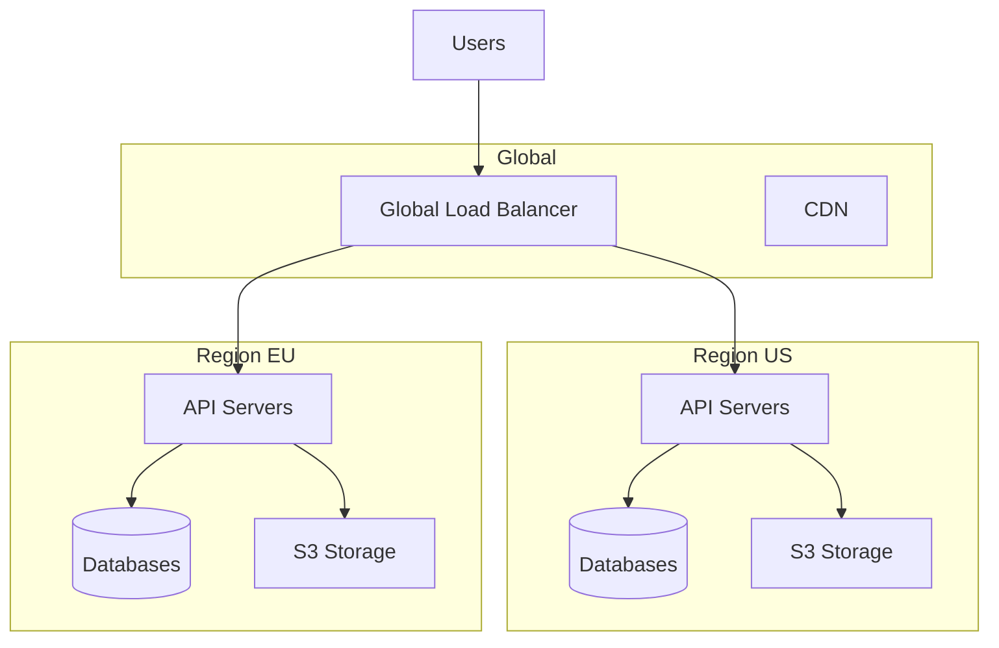

# Phase 14: Enterprise Features & Scalability

## Overview

Add enterprise-grade features including SSO, GDPR compliance, multi-region support, horizontal scalability, and on-premise deployment options. This phase transforms Replayly into an enterprise-ready platform that can handle large-scale deployments and meet strict security and compliance requirements.

**Duration Estimate**: 6-8 weeks  
**Priority**: Lower - Enterprise tier features  
**Dependencies**: All previous phases

---

## Goals

1. Implement SSO (SAML 2.0 and OIDC)
2. Add 2FA/MFA support
3. Build GDPR compliance features (data deletion, export, consent)
4. Implement data residency and multi-region support
5. Add horizontal scaling capabilities
6. Optimize database performance (read replicas, sharding)
7. Create on-premise deployment package
8. Build compliance dashboard and audit reports
9. Add IP allowlisting and advanced security features
10. Implement distributed tracing and monitoring

---

## Technical Architecture

### Multi-Region Architecture



---

## Part 1: Enterprise Authentication

### 1.1 SAML 2.0 Integration

**lib/auth/saml.ts:**

```typescript
import { SAML } from '@node-saml/node-saml'
import { prisma } from '@/lib/db/postgres'

export interface SAMLConfig {
  entryPoint: string // IdP SSO URL
  issuer: string // SP entity ID
  cert: string // IdP certificate
  callbackUrl: string // SP callback URL
  signatureAlgorithm?: string
  digestAlgorithm?: string
}

export class SAMLProvider {
  private saml: SAML

  constructor(config: SAMLConfig) {
    this.saml = new SAML({
      entryPoint: config.entryPoint,
      issuer: config.issuer,
      cert: config.cert,
      callbackUrl: config.callbackUrl,
      signatureAlgorithm: config.signatureAlgorithm || 'sha256',
      digestAlgorithm: config.digestAlgorithm || 'sha256',
    })
  }

  /**
   * Generate SAML authentication request URL
   */
  async getLoginUrl(): Promise<string> {
    return new Promise((resolve, reject) => {
      this.saml.getAuthorizeUrl({}, (err, url) => {
        if (err) reject(err)
        else resolve(url!)
      })
    })
  }

  /**
   * Validate SAML response
   */
  async validateResponse(body: any): Promise<{
    email: string
    firstName?: string
    lastName?: string
    attributes: any
  }> {
    return new Promise((resolve, reject) => {
      this.saml.validatePostResponse(body, (err, profile) => {
        if (err) {
          reject(err)
        } else if (!profile) {
          reject(new Error('No profile returned'))
        } else {
          resolve({
            email: profile.email || profile.nameID,
            firstName: profile.firstName,
            lastName: profile.lastName,
            attributes: profile.attributes,
          })
        }
      })
    })
  }

  /**
   * Generate SAML metadata
   */
  async getMetadata(): Promise<string> {
    return this.saml.generateServiceProviderMetadata(
      null, // decryption cert
      null  // signing cert
    )
  }
}
```

**app/api/auth/saml/[orgId]/login/route.ts:**

```typescript
import { NextRequest, NextResponse } from 'next/server'
import { prisma } from '@/lib/db/postgres'
import { SAMLProvider } from '@/lib/auth/saml'

export async function GET(
  req: NextRequest,
  { params }: { params: { orgId: string } }
) {
  try {
    // Get organization's SAML config
    const org = await prisma.organization.findUnique({
      where: { id: params.orgId },
      include: {
        ssoConfig: true,
      },
    })

    if (!org || !org.ssoConfig || org.ssoConfig.provider !== 'SAML') {
      return NextResponse.json(
        { error: 'SAML not configured for this organization' },
        { status: 400 }
      )
    }

    const samlProvider = new SAMLProvider(org.ssoConfig.config as any)
    const loginUrl = await samlProvider.getLoginUrl()

    return NextResponse.redirect(loginUrl)
  } catch (error: any) {
    console.error('SAML login error:', error)
    return NextResponse.json(
      { error: error.message || 'SAML login failed' },
      { status: 500 }
    )
  }
}
```

**app/api/auth/saml/[orgId]/callback/route.ts:**

```typescript
import { NextRequest, NextResponse } from 'next/server'
import { prisma } from '@/lib/db/postgres'
import { SAMLProvider } from '@/lib/auth/saml'
import { signJWT } from '@/lib/auth/jwt'

export async function POST(
  req: NextRequest,
  { params }: { params: { orgId: string } }
) {
  try {
    const body = await req.formData()

    // Get organization's SAML config
    const org = await prisma.organization.findUnique({
      where: { id: params.orgId },
      include: {
        ssoConfig: true,
      },
    })

    if (!org || !org.ssoConfig) {
      return NextResponse.json(
        { error: 'SAML not configured' },
        { status: 400 }
      )
    }

    const samlProvider = new SAMLProvider(org.ssoConfig.config as any)
    const profile = await samlProvider.validateResponse(body)

    // Find or create user
    let user = await prisma.user.findUnique({
      where: { email: profile.email },
    })

    if (!user) {
      user = await prisma.user.create({
        data: {
          email: profile.email,
          name: profile.firstName && profile.lastName
            ? `${profile.firstName} ${profile.lastName}`
            : profile.email,
        },
      })

      // Add to organization
      await prisma.organizationMember.create({
        data: {
          organizationId: org.id,
          userId: user.id,
          role: 'MEMBER',
        },
      })
    }

    // Generate JWT
    const token = await signJWT({
      userId: user.id,
      email: user.email,
    })

    // Set cookie and redirect
    const response = NextResponse.redirect(
      `${process.env.NEXT_PUBLIC_APP_URL}/dashboard`
    )
    response.cookies.set('token', token, {
      httpOnly: true,
      secure: process.env.NODE_ENV === 'production',
      sameSite: 'lax',
      maxAge: 30 * 24 * 60 * 60, // 30 days
    })

    return response
  } catch (error: any) {
    console.error('SAML callback error:', error)
    return NextResponse.redirect(
      `${process.env.NEXT_PUBLIC_APP_URL}/login?error=saml_failed`
    )
  }
}
```

### 1.2 OIDC Integration

**lib/auth/oidc.ts:**

```typescript
import { Issuer, Client, generators } from 'openid-client'

export interface OIDCConfig {
  issuer: string
  clientId: string
  clientSecret: string
  redirectUri: string
  scopes?: string[]
}

export class OIDCProvider {
  private client: Client | null = null
  private config: OIDCConfig

  constructor(config: OIDCConfig) {
    this.config = config
  }

  async initialize() {
    const issuer = await Issuer.discover(this.config.issuer)
    this.client = new issuer.Client({
      client_id: this.config.clientId,
      client_secret: this.config.clientSecret,
      redirect_uris: [this.config.redirectUri],
      response_types: ['code'],
    })
  }

  async getAuthorizationUrl(state: string, nonce: string): Promise<string> {
    if (!this.client) await this.initialize()

    return this.client!.authorizationUrl({
      scope: this.config.scopes?.join(' ') || 'openid email profile',
      state,
      nonce,
    })
  }

  async handleCallback(params: any, nonce: string) {
    if (!this.client) await this.initialize()

    const tokenSet = await this.client!.callback(
      this.config.redirectUri,
      params,
      { nonce }
    )

    const userinfo = await this.client!.userinfo(tokenSet.access_token!)

    return {
      email: userinfo.email as string,
      name: userinfo.name as string,
      sub: userinfo.sub,
      tokenSet,
    }
  }
}
```

### 1.3 Multi-Factor Authentication

**lib/auth/mfa.ts:**

```typescript
import { authenticator } from 'otplib'
import QRCode from 'qrcode'
import { prisma } from '@/lib/db/postgres'

export class MFAManager {
  /**
   * Generate MFA secret for user
   */
  async generateSecret(userId: string): Promise<{
    secret: string
    qrCode: string
  }> {
    const secret = authenticator.generateSecret()

    const user = await prisma.user.findUnique({
      where: { id: userId },
    })

    if (!user) {
      throw new Error('User not found')
    }

    const otpauth = authenticator.keyuri(
      user.email,
      'Replayly',
      secret
    )

    const qrCode = await QRCode.toDataURL(otpauth)

    return {
      secret,
      qrCode,
    }
  }

  /**
   * Enable MFA for user
   */
  async enableMFA(userId: string, secret: string, token: string): Promise<void> {
    // Verify token
    const isValid = authenticator.verify({
      token,
      secret,
    })

    if (!isValid) {
      throw new Error('Invalid MFA token')
    }

    // Store encrypted secret
    await prisma.user.update({
      where: { id: userId },
      data: {
        mfaEnabled: true,
        mfaSecret: secret, // Should be encrypted in production
      },
    })
  }

  /**
   * Verify MFA token
   */
  async verifyToken(userId: string, token: string): Promise<boolean> {
    const user = await prisma.user.findUnique({
      where: { id: userId },
    })

    if (!user || !user.mfaEnabled || !user.mfaSecret) {
      return false
    }

    return authenticator.verify({
      token,
      secret: user.mfaSecret,
    })
  }

  /**
   * Generate backup codes
   */
  async generateBackupCodes(userId: string): Promise<string[]> {
    const codes: string[] = []

    for (let i = 0; i < 10; i++) {
      codes.push(
        Math.random().toString(36).substring(2, 10).toUpperCase()
      )
    }

    // Store hashed codes
    await prisma.user.update({
      where: { id: userId },
      data: {
        mfaBackupCodes: codes, // Should be hashed in production
      },
    })

    return codes
  }
}
```

---

## Part 2: GDPR Compliance

### 2.1 Data Deletion (Right to be Forgotten)

**lib/compliance/gdpr.ts:**

```typescript
import { prisma } from '@/lib/db/postgres'
import { connectMongo } from '@/lib/db/mongodb'
import { getMinioClient } from '@/lib/storage/minio'

export class GDPRCompliance {
  /**
   * Delete all user data
   */
  async deleteUserData(userId: string): Promise<void> {
    console.log(`Deleting all data for user ${userId}`)

    // Delete from PostgreSQL
    await prisma.$transaction([
      // Delete user's events metadata
      prisma.activityLog.deleteMany({ where: { userId } }),
      prisma.auditLog.deleteMany({ where: { userId } }),
      prisma.comment.deleteMany({ where: { authorId: userId } }),
      prisma.alertRule.deleteMany({ where: { createdBy: userId } }),
      prisma.export.deleteMany({ where: { userId } }),
      prisma.replayHistory.deleteMany({ where: { userId } }),
      
      // Remove from organizations
      prisma.organizationMember.deleteMany({ where: { userId } }),
      prisma.projectMember.deleteMany({ where: { userId } }),
      
      // Delete user
      prisma.user.delete({ where: { id: userId } }),
    ])

    // Delete from MongoDB (anonymize events)
    const db = await connectMongo()
    await db.collection('events').updateMany(
      { userId },
      {
        $set: {
          userId: 'deleted-user',
          userEmail: 'deleted@example.com',
          userName: 'Deleted User',
        },
      }
    )

    // Delete from MinIO (user-specific files)
    const minioClient = getMinioClient()
    const objects = minioClient.listObjects(
      process.env.MINIO_BUCKET!,
      `users/${userId}/`,
      true
    )

    for await (const obj of objects) {
      await minioClient.removeObject(process.env.MINIO_BUCKET!, obj.name)
    }

    console.log(`User ${userId} data deleted successfully`)
  }

  /**
   * Export all user data
   */
  async exportUserData(userId: string): Promise<any> {
    const user = await prisma.user.findUnique({
      where: { id: userId },
      include: {
        organizationMembers: {
          include: {
            organization: true,
          },
        },
        projectMembers: {
          include: {
            project: true,
          },
        },
        activityLogs: true,
        comments: true,
      },
    })

    // Get events from MongoDB
    const db = await connectMongo()
    const events = await db
      .collection('events')
      .find({ userId })
      .limit(10000)
      .toArray()

    return {
      user: {
        id: user?.id,
        email: user?.email,
        name: user?.name,
        createdAt: user?.createdAt,
      },
      organizations: user?.organizationMembers.map(m => ({
        id: m.organization.id,
        name: m.organization.name,
        role: m.role,
      })),
      projects: user?.projectMembers.map(m => ({
        id: m.project.id,
        name: m.project.name,
        role: m.role,
      })),
      activityLogs: user?.activityLogs,
      comments: user?.comments,
      events: events.map(e => ({
        id: e._id.toString(),
        timestamp: e.timestamp,
        route: e.route,
        method: e.method,
        statusCode: e.statusCode,
      })),
    }
  }

  /**
   * Anonymize user data
   */
  async anonymizeUser(userId: string): Promise<void> {
    // Update user to anonymized state
    await prisma.user.update({
      where: { id: userId },
      data: {
        email: `anonymized-${userId}@example.com`,
        name: 'Anonymized User',
        mfaEnabled: false,
        mfaSecret: null,
      },
    })

    // Anonymize events
    const db = await connectMongo()
    await db.collection('events').updateMany(
      { userId },
      {
        $set: {
          userId: `anonymized-${userId}`,
          userEmail: null,
          userName: null,
        },
      }
    )
  }
}
```

**app/api/compliance/delete-user/route.ts:**

```typescript
import { NextRequest, NextResponse } from 'next/server'
import { verifyAuth } from '@/lib/auth/verify'
import { GDPRCompliance } from '@/lib/compliance/gdpr'
import { Queue } from 'bullmq'
import { getRedisConnection } from '@/lib/db/redis'

const complianceQueue = new Queue('compliance', {
  connection: getRedisConnection()
})

export async function POST(req: NextRequest) {
  const user = await verifyAuth(req)
  if (!user) {
    return NextResponse.json({ error: 'Unauthorized' }, { status: 401 })
  }

  try {
    const body = await req.json()
    const { confirmEmail } = body

    // Verify email confirmation
    if (confirmEmail !== user.email) {
      return NextResponse.json(
        { error: 'Email confirmation does not match' },
        { status: 400 }
      )
    }

    // Queue deletion job
    await complianceQueue.add('delete-user', {
      userId: user.userId,
    })

    return NextResponse.json({
      message: 'Account deletion initiated. This may take a few minutes.',
    })
  } catch (error: any) {
    console.error('Delete user error:', error)
    return NextResponse.json(
      { error: error.message || 'Failed to delete user' },
      { status: 500 }
    )
  }
}
```

### 2.2 Data Retention Policies

**lib/compliance/retention.ts:**

```typescript
import { connectMongo } from '@/lib/db/mongodb'
import { prisma } from '@/lib/db/postgres'
import { getMinioClient } from '@/lib/storage/minio'

export class DataRetentionManager {
  /**
   * Delete events older than retention period
   */
  async enforceRetention(projectId: string, retentionDays: number): Promise<void> {
    const cutoffDate = new Date(Date.now() - retentionDays * 24 * 60 * 60 * 1000)

    console.log(`Enforcing ${retentionDays} day retention for project ${projectId}`)

    // Get events to delete
    const db = await connectMongo()
    const eventsToDelete = await db
      .collection('events')
      .find({
        projectId,
        timestamp: { $lt: cutoffDate },
      })
      .toArray()

    console.log(`Found ${eventsToDelete.length} events to delete`)

    // Delete event payloads from MinIO
    const minioClient = getMinioClient()
    for (const event of eventsToDelete) {
      if (event.s3Pointer) {
        try {
          await minioClient.removeObject(
            process.env.MINIO_BUCKET!,
            event.s3Pointer
          )
        } catch (error) {
          console.error(`Failed to delete ${event.s3Pointer}:`, error)
        }
      }
    }

    // Delete from MongoDB
    const result = await db.collection('events').deleteMany({
      projectId,
      timestamp: { $lt: cutoffDate },
    })

    console.log(`Deleted ${result.deletedCount} events`)

    // Delete from OpenSearch
    // TODO: Implement OpenSearch deletion

    // Update analytics (keep aggregated data)
    // Daily stats are kept for longer periods
  }

  /**
   * Archive old events to cold storage
   */
  async archiveOldEvents(
    projectId: string,
    archiveAfterDays: number
  ): Promise<void> {
    const cutoffDate = new Date(Date.now() - archiveAfterDays * 24 * 60 * 60 * 1000)

    // Move events to archive collection
    const db = await connectMongo()
    const eventsToArchive = await db
      .collection('events')
      .find({
        projectId,
        timestamp: { $lt: cutoffDate },
      })
      .toArray()

    if (eventsToArchive.length > 0) {
      await db.collection('events_archive').insertMany(eventsToArchive)
      await db.collection('events').deleteMany({
        _id: { $in: eventsToArchive.map(e => e._id) },
      })

      console.log(`Archived ${eventsToArchive.length} events`)
    }
  }
}
```

---

## Part 3: Horizontal Scaling

### 3.1 Load Balancing Configuration

**deployment/nginx.conf:**

```nginx
upstream replayly_api {
    least_conn;
    server api1:3000 weight=1;
    server api2:3000 weight=1;
    server api3:3000 weight=1;
    
    keepalive 32;
}

upstream replayly_workers {
    server worker1:3001;
    server worker2:3001;
    server worker3:3001;
}

server {
    listen 80;
    server_name replayly.dev;

    # API routes
    location /api/ {
        proxy_pass http://replayly_api;
        proxy_http_version 1.1;
        proxy_set_header Upgrade $http_upgrade;
        proxy_set_header Connection 'upgrade';
        proxy_set_header Host $host;
        proxy_set_header X-Real-IP $remote_addr;
        proxy_set_header X-Forwarded-For $proxy_add_x_forwarded_for;
        proxy_cache_bypass $http_upgrade;
        
        # Timeouts
        proxy_connect_timeout 60s;
        proxy_send_timeout 60s;
        proxy_read_timeout 60s;
    }

    # WebSocket routes
    location /api/ws {
        proxy_pass http://replayly_api;
        proxy_http_version 1.1;
        proxy_set_header Upgrade $http_upgrade;
        proxy_set_header Connection "upgrade";
        proxy_set_header Host $host;
        proxy_read_timeout 86400;
    }

    # Static files
    location /_next/static/ {
        proxy_pass http://replayly_api;
        proxy_cache static_cache;
        proxy_cache_valid 200 1d;
        add_header Cache-Control "public, immutable";
    }
}
```

### 3.2 Database Read Replicas

**lib/db/postgres-replicas.ts:**

```typescript
import { PrismaClient } from '@prisma/client'

// Primary database (writes)
export const prismaPrimary = new PrismaClient({
  datasources: {
    db: {
      url: process.env.DATABASE_URL,
    },
  },
})

// Read replica (reads)
export const prismaReplica = new PrismaClient({
  datasources: {
    db: {
      url: process.env.DATABASE_REPLICA_URL || process.env.DATABASE_URL,
    },
  },
})

/**
 * Smart query router
 */
export function getPrismaClient(operation: 'read' | 'write'): PrismaClient {
  if (operation === 'write') {
    return prismaPrimary
  }

  // Use replica for reads if available
  return process.env.DATABASE_REPLICA_URL ? prismaReplica : prismaPrimary
}
```

### 3.3 Redis Cluster

**lib/db/redis-cluster.ts:**

```typescript
import Redis from 'ioredis'

export function createRedisCluster() {
  const cluster = new Redis.Cluster([
    {
      host: process.env.REDIS_NODE1_HOST || 'localhost',
      port: parseInt(process.env.REDIS_NODE1_PORT || '6379'),
    },
    {
      host: process.env.REDIS_NODE2_HOST || 'localhost',
      port: parseInt(process.env.REDIS_NODE2_PORT || '6380'),
    },
    {
      host: process.env.REDIS_NODE3_HOST || 'localhost',
      port: parseInt(process.env.REDIS_NODE3_PORT || '6381'),
    },
  ], {
    redisOptions: {
      password: process.env.REDIS_PASSWORD,
    },
    clusterRetryStrategy: (times) => {
      const delay = Math.min(100 * times, 2000)
      return delay
    },
  })

  cluster.on('error', (err) => {
    console.error('Redis Cluster Error:', err)
  })

  cluster.on('connect', () => {
    console.log('Connected to Redis Cluster')
  })

  return cluster
}
```

---

## Part 4: On-Premise Deployment

### 4.1 Docker Compose for Production

**deployment/docker-compose.prod.yml:**

```yaml
version: '3.8'

services:
  # API Servers (3 replicas)
  api:
    image: replayly/api:latest
    deploy:
      replicas: 3
      resources:
        limits:
          cpus: '2'
          memory: 4G
        reservations:
          cpus: '1'
          memory: 2G
    environment:
      - NODE_ENV=production
      - DATABASE_URL=${DATABASE_URL}
      - MONGODB_URI=${MONGODB_URI}
      - REDIS_URL=${REDIS_URL}
      - MINIO_ENDPOINT=${MINIO_ENDPOINT}
      - JWT_SECRET=${JWT_SECRET}
    depends_on:
      - postgres
      - mongodb
      - redis
      - minio
    networks:
      - replayly

  # Worker Servers (3 replicas)
  worker:
    image: replayly/worker:latest
    deploy:
      replicas: 3
      resources:
        limits:
          cpus: '2'
          memory: 4G
    environment:
      - NODE_ENV=production
      - DATABASE_URL=${DATABASE_URL}
      - MONGODB_URI=${MONGODB_URI}
      - REDIS_URL=${REDIS_URL}
      - MINIO_ENDPOINT=${MINIO_ENDPOINT}
    depends_on:
      - postgres
      - mongodb
      - redis
      - minio
    networks:
      - replayly

  # PostgreSQL with replication
  postgres:
    image: postgres:15-alpine
    volumes:
      - postgres_data:/var/lib/postgresql/data
    environment:
      - POSTGRES_DB=replayly
      - POSTGRES_USER=${POSTGRES_USER}
      - POSTGRES_PASSWORD=${POSTGRES_PASSWORD}
    networks:
      - replayly

  # MongoDB with replica set
  mongodb:
    image: mongo:7
    command: mongod --replSet rs0
    volumes:
      - mongodb_data:/data/db
    environment:
      - MONGO_INITDB_ROOT_USERNAME=${MONGO_USER}
      - MONGO_INITDB_ROOT_PASSWORD=${MONGO_PASSWORD}
    networks:
      - replayly

  # Redis Cluster
  redis:
    image: redis:7-alpine
    command: redis-server --appendonly yes --requirepass ${REDIS_PASSWORD}
    volumes:
      - redis_data:/data
    networks:
      - replayly

  # MinIO
  minio:
    image: minio/minio:latest
    command: server /data --console-address ":9001"
    volumes:
      - minio_data:/data
    environment:
      - MINIO_ROOT_USER=${MINIO_ROOT_USER}
      - MINIO_ROOT_PASSWORD=${MINIO_ROOT_PASSWORD}
    networks:
      - replayly

  # OpenSearch
  opensearch:
    image: opensearchproject/opensearch:2
    environment:
      - discovery.type=single-node
      - OPENSEARCH_JAVA_OPTS=-Xms2g -Xmx2g
    volumes:
      - opensearch_data:/usr/share/opensearch/data
    networks:
      - replayly

  # Nginx Load Balancer
  nginx:
    image: nginx:alpine
    ports:
      - "80:80"
      - "443:443"
    volumes:
      - ./nginx.conf:/etc/nginx/nginx.conf:ro
      - ./ssl:/etc/nginx/ssl:ro
    depends_on:
      - api
    networks:
      - replayly

volumes:
  postgres_data:
  mongodb_data:
  redis_data:
  minio_data:
  opensearch_data:

networks:
  replayly:
    driver: bridge
```

### 4.2 Kubernetes Helm Chart

**deployment/kubernetes/values.yaml:**

```yaml
replicaCount:
  api: 3
  worker: 3

image:
  repository: replayly/api
  tag: latest
  pullPolicy: IfNotPresent

resources:
  api:
    limits:
      cpu: 2000m
      memory: 4Gi
    requests:
      cpu: 1000m
      memory: 2Gi
  worker:
    limits:
      cpu: 2000m
      memory: 4Gi
    requests:
      cpu: 1000m
      memory: 2Gi

autoscaling:
  enabled: true
  minReplicas: 3
  maxReplicas: 10
  targetCPUUtilizationPercentage: 70
  targetMemoryUtilizationPercentage: 80

postgresql:
  enabled: true
  auth:
    username: replayly
    password: changeme
    database: replayly
  primary:
    persistence:
      size: 100Gi
  readReplicas:
    replicaCount: 2

mongodb:
  enabled: true
  auth:
    rootPassword: changeme
  replicaSet:
    enabled: true
    replicas:
      secondary: 2
  persistence:
    size: 500Gi

redis:
  enabled: true
  auth:
    password: changeme
  master:
    persistence:
      size: 20Gi
  replica:
    replicaCount: 2

minio:
  enabled: true
  rootUser: admin
  rootPassword: changeme
  persistence:
    size: 1Ti

ingress:
  enabled: true
  className: nginx
  hosts:
    - host: replayly.example.com
      paths:
        - path: /
          pathType: Prefix
  tls:
    - secretName: replayly-tls
      hosts:
        - replayly.example.com
```

---

## Acceptance Criteria

- [ ] SAML 2.0 authentication working
- [ ] OIDC authentication working
- [ ] 2FA/MFA functional
- [ ] GDPR data deletion implemented
- [ ] Data export for compliance
- [ ] Data retention policies enforced
- [ ] Horizontal scaling with load balancer
- [ ] Database read replicas configured
- [ ] Redis cluster setup
- [ ] On-premise Docker Compose working
- [ ] Kubernetes Helm chart deployable
- [ ] IP allowlisting functional
- [ ] Compliance dashboard complete
- [ ] All tests passing

---

## Testing Strategy

### Unit Tests
- SAML/OIDC authentication flow
- MFA token generation and verification
- Data deletion logic
- Retention policy enforcement

### Integration Tests
- Full SSO flow
- Data export and deletion
- Multi-instance deployment
- Load balancing

### Load Tests
- 10K+ concurrent users
- 1M+ events per day
- Database replication lag
- Redis cluster performance

---

## Deployment Notes

1. Configure SSO providers (SAML/OIDC)
2. Set up database replication
3. Deploy Redis cluster
4. Configure load balancer
5. Test failover scenarios
6. Document on-premise installation
7. Create compliance reports

---

## Next Steps

After completing Phase 14, proceed to **Phase 15: Developer Experience & Polish** to finalize documentation, onboarding, and developer tools.
