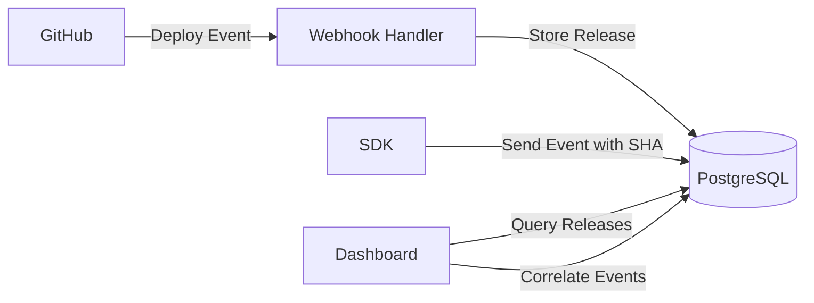

# Phase 6: Release Monitoring & Git Integration

## Overview

Implement release tracking and Git integration to correlate errors with deployments. This enables developers to identify which code changes introduced bugs and detect error spikes after deployments.

**Duration Estimate**: Enhanced debugging context  
**Priority**: High - Valuable for production debugging  
**Dependencies**: Phase 1 (database), Phase 4 (dashboard)

---

## Goals

1. Set up GitHub OAuth app for repository access
2. Implement webhook handler for deployment events
3. Build release tracking system
4. Create deployment timeline in dashboard
5. Implement error spike detection after deploys
6. Build version comparison view
7. Correlate events with Git commit SHA
8. Display release information in event details

---

## Technical Architecture

### System Flow



---

## GitHub Integration

### GitHub OAuth App Setup

1. Create GitHub OAuth App:
   - Go to GitHub Settings → Developer settings → OAuth Apps
   - Application name: "Replayly"
   - Homepage URL: `https://replayly.dev`
   - Authorization callback URL: `https://replayly.dev/api/auth/github/callback`

2. Store credentials in environment:

```bash
GITHUB_CLIENT_ID=your_client_id
GITHUB_CLIENT_SECRET=your_client_secret
GITHUB_WEBHOOK_SECRET=your_webhook_secret
```

### GitHub OAuth Flow

**app/api/auth/github/route.ts:**

```typescript
import { NextRequest, NextResponse } from 'next/server'
import { verifyAuth } from '@/lib/auth/verify'

export async function GET(req: NextRequest) {
  const user = await verifyAuth(req)
  if (!user) {
    return NextResponse.json({ error: 'Unauthorized' }, { status: 401 })
  }
  
  const projectId = req.nextUrl.searchParams.get('projectId')
  if (!projectId) {
    return NextResponse.json({ error: 'Missing projectId' }, { status: 400 })
  }
  
  // Store state for callback
  const state = Buffer.from(
    JSON.stringify({ userId: user.userId, projectId })
  ).toString('base64')
  
  const githubAuthUrl = new URL('https://github.com/login/oauth/authorize')
  githubAuthUrl.searchParams.set('client_id', process.env.GITHUB_CLIENT_ID!)
  githubAuthUrl.searchParams.set('redirect_uri', `${process.env.NEXT_PUBLIC_APP_URL}/api/auth/github/callback`)
  githubAuthUrl.searchParams.set('scope', 'repo,read:org')
  githubAuthUrl.searchParams.set('state', state)
  
  return NextResponse.redirect(githubAuthUrl.toString())
}
```

**app/api/auth/github/callback/route.ts:**

```typescript
import { NextRequest, NextResponse } from 'next/server'
import { prisma } from '@/lib/db/postgres'
import axios from 'axios'

export async function GET(req: NextRequest) {
  const code = req.nextUrl.searchParams.get('code')
  const state = req.nextUrl.searchParams.get('state')
  
  if (!code || !state) {
    return NextResponse.redirect(`${process.env.NEXT_PUBLIC_APP_URL}/error?message=Invalid callback`)
  }
  
  try {
    // Decode state
    const { userId, projectId } = JSON.parse(
      Buffer.from(state, 'base64').toString()
    )
    
    // Exchange code for access token
    const tokenResponse = await axios.post(
      'https://github.com/login/oauth/access_token',
      {
        client_id: process.env.GITHUB_CLIENT_ID,
        client_secret: process.env.GITHUB_CLIENT_SECRET,
        code,
      },
      {
        headers: { Accept: 'application/json' },
      }
    )
    
    const accessToken = tokenResponse.data.access_token
    
    // Get user's GitHub info
    const userResponse = await axios.get('https://api.github.com/user', {
      headers: { Authorization: `Bearer ${accessToken}` },
    })
    
    // Store GitHub integration
    await prisma.gitHubIntegration.create({
      data: {
        projectId,
        userId,
        accessToken: encryptToken(accessToken),
        githubUserId: userResponse.data.id,
        githubUsername: userResponse.data.login,
      },
    })
    
    return NextResponse.redirect(
      `${process.env.NEXT_PUBLIC_APP_URL}/dashboard/${projectId}/settings?github=connected`
    )
    
  } catch (error: any) {
    console.error('[GitHub OAuth] Error:', error)
    return NextResponse.redirect(
      `${process.env.NEXT_PUBLIC_APP_URL}/error?message=GitHub connection failed`
    )
  }
}

function encryptToken(token: string): string {
  // Use encryption library to encrypt token
  // For now, just return as-is (implement proper encryption in production)
  return token
}
```

---

## Webhook Handler

### GitHub Webhook Setup

**app/api/webhooks/github/route.ts:**

```typescript
import { NextRequest, NextResponse } from 'next/server'
import { verifyWebhookSignature } from '@/lib/integrations/github/verify'
import { handleDeploymentEvent } from '@/lib/integrations/github/handlers'
import { prisma } from '@/lib/db/postgres'

export async function POST(req: NextRequest) {
  try {
    // Verify webhook signature
    const signature = req.headers.get('x-hub-signature-256')
    const body = await req.text()
    
    if (!verifyWebhookSignature(body, signature!)) {
      return NextResponse.json(
        { error: 'Invalid signature' },
        { status: 401 }
      )
    }
    
    const event = JSON.parse(body)
    const eventType = req.headers.get('x-github-event')
    
    // Handle different event types
    switch (eventType) {
      case 'deployment':
        await handleDeploymentEvent(event)
        break
        
      case 'deployment_status':
        await handleDeploymentStatusEvent(event)
        break
        
      case 'push':
        await handlePushEvent(event)
        break
        
      default:
        console.log(`[GitHub Webhook] Unhandled event type: ${eventType}`)
    }
    
    return NextResponse.json({ success: true })
    
  } catch (error: any) {
    console.error('[GitHub Webhook] Error:', error)
    return NextResponse.json(
      { error: 'Internal server error' },
      { status: 500 }
    )
  }
}

async function handleDeploymentStatusEvent(event: any) {
  if (event.deployment_status.state !== 'success') {
    return
  }
  
  // Find project by repository
  const integration = await prisma.gitHubIntegration.findFirst({
    where: {
      githubRepoId: event.repository.id,
    },
  })
  
  if (!integration) {
    console.log('[GitHub Webhook] No integration found for repository')
    return
  }
  
  // Create release record
  await prisma.release.create({
    data: {
      projectId: integration.projectId,
      version: event.deployment.ref,
      commitSha: event.deployment.sha,
      branch: event.deployment.ref,
      author: event.deployment.creator.login,
      deployedAt: new Date(),
      environment: event.deployment.environment,
    },
  })
  
  console.log(`[GitHub Webhook] Release created: ${event.deployment.sha}`)
}

async function handlePushEvent(event: any) {
  // Store commit information for future correlation
  const integration = await prisma.gitHubIntegration.findFirst({
    where: {
      githubRepoId: event.repository.id,
    },
  })
  
  if (!integration) return
  
  // Store commits
  for (const commit of event.commits) {
    await prisma.commit.upsert({
      where: {
        projectId_sha: {
          projectId: integration.projectId,
          sha: commit.id,
        },
      },
      create: {
        projectId: integration.projectId,
        sha: commit.id,
        message: commit.message,
        author: commit.author.name,
        timestamp: new Date(commit.timestamp),
        url: commit.url,
      },
      update: {},
    })
  }
}
```

### Webhook Signature Verification

**lib/integrations/github/verify.ts:**

```typescript
import crypto from 'crypto'

export function verifyWebhookSignature(
  payload: string,
  signature: string
): boolean {
  if (!signature) return false
  
  const secret = process.env.GITHUB_WEBHOOK_SECRET!
  const hmac = crypto.createHmac('sha256', secret)
  const digest = 'sha256=' + hmac.update(payload).digest('hex')
  
  return crypto.timingSafeEqual(
    Buffer.from(signature),
    Buffer.from(digest)
  )
}
```

---

## Database Schema Updates

### Prisma Schema Additions

**prisma/schema.prisma (add to existing):**

```prisma
// GitHub Integration
model GitHubIntegration {
  id              String   @id @default(cuid())
  projectId       String
  userId          String
  accessToken     String   // Encrypted
  githubUserId    Int
  githubUsername  String
  githubRepoId    Int?
  githubRepoName  String?
  createdAt       DateTime @default(now())
  updatedAt       DateTime @updatedAt
  
  project         Project  @relation(fields: [projectId], references: [id], onDelete: Cascade)
  user            User     @relation(fields: [userId], references: [id], onDelete: Cascade)
  
  @@unique([projectId])
  @@map("github_integrations")
}

// Commits
model Commit {
  id          String   @id @default(cuid())
  projectId   String
  sha         String
  message     String
  author      String
  timestamp   DateTime
  url         String
  createdAt   DateTime @default(now())
  
  project     Project  @relation(fields: [projectId], references: [id], onDelete: Cascade)
  
  @@unique([projectId, sha])
  @@index([projectId, timestamp])
  @@map("commits")
}

// Update Release model
model Release {
  id          String   @id @default(cuid())
  projectId   String
  version     String
  commitSha   String
  branch      String?
  author      String?
  deployedAt  DateTime @default(now())
  environment String   @default("production")
  
  project     Project  @relation(fields: [projectId], references: [id], onDelete: Cascade)
  
  @@index([projectId, deployedAt])
  @@map("releases")
}
```

---

## Release APIs

### List Releases

**app/api/projects/[projectId]/releases/route.ts:**

```typescript
import { NextRequest, NextResponse } from 'next/server'
import { verifyAuth } from '@/lib/auth/verify'
import { prisma } from '@/lib/db/postgres'
import { mongodb } from '@/lib/db/mongodb'

export async function GET(
  req: NextRequest,
  { params }: { params: { projectId: string } }
) {
  try {
    const user = await verifyAuth(req)
    if (!user) {
      return NextResponse.json({ error: 'Unauthorized' }, { status: 401 })
    }
    
    const hasAccess = await verifyProjectAccess(user.userId, params.projectId)
    if (!hasAccess) {
      return NextResponse.json({ error: 'Forbidden' }, { status: 403 })
    }
    
    // Get releases
    const releases = await prisma.release.findMany({
      where: { projectId: params.projectId },
      orderBy: { deployedAt: 'desc' },
      take: 50,
    })
    
    // Get error counts for each release
    const releasesWithStats = await Promise.all(
      releases.map(async (release) => {
        const stats = await getErrorStatsForRelease(
          params.projectId,
          release.commitSha,
          release.deployedAt
        )
        
        return {
          ...release,
          stats,
        }
      })
    )
    
    return NextResponse.json({ releases: releasesWithStats })
    
  } catch (error: any) {
    console.error('[Releases API] Error:', error)
    return NextResponse.json(
      { error: 'Internal server error' },
      { status: 500 }
    )
  }
}

async function getErrorStatsForRelease(
  projectId: string,
  commitSha: string,
  deployedAt: Date
) {
  const db = await mongodb.getDb()
  const collection = db.collection('events')
  
  // Get errors in first hour after deployment
  const oneHourAfter = new Date(deployedAt.getTime() + 60 * 60 * 1000)
  
  const errorCount = await collection.countDocuments({
    projectId,
    gitCommitSha: commitSha,
    isError: true,
    timestamp: {
      $gte: deployedAt,
      $lte: oneHourAfter,
    },
  })
  
  const totalCount = await collection.countDocuments({
    projectId,
    gitCommitSha: commitSha,
    timestamp: {
      $gte: deployedAt,
      $lte: oneHourAfter,
    },
  })
  
  return {
    errorCount,
    totalCount,
    errorRate: totalCount > 0 ? (errorCount / totalCount) * 100 : 0,
  }
}
```

### Release Detail

**app/api/projects/[projectId]/releases/[releaseId]/route.ts:**

```typescript
import { NextRequest, NextResponse } from 'next/server'
import { verifyAuth } from '@/lib/auth/verify'
import { prisma } from '@/lib/db/postgres'
import { mongodb } from '@/lib/db/mongodb'

export async function GET(
  req: NextRequest,
  { params }: { params: { projectId: string; releaseId: string } }
) {
  try {
    const user = await verifyAuth(req)
    if (!user) {
      return NextResponse.json({ error: 'Unauthorized' }, { status: 401 })
    }
    
    const hasAccess = await verifyProjectAccess(user.userId, params.projectId)
    if (!hasAccess) {
      return NextResponse.json({ error: 'Forbidden' }, { status: 403 })
    }
    
    // Get release
    const release = await prisma.release.findUnique({
      where: { id: params.releaseId },
      include: {
        project: true,
      },
    })
    
    if (!release || release.projectId !== params.projectId) {
      return NextResponse.json({ error: 'Release not found' }, { status: 404 })
    }
    
    // Get commit details
    const commit = await prisma.commit.findUnique({
      where: {
        projectId_sha: {
          projectId: params.projectId,
          sha: release.commitSha,
        },
      },
    })
    
    // Get errors introduced by this release
    const db = await mongodb.getDb()
    const collection = db.collection('events')
    
    const errors = await collection
      .find({
        projectId: params.projectId,
        gitCommitSha: release.commitSha,
        isError: true,
      })
      .sort({ timestamp: -1 })
      .limit(100)
      .toArray()
    
    // Group errors by hash
    const errorGroups = await collection
      .aggregate([
        {
          $match: {
            projectId: params.projectId,
            gitCommitSha: release.commitSha,
            isError: true,
          },
        },
        {
          $group: {
            _id: '$errorHash',
            count: { $sum: 1 },
            errorMessage: { $first: '$errorMessage' },
            route: { $first: '$route' },
          },
        },
        {
          $sort: { count: -1 },
        },
      ])
      .toArray()
    
    return NextResponse.json({
      release,
      commit,
      errors,
      errorGroups,
    })
    
  } catch (error: any) {
    console.error('[Release Detail API] Error:', error)
    return NextResponse.json(
      { error: 'Internal server error' },
      { status: 500 }
    )
  }
}
```

---

## Dashboard Pages

### Releases Page

**app/(dashboard)/dashboard/[projectId]/releases/page.tsx:**

```typescript
import { ReleaseTimeline } from '@/components/dashboard/releases/release-timeline'
import { ReleaseList } from '@/components/dashboard/releases/release-list'
import { Button } from '@/components/ui/button'
import { GitBranch } from 'lucide-react'
import Link from 'next/link'

interface PageProps {
  params: { projectId: string }
}

async function getReleases(projectId: string) {
  const res = await fetch(
    `${process.env.NEXT_PUBLIC_APP_URL}/api/projects/${projectId}/releases`,
    { cache: 'no-store' }
  )
  
  if (!res.ok) return []
  const data = await res.json()
  return data.releases
}

async function getGitHubIntegration(projectId: string) {
  const res = await fetch(
    `${process.env.NEXT_PUBLIC_APP_URL}/api/projects/${projectId}/integrations/github`,
    { cache: 'no-store' }
  )
  
  if (!res.ok) return null
  return res.json()
}

export default async function ReleasesPage({ params }: PageProps) {
  const [releases, integration] = await Promise.all([
    getReleases(params.projectId),
    getGitHubIntegration(params.projectId),
  ])
  
  if (!integration) {
    return (
      <div className="space-y-6">
        <div>
          <h1 className="text-3xl font-bold">Releases</h1>
          <p className="text-muted-foreground">
            Track deployments and correlate errors with releases
          </p>
        </div>
        
        <div className="flex flex-col items-center justify-center py-12 border rounded-lg">
          <GitBranch className="h-12 w-12 text-muted-foreground mb-4" />
          <h3 className="text-lg font-semibold mb-2">Connect GitHub</h3>
          <p className="text-muted-foreground mb-4">
            Connect your GitHub repository to track releases
          </p>
          <Link href={`/api/auth/github?projectId=${params.projectId}`}>
            <Button>Connect GitHub</Button>
          </Link>
        </div>
      </div>
    )
  }
  
  return (
    <div className="space-y-6">
      <div className="flex items-center justify-between">
        <div>
          <h1 className="text-3xl font-bold">Releases</h1>
          <p className="text-muted-foreground">
            Track deployments and correlate errors with releases
          </p>
        </div>
        
        <Button variant="outline" asChild>
          <Link href={`/dashboard/${params.projectId}/settings`}>
            Settings
          </Link>
        </Button>
      </div>
      
      <ReleaseTimeline releases={releases} />
      
      <ReleaseList releases={releases} projectId={params.projectId} />
    </div>
  )
}
```

### Release Detail Page

**app/(dashboard)/dashboard/[projectId]/releases/[releaseId]/page.tsx:**

```typescript
import { notFound } from 'next/navigation'
import { Badge } from '@/components/ui/badge'
import { Card, CardContent, CardHeader, CardTitle } from '@/components/ui/card'
import { ErrorGroupList } from '@/components/dashboard/releases/error-group-list'
import { ArrowLeft, GitCommit } from 'lucide-react'
import { Button } from '@/components/ui/button'
import Link from 'next/link'

interface PageProps {
  params: { projectId: string; releaseId: string }
}

async function getRelease(projectId: string, releaseId: string) {
  const res = await fetch(
    `${process.env.NEXT_PUBLIC_APP_URL}/api/projects/${projectId}/releases/${releaseId}`,
    { cache: 'no-store' }
  )
  
  if (!res.ok) return null
  return res.json()
}

export default async function ReleaseDetailPage({ params }: PageProps) {
  const data = await getRelease(params.projectId, params.releaseId)
  
  if (!data) {
    notFound()
  }
  
  const { release, commit, errorGroups } = data
  
  return (
    <div className="space-y-6">
      <div>
        <Link href={`/dashboard/${params.projectId}/releases`}>
          <Button variant="ghost" size="sm">
            <ArrowLeft className="h-4 w-4 mr-2" />
            Back to Releases
          </Button>
        </Link>
      </div>
      
      <div className="flex items-start justify-between">
        <div className="space-y-2">
          <div className="flex items-center gap-2">
            <GitCommit className="h-5 w-5" />
            <h1 className="text-3xl font-bold">{release.version}</h1>
          </div>
          <p className="text-muted-foreground">
            Deployed {new Date(release.deployedAt).toLocaleString()}
          </p>
          {release.author && (
            <p className="text-sm text-muted-foreground">by {release.author}</p>
          )}
        </div>
        
        <Badge>{release.environment}</Badge>
      </div>
      
      {commit && (
        <Card>
          <CardHeader>
            <CardTitle>Commit Details</CardTitle>
          </CardHeader>
          <CardContent className="space-y-2">
            <div>
              <span className="text-sm font-medium">SHA:</span>
              <code className="ml-2 text-sm bg-muted px-2 py-1 rounded">
                {commit.sha.substring(0, 8)}
              </code>
            </div>
            <div>
              <span className="text-sm font-medium">Message:</span>
              <p className="text-sm text-muted-foreground mt-1">
                {commit.message}
              </p>
            </div>
            <div>
              <span className="text-sm font-medium">Author:</span>
              <span className="ml-2 text-sm">{commit.author}</span>
            </div>
          </CardContent>
        </Card>
      )}
      
      <div>
        <h2 className="text-2xl font-bold mb-4">
          Errors ({errorGroups.length})
        </h2>
        <ErrorGroupList 
          errorGroups={errorGroups} 
          projectId={params.projectId}
        />
      </div>
    </div>
  )
}
```

---

## Components

### Release Timeline

**components/dashboard/releases/release-timeline.tsx:**

```typescript
'use client'

import { Card, CardContent } from '@/components/ui/card'
import { Badge } from '@/components/ui/badge'
import { AlertCircle, CheckCircle } from 'lucide-react'

interface Release {
  id: string
  version: string
  deployedAt: string
  stats: {
    errorCount: number
    errorRate: number
  }
}

export function ReleaseTimeline({ releases }: { releases: Release[] }) {
  return (
    <Card>
      <CardContent className="p-6">
        <div className="relative">
          {/* Timeline line */}
          <div className="absolute left-4 top-0 bottom-0 w-0.5 bg-border" />
          
          {/* Releases */}
          <div className="space-y-6">
            {releases.slice(0, 10).map((release, i) => (
              <div key={release.id} className="relative flex items-start gap-4">
                {/* Dot */}
                <div className={`relative z-10 flex h-8 w-8 items-center justify-center rounded-full border-2 ${
                  release.stats.errorRate > 10
                    ? 'border-destructive bg-destructive/10'
                    : 'border-green-500 bg-green-500/10'
                }`}>
                  {release.stats.errorRate > 10 ? (
                    <AlertCircle className="h-4 w-4 text-destructive" />
                  ) : (
                    <CheckCircle className="h-4 w-4 text-green-500" />
                  )}
                </div>
                
                {/* Content */}
                <div className="flex-1 pt-1">
                  <div className="flex items-center gap-2">
                    <span className="font-medium">{release.version}</span>
                    {release.stats.errorRate > 10 && (
                      <Badge variant="destructive">
                        {release.stats.errorCount} errors
                      </Badge>
                    )}
                  </div>
                  <p className="text-sm text-muted-foreground">
                    {new Date(release.deployedAt).toLocaleString()}
                  </p>
                </div>
              </div>
            ))}
          </div>
        </div>
      </CardContent>
    </Card>
  )
}
```

---

## SDK Updates

### Capture Git Commit SHA

**packages/sdk/src/core/client.ts (update):**

```typescript
// In createContext method, add:
metadata: {
  userId: req.user?.id,
  gitCommitSha: process.env.GIT_COMMIT_SHA || process.env.VERCEL_GIT_COMMIT_SHA,
  environment: this.config.environment,
}
```

---

## Testing Strategy

### Unit Tests

- Webhook signature verification
- Release stats calculation
- Error correlation logic

### Integration Tests

- GitHub OAuth flow completes
- Webhook handler processes events
- Releases are stored correctly
- Error stats are accurate

### E2E Tests

- User connects GitHub
- Webhook creates release
- Release appears in dashboard
- Errors are correlated with releases

---

## Acceptance Criteria

### GitHub Integration

- [ ] User can connect GitHub account
- [ ] OAuth flow completes successfully
- [ ] Access token is stored securely
- [ ] Repository can be selected

### Webhook Handling

- [ ] Webhook signature is verified
- [ ] Deployment events create releases
- [ ] Push events store commits
- [ ] Invalid webhooks are rejected

### Release Tracking

- [ ] Releases are stored with metadata
- [ ] Commit SHA is captured
- [ ] Author information is stored
- [ ] Environment is tracked

### Dashboard

- [ ] Release timeline is displayed
- [ ] Error spikes are highlighted
- [ ] Release details show errors
- [ ] Errors are grouped by hash
- [ ] Commit details are shown

### Event Correlation

- [ ] Events include git commit SHA
- [ ] Events can be filtered by release
- [ ] Error groups show affected releases
- [ ] Version comparison works

---

## Documentation

### Setup Guide

```markdown
# GitHub Integration Setup

## 1. Connect GitHub

1. Go to Project Settings
2. Click "Connect GitHub"
3. Authorize Replayly
4. Select repository

## 2. Configure Webhook

Add webhook to your repository:

- URL: `https://api.replayly.dev/webhooks/github`
- Content type: `application/json`
- Secret: [from settings]
- Events: Deployments, Deployment statuses, Pushes

## 3. Configure SDK

Set environment variable in your deployment:

```bash
GIT_COMMIT_SHA=$COMMIT_SHA
```

For Vercel, this is automatic as `VERCEL_GIT_COMMIT_SHA`.
```

---

## Risks & Mitigations

| Risk | Impact | Mitigation |
|------|--------|-----------|
| Webhook delivery failures | Medium | Retry logic, manual sync option |
| Token expiration | Low | Refresh token flow, re-auth prompt |
| Incorrect SHA correlation | High | Validation, fallback to timestamp |
| Privacy concerns | Medium | Clear permissions, minimal scope |

---

## Next Steps

After Phase 6 completion:
- **Phase 7**: Polish, Testing & Documentation
- Comprehensive testing
- Performance optimization
- Complete documentation
- Example projects
