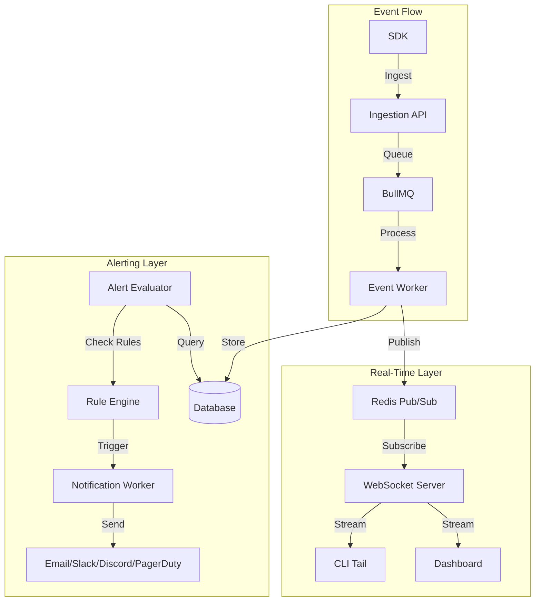

# Phase 8: Real-Time Monitoring & Intelligent Alerting

## Overview

Enable proactive issue detection with real-time event streaming and smart alerting. This phase transforms Replayly from a reactive debugging tool into a proactive monitoring platform that catches issues before users report them.

**Duration Estimate**: 4-5 weeks  
**Priority**: High - Critical for production use  
**Dependencies**: Phase 1 (infrastructure), Phase 3 (ingestion), Phase 4 (dashboard)

---

## Goals

1. Implement WebSocket infrastructure for real-time event streaming
2. Build live event updates in dashboard without polling
3. Create CLI `tail` command for live event monitoring
4. Design flexible alert rule engine with multiple condition types
5. Implement notification channels (Email, Slack, Discord, PagerDuty, Webhooks)
6. Build alert management UI with rule builder
7. Create background workers for alert evaluation and notification delivery
8. Add performance monitoring enhancements (P50/P95/P99, slow queries)

---

## Technical Architecture

### System Flow



---

## Part 1: Real-Time Event Streaming

### 1.1 WebSocket Infrastructure

**lib/realtime/pubsub.ts:**

```typescript
import { createClient } from 'redis'

export interface PubSubMessage {
  type: 'event' | 'error' | 'alert' | 'release'
  projectId: string
  data: any
  timestamp: Date
}

export class RedisPubSub {
  private publisher: ReturnType<typeof createClient>
  private subscriber: ReturnType<typeof createClient>
  private handlers: Map<string, Set<(message: PubSubMessage) => void>> = new Map()

  constructor() {
    this.publisher = createClient({ url: process.env.REDIS_URL })
    this.subscriber = createClient({ url: process.env.REDIS_URL })
  }

  async connect() {
    await this.publisher.connect()
    await this.subscriber.connect()
    
    // Handle incoming messages
    this.subscriber.on('message', (channel, message) => {
      const handlers = this.handlers.get(channel)
      if (handlers) {
        const parsed: PubSubMessage = JSON.parse(message)
        handlers.forEach(handler => handler(parsed))
      }
    })
  }

  async publish(channel: string, message: PubSubMessage) {
    await this.publisher.publish(channel, JSON.stringify(message))
  }

  async subscribe(channel: string, handler: (message: PubSubMessage) => void) {
    if (!this.handlers.has(channel)) {
      this.handlers.set(channel, new Set())
      await this.subscriber.subscribe(channel)
    }
    this.handlers.get(channel)!.add(handler)
  }

  async unsubscribe(channel: string, handler: (message: PubSubMessage) => void) {
    const handlers = this.handlers.get(channel)
    if (handlers) {
      handlers.delete(handler)
      if (handlers.size === 0) {
        await this.subscriber.unsubscribe(channel)
        this.handlers.delete(channel)
      }
    }
  }

  async disconnect() {
    await this.publisher.disconnect()
    await this.subscriber.disconnect()
  }
}

// Singleton instance
let pubsubInstance: RedisPubSub | null = null

export function getPubSub(): RedisPubSub {
  if (!pubsubInstance) {
    pubsubInstance = new RedisPubSub()
  }
  return pubsubInstance
}
```

**lib/realtime/subscriptions.ts:**

```typescript
import { getPubSub, PubSubMessage } from './pubsub'

export interface Subscription {
  id: string
  projectId: string
  userId: string
  filters?: {
    eventTypes?: string[]
    routes?: string[]
    statusCodes?: number[]
    errorOnly?: boolean
  }
  callback: (message: PubSubMessage) => void
}

export class SubscriptionManager {
  private subscriptions: Map<string, Subscription> = new Map()
  private pubsub = getPubSub()

  async subscribe(subscription: Subscription) {
    this.subscriptions.set(subscription.id, subscription)
    
    const channel = `project:${subscription.projectId}`
    
    await this.pubsub.subscribe(channel, (message) => {
      // Apply filters
      if (this.shouldSendMessage(subscription, message)) {
        subscription.callback(message)
      }
    })
  }

  async unsubscribe(subscriptionId: string) {
    const subscription = this.subscriptions.get(subscriptionId)
    if (subscription) {
      const channel = `project:${subscription.projectId}`
      await this.pubsub.unsubscribe(channel, subscription.callback)
      this.subscriptions.delete(subscriptionId)
    }
  }

  private shouldSendMessage(subscription: Subscription, message: PubSubMessage): boolean {
    const { filters } = subscription
    if (!filters) return true

    // Filter by event type
    if (filters.eventTypes && !filters.eventTypes.includes(message.type)) {
      return false
    }

    // Filter by error only
    if (filters.errorOnly && message.type !== 'error') {
      return false
    }

    // Filter by route
    if (filters.routes && message.data.route) {
      if (!filters.routes.some(route => message.data.route.includes(route))) {
        return false
      }
    }

    // Filter by status code
    if (filters.statusCodes && message.data.statusCode) {
      if (!filters.statusCodes.includes(message.data.statusCode)) {
        return false
      }
    }

    return true
  }

  getSubscription(id: string): Subscription | undefined {
    return this.subscriptions.get(id)
  }

  getAllSubscriptions(): Subscription[] {
    return Array.from(this.subscriptions.values())
  }
}
```

**app/api/ws/route.ts:**

```typescript
import { NextRequest } from 'next/server'
import { WebSocketServer, WebSocket } from 'ws'
import { verifyAuth } from '@/lib/auth/verify'
import { SubscriptionManager } from '@/lib/realtime/subscriptions'
import { v4 as uuidv4 } from 'uuid'

// Store WebSocket server instance
let wss: WebSocketServer | null = null

export async function GET(req: NextRequest) {
  // Verify authentication
  const user = await verifyAuth(req)
  if (!user) {
    return new Response('Unauthorized', { status: 401 })
  }

  // Upgrade to WebSocket
  const upgrade = req.headers.get('upgrade')
  if (upgrade !== 'websocket') {
    return new Response('Expected WebSocket upgrade', { status: 426 })
  }

  // Initialize WebSocket server if not exists
  if (!wss) {
    wss = new WebSocketServer({ noServer: true })
  }

  // Handle WebSocket connection
  const subscriptionManager = new SubscriptionManager()

  wss.on('connection', (ws: WebSocket, request: any) => {
    const connectionId = uuidv4()
    console.log(`WebSocket connection established: ${connectionId}`)

    // Handle incoming messages
    ws.on('message', async (data: string) => {
      try {
        const message = JSON.parse(data.toString())

        if (message.type === 'subscribe') {
          const { projectId, filters } = message.payload

          // Verify user has access to project
          // TODO: Add project access check

          await subscriptionManager.subscribe({
            id: connectionId,
            projectId,
            userId: user.userId,
            filters,
            callback: (event) => {
              ws.send(JSON.stringify({
                type: 'event',
                payload: event
              }))
            }
          })

          ws.send(JSON.stringify({
            type: 'subscribed',
            payload: { projectId, subscriptionId: connectionId }
          }))
        }

        if (message.type === 'unsubscribe') {
          await subscriptionManager.unsubscribe(connectionId)
          ws.send(JSON.stringify({
            type: 'unsubscribed',
            payload: { subscriptionId: connectionId }
          }))
        }

        if (message.type === 'ping') {
          ws.send(JSON.stringify({ type: 'pong' }))
        }
      } catch (error) {
        console.error('WebSocket message error:', error)
        ws.send(JSON.stringify({
          type: 'error',
          payload: { message: 'Invalid message format' }
        }))
      }
    })

    ws.on('close', async () => {
      console.log(`WebSocket connection closed: ${connectionId}`)
      await subscriptionManager.unsubscribe(connectionId)
    })

    ws.on('error', (error) => {
      console.error(`WebSocket error for ${connectionId}:`, error)
    })

    // Send welcome message
    ws.send(JSON.stringify({
      type: 'connected',
      payload: { connectionId }
    }))
  })

  return new Response('WebSocket server running', { status: 200 })
}
```

### 1.2 Frontend Real-Time Updates

**hooks/use-websocket.ts:**

```typescript
import { useEffect, useRef, useState, useCallback } from 'react'

export interface WebSocketMessage {
  type: string
  payload: any
}

export interface UseWebSocketOptions {
  url: string
  projectId: string
  filters?: {
    eventTypes?: string[]
    routes?: string[]
    statusCodes?: number[]
    errorOnly?: boolean
  }
  onMessage?: (message: WebSocketMessage) => void
  onConnect?: () => void
  onDisconnect?: () => void
  onError?: (error: Event) => void
  reconnect?: boolean
  reconnectInterval?: number
}

export function useWebSocket(options: UseWebSocketOptions) {
  const {
    url,
    projectId,
    filters,
    onMessage,
    onConnect,
    onDisconnect,
    onError,
    reconnect = true,
    reconnectInterval = 3000
  } = options

  const [isConnected, setIsConnected] = useState(false)
  const [lastMessage, setLastMessage] = useState<WebSocketMessage | null>(null)
  const wsRef = useRef<WebSocket | null>(null)
  const reconnectTimeoutRef = useRef<NodeJS.Timeout>()

  const connect = useCallback(() => {
    try {
      const ws = new WebSocket(url)
      wsRef.current = ws

      ws.onopen = () => {
        console.log('WebSocket connected')
        setIsConnected(true)
        onConnect?.()

        // Subscribe to project events
        ws.send(JSON.stringify({
          type: 'subscribe',
          payload: { projectId, filters }
        }))
      }

      ws.onmessage = (event) => {
        const message: WebSocketMessage = JSON.parse(event.data)
        setLastMessage(message)
        onMessage?.(message)
      }

      ws.onclose = () => {
        console.log('WebSocket disconnected')
        setIsConnected(false)
        onDisconnect?.()

        // Attempt reconnection
        if (reconnect) {
          reconnectTimeoutRef.current = setTimeout(() => {
            console.log('Attempting to reconnect...')
            connect()
          }, reconnectInterval)
        }
      }

      ws.onerror = (error) => {
        console.error('WebSocket error:', error)
        onError?.(error)
      }
    } catch (error) {
      console.error('Failed to create WebSocket:', error)
    }
  }, [url, projectId, filters, onMessage, onConnect, onDisconnect, onError, reconnect, reconnectInterval])

  const disconnect = useCallback(() => {
    if (reconnectTimeoutRef.current) {
      clearTimeout(reconnectTimeoutRef.current)
    }
    if (wsRef.current) {
      wsRef.current.close()
      wsRef.current = null
    }
  }, [])

  const send = useCallback((message: WebSocketMessage) => {
    if (wsRef.current && isConnected) {
      wsRef.current.send(JSON.stringify(message))
    }
  }, [isConnected])

  useEffect(() => {
    connect()
    return () => disconnect()
  }, [connect, disconnect])

  return {
    isConnected,
    lastMessage,
    send,
    disconnect,
    reconnect: connect
  }
}
```

**app/dashboard/[projectId]/page.tsx (Enhanced with WebSocket):**

```typescript
'use client'

import { useEffect, useState } from 'react'
import { useWebSocket } from '@/hooks/use-websocket'
import { Badge } from '@/components/ui/badge'
import { toast } from '@/components/ui/use-toast'

export default function ProjectDashboard({ params }: { params: { projectId: string } }) {
  const [events, setEvents] = useState<any[]>([])
  const [liveMode, setLiveMode] = useState(false)

  const { isConnected, lastMessage } = useWebSocket({
    url: `${process.env.NEXT_PUBLIC_WS_URL}/api/ws`,
    projectId: params.projectId,
    filters: liveMode ? undefined : { errorOnly: true },
    onMessage: (message) => {
      if (message.type === 'event') {
        // Add new event to the top of the list
        setEvents(prev => [message.payload.data, ...prev].slice(0, 100))
        
        // Show toast for errors
        if (message.payload.type === 'error') {
          toast({
            title: 'New Error Detected',
            description: `${message.payload.data.route} - ${message.payload.data.statusCode}`,
            variant: 'destructive'
          })
        }
      }
    },
    onConnect: () => {
      toast({
        title: 'Live Mode Active',
        description: 'Receiving real-time events'
      })
    },
    onDisconnect: () => {
      toast({
        title: 'Live Mode Disconnected',
        description: 'Attempting to reconnect...',
        variant: 'destructive'
      })
    }
  })

  return (
    <div className="space-y-4">
      <div className="flex items-center justify-between">
        <h1 className="text-2xl font-bold">Events</h1>
        <div className="flex items-center gap-2">
          {isConnected && (
            <Badge variant="success" className="animate-pulse">
              Live
            </Badge>
          )}
          <button
            onClick={() => setLiveMode(!liveMode)}
            className="px-4 py-2 bg-primary text-white rounded"
          >
            {liveMode ? 'Show Errors Only' : 'Show All Events'}
          </button>
        </div>
      </div>

      <div className="space-y-2">
        {events.map((event, index) => (
          <div
            key={event._id || index}
            className="p-4 border rounded-lg hover:bg-gray-50 transition-colors"
          >
            <div className="flex items-center justify-between">
              <span className="font-mono text-sm">{event.route}</span>
              <Badge variant={event.statusCode >= 400 ? 'destructive' : 'default'}>
                {event.statusCode}
              </Badge>
            </div>
            <div className="text-xs text-gray-500 mt-1">
              {new Date(event.timestamp).toLocaleString()}
            </div>
          </div>
        ))}
      </div>
    </div>
  )
}
```

### 1.3 CLI Tail Command

**packages/cli/src/commands/tail.ts:**

```typescript
import { Command } from 'commander'
import WebSocket from 'ws'
import chalk from 'chalk'
import ora from 'ora'
import { getAuthManager } from '../auth/auth-manager'
import { getApiClient } from '../api/client'

export function createTailCommand() {
  return new Command('tail')
    .description('Stream live events from a project')
    .option('-p, --project <id>', 'Project ID')
    .option('-r, --route <pattern>', 'Filter by route pattern')
    .option('-s, --status <codes>', 'Filter by status codes (comma-separated)')
    .option('--errors-only', 'Show only errors (4xx, 5xx)')
    .action(async (options) => {
      const authManager = getAuthManager()
      const credentials = await authManager.getCredentials()

      if (!credentials) {
        console.error(chalk.red('Not logged in. Run `replayly login` first.'))
        process.exit(1)
      }

      let projectId = options.project

      // If no project specified, let user select
      if (!projectId) {
        const apiClient = getApiClient(credentials.accessToken)
        const projects = await apiClient.getProjects()

        if (projects.length === 0) {
          console.error(chalk.red('No projects found'))
          process.exit(1)
        }

        // TODO: Add interactive project selection
        projectId = projects[0].id
        console.log(chalk.blue(`Using project: ${projects[0].name}`))
      }

      const spinner = ora('Connecting to event stream...').start()

      // Build filters
      const filters: any = {}
      if (options.route) {
        filters.routes = [options.route]
      }
      if (options.status) {
        filters.statusCodes = options.status.split(',').map(Number)
      }
      if (options.errorsOnly) {
        filters.errorOnly = true
      }

      // Connect to WebSocket
      const wsUrl = process.env.REPLAYLY_WS_URL || 'ws://localhost:3000/api/ws'
      const ws = new WebSocket(wsUrl, {
        headers: {
          Authorization: `Bearer ${credentials.accessToken}`
        }
      })

      ws.on('open', () => {
        spinner.succeed('Connected to event stream')
        console.log(chalk.gray('Waiting for events...\n'))

        // Subscribe to project
        ws.send(JSON.stringify({
          type: 'subscribe',
          payload: { projectId, filters }
        }))
      })

      ws.on('message', (data: string) => {
        const message = JSON.parse(data.toString())

        if (message.type === 'event') {
          const event = message.payload.data
          const timestamp = new Date(event.timestamp).toLocaleTimeString()
          const method = event.method.padEnd(6)
          const route = event.route
          const status = event.statusCode
          const duration = `${event.durationMs}ms`

          // Color based on status code
          let statusColor = chalk.green
          if (status >= 500) statusColor = chalk.red
          else if (status >= 400) statusColor = chalk.yellow
          else if (status >= 300) statusColor = chalk.cyan

          console.log(
            chalk.gray(timestamp),
            chalk.blue(method),
            route,
            statusColor(status),
            chalk.gray(duration)
          )

          // Show error message if present
          if (event.error) {
            console.log(chalk.red(`  └─ ${event.error.message}`))
          }
        }
      })

      ws.on('error', (error) => {
        spinner.fail('Connection error')
        console.error(chalk.red(error.message))
        process.exit(1)
      })

      ws.on('close', () => {
        console.log(chalk.yellow('\nConnection closed'))
        process.exit(0)
      })

      // Handle Ctrl+C
      process.on('SIGINT', () => {
        console.log(chalk.yellow('\nClosing connection...'))
        ws.close()
      })
    })
}
```

---

## Part 2: Intelligent Alerting System

### 2.1 Database Schema

**prisma/schema.prisma (additions):**

```prisma
model AlertRule {
  id          String   @id @default(cuid())
  projectId   String
  name        String
  description String?
  enabled     Boolean  @default(true)
  
  // Rule conditions
  conditions  Json     // Array of condition objects
  
  // Notification settings
  channels    AlertChannel[]
  
  // Throttling
  throttleMinutes Int @default(5)
  
  createdAt   DateTime @default(now())
  updatedAt   DateTime @updatedAt
  createdBy   String
  
  project     Project  @relation(fields: [projectId], references: [id], onDelete: Cascade)
  user        User     @relation(fields: [createdBy], references: [id])
  history     AlertHistory[]
  
  @@index([projectId, enabled])
}

model AlertChannel {
  id          String   @id @default(cuid())
  ruleId      String
  type        String   // email, slack, discord, pagerduty, webhook
  config      Json     // Channel-specific configuration
  enabled     Boolean  @default(true)
  
  createdAt   DateTime @default(now())
  updatedAt   DateTime @updatedAt
  
  rule        AlertRule @relation(fields: [ruleId], references: [id], onDelete: Cascade)
  
  @@index([ruleId])
}

model AlertHistory {
  id          String   @id @default(cuid())
  ruleId      String
  triggeredAt DateTime @default(now())
  
  // Alert details
  condition   String   // Which condition triggered
  value       Float    // Actual value that triggered
  threshold   Float    // Threshold that was exceeded
  
  // Notification status
  notificationsSent Int @default(0)
  notificationsFailed Int @default(0)
  
  // Acknowledgment
  acknowledgedAt DateTime?
  acknowledgedBy String?
  
  // Resolution
  resolvedAt  DateTime?
  resolvedBy  String?
  
  rule        AlertRule @relation(fields: [ruleId], references: [id], onDelete: Cascade)
  
  @@index([ruleId, triggeredAt])
  @@index([acknowledgedAt])
}

model NotificationChannel {
  id          String   @id @default(cuid())
  projectId   String
  type        String   // email, slack, discord, pagerduty, webhook
  name        String
  config      Json     // Channel-specific configuration
  enabled     Boolean  @default(true)
  
  createdAt   DateTime @default(now())
  updatedAt   DateTime @updatedAt
  
  project     Project  @relation(fields: [projectId], references: [id], onDelete: Cascade)
  
  @@index([projectId, type])
}
```

### 2.2 Alert Rule Engine

**lib/alerts/rule-engine.ts:**

```typescript
import { prisma } from '@/lib/db/postgres'
import { getOpenSearchClient } from '@/lib/search/opensearch'

export interface AlertCondition {
  type: 'error_rate' | 'response_time' | 'status_code' | 'spike' | 'custom_query'
  operator: 'gt' | 'gte' | 'lt' | 'lte' | 'eq'
  threshold: number
  timeWindow: number // minutes
  aggregation?: 'avg' | 'p95' | 'p99' | 'count' | 'sum'
  filters?: {
    routes?: string[]
    statusCodes?: number[]
    errorHashes?: string[]
  }
  customQuery?: string // OpenSearch query for custom alerts
}

export interface AlertRuleEvaluation {
  ruleId: string
  triggered: boolean
  condition: AlertCondition
  actualValue: number
  threshold: number
  message: string
}

export class AlertRuleEngine {
  async evaluateRule(ruleId: string): Promise<AlertRuleEvaluation | null> {
    const rule = await prisma.alertRule.findUnique({
      where: { id: ruleId },
      include: { project: true }
    })

    if (!rule || !rule.enabled) {
      return null
    }

    const conditions = rule.conditions as AlertCondition[]
    
    for (const condition of conditions) {
      const evaluation = await this.evaluateCondition(rule.projectId, condition)
      
      if (evaluation.triggered) {
        return {
          ruleId: rule.id,
          ...evaluation
        }
      }
    }

    return null
  }

  private async evaluateCondition(
    projectId: string,
    condition: AlertCondition
  ): Promise<Omit<AlertRuleEvaluation, 'ruleId'>> {
    switch (condition.type) {
      case 'error_rate':
        return this.evaluateErrorRate(projectId, condition)
      case 'response_time':
        return this.evaluateResponseTime(projectId, condition)
      case 'status_code':
        return this.evaluateStatusCode(projectId, condition)
      case 'spike':
        return this.evaluateSpike(projectId, condition)
      case 'custom_query':
        return this.evaluateCustomQuery(projectId, condition)
      default:
        throw new Error(`Unknown condition type: ${condition.type}`)
    }
  }

  private async evaluateErrorRate(
    projectId: string,
    condition: AlertCondition
  ): Promise<Omit<AlertRuleEvaluation, 'ruleId'>> {
    const since = new Date(Date.now() - condition.timeWindow * 60 * 1000)

    // Query MongoDB for error rate
    const { connectMongo } = await import('@/lib/db/mongodb')
    const db = await connectMongo()
    
    const totalEvents = await db.collection('events').countDocuments({
      projectId,
      timestamp: { $gte: since }
    })

    const errorEvents = await db.collection('events').countDocuments({
      projectId,
      timestamp: { $gte: since },
      statusCode: { $gte: 400 }
    })

    const errorRate = totalEvents > 0 ? (errorEvents / totalEvents) * 100 : 0
    const triggered = this.compareValues(errorRate, condition.operator, condition.threshold)

    return {
      triggered,
      condition,
      actualValue: errorRate,
      threshold: condition.threshold,
      message: `Error rate is ${errorRate.toFixed(2)}% (threshold: ${condition.threshold}%)`
    }
  }

  private async evaluateResponseTime(
    projectId: string,
    condition: AlertCondition
  ): Promise<Omit<AlertRuleEvaluation, 'ruleId'>> {
    const since = new Date(Date.now() - condition.timeWindow * 60 * 1000)

    const { connectMongo } = await import('@/lib/db/mongodb')
    const db = await connectMongo()

    const aggregation = condition.aggregation || 'avg'
    let pipeline: any[] = [
      {
        $match: {
          projectId,
          timestamp: { $gte: since }
        }
      }
    ]

    // Apply filters
    if (condition.filters?.routes) {
      pipeline[0].$match.route = { $in: condition.filters.routes }
    }

    // Calculate metric
    if (aggregation === 'avg') {
      pipeline.push({
        $group: {
          _id: null,
          value: { $avg: '$durationMs' }
        }
      })
    } else if (aggregation === 'p95' || aggregation === 'p99') {
      const percentile = aggregation === 'p95' ? 0.95 : 0.99
      pipeline.push(
        { $sort: { durationMs: 1 } },
        {
          $group: {
            _id: null,
            values: { $push: '$durationMs' },
            count: { $sum: 1 }
          }
        },
        {
          $project: {
            value: {
              $arrayElemAt: [
                '$values',
                { $floor: { $multiply: ['$count', percentile] } }
              ]
            }
          }
        }
      )
    }

    const result = await db.collection('events').aggregate(pipeline).toArray()
    const actualValue = result[0]?.value || 0

    const triggered = this.compareValues(actualValue, condition.operator, condition.threshold)

    return {
      triggered,
      condition,
      actualValue,
      threshold: condition.threshold,
      message: `${aggregation.toUpperCase()} response time is ${actualValue.toFixed(2)}ms (threshold: ${condition.threshold}ms)`
    }
  }

  private async evaluateStatusCode(
    projectId: string,
    condition: AlertCondition
  ): Promise<Omit<AlertRuleEvaluation, 'ruleId'>> {
    const since = new Date(Date.now() - condition.timeWindow * 60 * 1000)

    const { connectMongo } = await import('@/lib/db/mongodb')
    const db = await connectMongo()

    const count = await db.collection('events').countDocuments({
      projectId,
      timestamp: { $gte: since },
      statusCode: { $in: condition.filters?.statusCodes || [] }
    })

    const triggered = this.compareValues(count, condition.operator, condition.threshold)

    return {
      triggered,
      condition,
      actualValue: count,
      threshold: condition.threshold,
      message: `Status code count is ${count} (threshold: ${condition.threshold})`
    }
  }

  private async evaluateSpike(
    projectId: string,
    condition: AlertCondition
  ): Promise<Omit<AlertRuleEvaluation, 'ruleId'>> {
    const currentWindow = new Date(Date.now() - condition.timeWindow * 60 * 1000)
    const previousWindow = new Date(Date.now() - condition.timeWindow * 60 * 1000 * 2)

    const { connectMongo } = await import('@/lib/db/mongodb')
    const db = await connectMongo()

    const currentCount = await db.collection('events').countDocuments({
      projectId,
      timestamp: { $gte: currentWindow },
      statusCode: { $gte: 400 }
    })

    const previousCount = await db.collection('events').countDocuments({
      projectId,
      timestamp: { $gte: previousWindow, $lt: currentWindow },
      statusCode: { $gte: 400 }
    })

    const spikeMultiplier = previousCount > 0 ? currentCount / previousCount : currentCount
    const triggered = spikeMultiplier >= condition.threshold

    return {
      triggered,
      condition,
      actualValue: spikeMultiplier,
      threshold: condition.threshold,
      message: `Error spike detected: ${spikeMultiplier.toFixed(2)}x increase (threshold: ${condition.threshold}x)`
    }
  }

  private async evaluateCustomQuery(
    projectId: string,
    condition: AlertCondition
  ): Promise<Omit<AlertRuleEvaluation, 'ruleId'>> {
    if (!condition.customQuery) {
      throw new Error('Custom query is required for custom_query condition type')
    }

    const client = getOpenSearchClient()
    
    // Execute custom OpenSearch query
    const result = await client.search({
      index: 'events',
      body: {
        query: {
          bool: {
            must: [
              { term: { projectId } },
              JSON.parse(condition.customQuery)
            ]
          }
        }
      }
    })

    const count = result.body.hits.total.value
    const triggered = this.compareValues(count, condition.operator, condition.threshold)

    return {
      triggered,
      condition,
      actualValue: count,
      threshold: condition.threshold,
      message: `Custom query result: ${count} (threshold: ${condition.threshold})`
    }
  }

  private compareValues(actual: number, operator: string, threshold: number): boolean {
    switch (operator) {
      case 'gt': return actual > threshold
      case 'gte': return actual >= threshold
      case 'lt': return actual < threshold
      case 'lte': return actual <= threshold
      case 'eq': return actual === threshold
      default: return false
    }
  }
}
```

### 2.3 Notification Channels

**lib/alerts/channels/email.ts:**

```typescript
import { Resend } from 'resend'

const resend = new Resend(process.env.RESEND_API_KEY)

export interface EmailNotification {
  to: string[]
  subject: string
  message: string
  projectName: string
  ruleNa: string
  alertUrl: string
}

export async function sendEmailNotification(notification: EmailNotification) {
  const html = `
    <!DOCTYPE html>
    <html>
      <head>
        <style>
          body { font-family: Arial, sans-serif; line-height: 1.6; }
          .container { max-width: 600px; margin: 0 auto; padding: 20px; }
          .header { background: #ef4444; color: white; padding: 20px; border-radius: 8px 8px 0 0; }
          .content { background: #f9fafb; padding: 20px; border-radius: 0 0 8px 8px; }
          .button { display: inline-block; background: #3b82f6; color: white; padding: 12px 24px; text-decoration: none; border-radius: 6px; margin-top: 16px; }
          .footer { margin-top: 20px; padding-top: 20px; border-top: 1px solid #e5e7eb; color: #6b7280; font-size: 14px; }
        </style>
      </head>
      <body>
        <div class="container">
          <div class="header">
            <h1>🚨 Alert Triggered</h1>
            <p>${notification.ruleName}</p>
          </div>
          <div class="content">
            <p><strong>Project:</strong> ${notification.projectName}</p>
            <p><strong>Message:</strong> ${notification.message}</p>
            <a href="${notification.alertUrl}" class="button">View Alert Details</a>
          </div>
          <div class="footer">
            <p>You received this alert because you're subscribed to notifications for this project.</p>
            <p>Manage your notification settings in the Replayly dashboard.</p>
          </div>
        </div>
      </body>
    </html>
  `

  await resend.emails.send({
    from: 'alerts@replayly.dev',
    to: notification.to,
    subject: `[Replayly Alert] ${notification.subject}`,
    html
  })
}
```

**lib/alerts/channels/slack.ts:**

```typescript
import axios from 'axios'

export interface SlackNotification {
  webhookUrl: string
  message: string
  projectName: string
  ruleName: string
  alertUrl: string
}

export async function sendSlackNotification(notification: SlackNotification) {
  const payload = {
    blocks: [
      {
        type: 'header',
        text: {
          type: 'plain_text',
          text: '🚨 Alert Triggered',
          emoji: true
        }
      },
      {
        type: 'section',
        fields: [
          {
            type: 'mrkdwn',
            text: `*Project:*\n${notification.projectName}`
          },
          {
            type: 'mrkdwn',
            text: `*Rule:*\n${notification.ruleName}`
          }
        ]
      },
      {
        type: 'section',
        text: {
          type: 'mrkdwn',
          text: `*Message:*\n${notification.message}`
        }
      },
      {
        type: 'actions',
        elements: [
          {
            type: 'button',
            text: {
              type: 'plain_text',
              text: 'View Alert Details',
              emoji: true
            },
            url: notification.alertUrl,
            style: 'primary'
          }
        ]
      }
    ]
  }

  await axios.post(notification.webhookUrl, payload)
}
```

**lib/alerts/channels/discord.ts:**

```typescript
import axios from 'axios'

export interface DiscordNotification {
  webhookUrl: string
  message: string
  projectName: string
  ruleName: string
  alertUrl: string
}

export async function sendDiscordNotification(notification: DiscordNotification) {
  const payload = {
    embeds: [
      {
        title: '🚨 Alert Triggered',
        color: 15548997, // Red color
        fields: [
          {
            name: 'Project',
            value: notification.projectName,
            inline: true
          },
          {
            name: 'Rule',
            value: notification.ruleName,
            inline: true
          },
          {
            name: 'Message',
            value: notification.message,
            inline: false
          }
        ],
        timestamp: new Date().toISOString()
      }
    ],
    components: [
      {
        type: 1,
        components: [
          {
            type: 2,
            style: 5,
            label: 'View Alert Details',
            url: notification.alertUrl
          }
        ]
      }
    ]
  }

  await axios.post(notification.webhookUrl, payload)
}
```

**lib/alerts/channels/pagerduty.ts:**

```typescript
import axios from 'axios'

export interface PagerDutyNotification {
  integrationKey: string
  message: string
  severity: 'critical' | 'error' | 'warning' | 'info'
  projectName: string
  ruleName: string
  alertUrl: string
}

export async function sendPagerDutyNotification(notification: PagerDutyNotification) {
  const payload = {
    routing_key: notification.integrationKey,
    event_action: 'trigger',
    payload: {
      summary: `[Replayly] ${notification.ruleName}`,
      severity: notification.severity,
      source: notification.projectName,
      custom_details: {
        message: notification.message,
        alert_url: notification.alertUrl
      }
    }
  }

  await axios.post('https://events.pagerduty.com/v2/enqueue', payload)
}
```

### 2.4 Alert Evaluation Worker

**workers/alert-evaluator.ts:**

```typescript
import { Worker, Queue } from 'bullmq'
import { prisma } from '@/lib/db/postgres'
import { AlertRuleEngine } from '@/lib/alerts/rule-engine'
import { getRedisConnection } from '@/lib/db/redis'

const alertQueue = new Queue('alerts', {
  connection: getRedisConnection()
})

export async function startAlertEvaluator() {
  const engine = new AlertRuleEngine()

  // Create worker
  const worker = new Worker(
    'alert-evaluation',
    async (job) => {
      console.log(`Evaluating alert rules...`)

      // Get all enabled alert rules
      const rules = await prisma.alertRule.findMany({
        where: { enabled: true },
        include: {
          channels: true,
          project: true
        }
      })

      for (const rule of rules) {
        try {
          // Check if rule was recently triggered (throttling)
          const recentAlert = await prisma.alertHistory.findFirst({
            where: {
              ruleId: rule.id,
              triggeredAt: {
                gte: new Date(Date.now() - rule.throttleMinutes * 60 * 1000)
              }
            }
          })

          if (recentAlert) {
            console.log(`Rule ${rule.id} throttled, skipping`)
            continue
          }

          // Evaluate rule
          const evaluation = await engine.evaluateRule(rule.id)

          if (evaluation && evaluation.triggered) {
            console.log(`Alert triggered: ${rule.name}`)

            // Create alert history
            const alertHistory = await prisma.alertHistory.create({
              data: {
                ruleId: rule.id,
                condition: evaluation.condition.type,
                value: evaluation.actualValue,
                threshold: evaluation.threshold
              }
            })

            // Queue notifications
            for (const channel of rule.channels) {
              if (channel.enabled) {
                await alertQueue.add('send-notification', {
                  alertHistoryId: alertHistory.id,
                  ruleId: rule.id,
                  channelId: channel.id,
                  message: evaluation.message,
                  projectName: rule.project.name,
                  ruleName: rule.name
                })
              }
            }
          }
        } catch (error) {
          console.error(`Error evaluating rule ${rule.id}:`, error)
        }
      }
    },
    {
      connection: getRedisConnection(),
      concurrency: 1
    }
  )

  // Schedule evaluation every minute
  await alertQueue.add(
    'evaluate-rules',
    {},
    {
      repeat: {
        every: 60000 // 1 minute
      }
    }
  )

  console.log('Alert evaluator worker started')

  return worker
}
```

**workers/notification-delivery.ts:**

```typescript
import { Worker } from 'bullmq'
import { prisma } from '@/lib/db/postgres'
import { sendEmailNotification } from '@/lib/alerts/channels/email'
import { sendSlackNotification } from '@/lib/alerts/channels/slack'
import { sendDiscordNotification } from '@/lib/alerts/channels/discord'
import { sendPagerDutyNotification } from '@/lib/alerts/channels/pagerduty'
import { getRedisConnection } from '@/lib/db/redis'

export async function startNotificationDelivery() {
  const worker = new Worker(
    'alerts',
    async (job) => {
      if (job.name === 'send-notification') {
        const { alertHistoryId, channelId, message, projectName, ruleName } = job.data

        try {
          const channel = await prisma.alertChannel.findUnique({
            where: { id: channelId }
          })

          if (!channel) {
            throw new Error(`Channel ${channelId} not found`)
          }

          const alertUrl = `${process.env.NEXT_PUBLIC_APP_URL}/dashboard/alerts/${alertHistoryId}`

          switch (channel.type) {
            case 'email':
              await sendEmailNotification({
                to: channel.config.recipients,
                subject: ruleName,
                message,
                projectName,
                ruleName,
                alertUrl
              })
              break

            case 'slack':
              await sendSlackNotification({
                webhookUrl: channel.config.webhookUrl,
                message,
                projectName,
                ruleName,
                alertUrl
              })
              break

            case 'discord':
              await sendDiscordNotification({
                webhookUrl: channel.config.webhookUrl,
                message,
                projectName,
                ruleName,
                alertUrl
              })
              break

            case 'pagerduty':
              await sendPagerDutyNotification({
                integrationKey: channel.config.integrationKey,
                message,
                severity: 'error',
                projectName,
                ruleName,
                alertUrl
              })
              break

            case 'webhook':
              // Custom webhook implementation
              break

            default:
              throw new Error(`Unknown channel type: ${channel.type}`)
          }

          // Update alert history
          await prisma.alertHistory.update({
            where: { id: alertHistoryId },
            data: {
              notificationsSent: { increment: 1 }
            }
          })

          console.log(`Notification sent via ${channel.type}`)
        } catch (error) {
          console.error(`Failed to send notification:`, error)

          // Update alert history
          await prisma.alertHistory.update({
            where: { id: alertHistoryId },
            data: {
              notificationsFailed: { increment: 1 }
            }
          })

          throw error
        }
      }
    },
    {
      connection: getRedisConnection(),
      concurrency: 5,
      attempts: 3,
      backoff: {
        type: 'exponential',
        delay: 2000
      }
    }
  )

  console.log('Notification delivery worker started')

  return worker
}
```

---

## Part 3: Alert Management UI

### 3.1 Alert Rules Page

**app/dashboard/[projectId]/settings/alerts/page.tsx:**

```typescript
'use client'

import { useState, useEffect } from 'react'
import { Button } from '@/components/ui/button'
import { Card } from '@/components/ui/card'
import { Badge } from '@/components/ui/badge'
import { Switch } from '@/components/ui/switch'
import { Plus, Edit, Trash2 } from 'lucide-react'
import Link from 'next/link'

export default function AlertRulesPage({ params }: { params: { projectId: string } }) {
  const [rules, setRules] = useState<any[]>([])
  const [loading, setLoading] = useState(true)

  useEffect(() => {
    fetchRules()
  }, [])

  async function fetchRules() {
    const res = await fetch(`/api/projects/${params.projectId}/alerts`)
    const data = await res.json()
    setRules(data.rules)
    setLoading(false)
  }

  async function toggleRule(ruleId: string, enabled: boolean) {
    await fetch(`/api/projects/${params.projectId}/alerts/${ruleId}`, {
      method: 'PATCH',
      headers: { 'Content-Type': 'application/json' },
      body: JSON.stringify({ enabled })
    })
    fetchRules()
  }

  async function deleteRule(ruleId: string) {
    if (!confirm('Are you sure you want to delete this alert rule?')) return

    await fetch(`/api/projects/${params.projectId}/alerts/${ruleId}`, {
      method: 'DELETE'
    })
    fetchRules()
  }

  if (loading) {
    return <div>Loading...</div>
  }

  return (
    <div className="space-y-6">
      <div className="flex items-center justify-between">
        <div>
          <h1 className="text-2xl font-bold">Alert Rules</h1>
          <p className="text-gray-600">Configure alerts to be notified of issues</p>
        </div>
        <Link href={`/dashboard/${params.projectId}/settings/alerts/new`}>
          <Button>
            <Plus className="w-4 h-4 mr-2" />
            New Alert Rule
          </Button>
        </Link>
      </div>

      <div className="space-y-4">
        {rules.map((rule) => (
          <Card key={rule.id} className="p-6">
            <div className="flex items-start justify-between">
              <div className="flex-1">
                <div className="flex items-center gap-3 mb-2">
                  <h3 className="text-lg font-semibold">{rule.name}</h3>
                  <Badge variant={rule.enabled ? 'success' : 'secondary'}>
                    {rule.enabled ? 'Enabled' : 'Disabled'}
                  </Badge>
                </div>
                {rule.description && (
                  <p className="text-gray-600 mb-3">{rule.description}</p>
                )}
                <div className="flex items-center gap-4 text-sm text-gray-500">
                  <span>{rule.conditions.length} condition(s)</span>
                  <span>{rule.channels.length} channel(s)</span>
                  <span>Throttle: {rule.throttleMinutes}m</span>
                </div>
              </div>
              <div className="flex items-center gap-2">
                <Switch
                  checked={rule.enabled}
                  onCheckedChange={(checked) => toggleRule(rule.id, checked)}
                />
                <Link href={`/dashboard/${params.projectId}/settings/alerts/${rule.id}/edit`}>
                  <Button variant="ghost" size="sm">
                    <Edit className="w-4 h-4" />
                  </Button>
                </Link>
                <Button
                  variant="ghost"
                  size="sm"
                  onClick={() => deleteRule(rule.id)}
                >
                  <Trash2 className="w-4 h-4" />
                </Button>
              </div>
            </div>
          </Card>
        ))}

        {rules.length === 0 && (
          <Card className="p-12 text-center">
            <p className="text-gray-500 mb-4">No alert rules configured</p>
            <Link href={`/dashboard/${params.projectId}/settings/alerts/new`}>
              <Button>Create Your First Alert Rule</Button>
            </Link>
          </Card>
        )}
      </div>
    </div>
  )
}
```

---

## Acceptance Criteria

- [ ] WebSocket server running and handling connections
- [ ] Real-time event streaming working in dashboard
- [ ] Live event notifications showing in UI
- [ ] CLI `tail` command streaming events
- [ ] Alert rule engine evaluating conditions correctly
- [ ] Email notifications sending successfully
- [ ] Slack notifications working
- [ ] Discord notifications working
- [ ] PagerDuty integration functional
- [ ] Alert management UI complete
- [ ] Alert history tracking implemented
- [ ] Alert throttling preventing spam
- [ ] Performance metrics dashboard showing P95/P99
- [ ] All tests passing (unit + integration)

---

## Testing Strategy

### Unit Tests
- WebSocket connection handling
- Alert rule evaluation logic
- Notification channel implementations
- Subscription filtering

### Integration Tests
- End-to-end alert flow
- WebSocket message delivery
- Multi-channel notifications
- Alert throttling

### Load Tests
- 1000+ concurrent WebSocket connections
- Alert evaluation under load
- Notification delivery performance

---

## Deployment Notes

1. Add environment variables for notification services
2. Configure Redis pub/sub
3. Start alert evaluation worker
4. Start notification delivery worker
5. Update WebSocket URL in frontend
6. Test all notification channels

---

## Next Steps

After completing Phase 8, proceed to **Phase 9: Team Collaboration & Workflow** to add team management, issue assignment, and comments.
