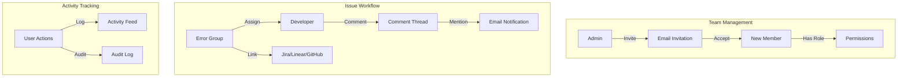

# Phase 9: Team Collaboration & Workflow

## Overview

Enable teams to collaborate on debugging with role-based access control, issue assignment, comments, activity tracking, and integrations with issue trackers. This phase transforms Replayly from a single-developer tool into a team collaboration platform.

**Duration Estimate**: 3-4 weeks  
**Priority**: High - Essential for team adoption  
**Dependencies**: Phase 1 (authentication), Phase 4 (dashboard), Phase 8 (alerting)

---

## Goals

1. Implement role-based access control (RBAC) with multiple permission levels
2. Build team invitation system with email magic links
3. Create issue assignment and status tracking for error groups
4. Add comment threads with @mentions and notifications
5. Integrate with issue trackers (Jira, Linear, GitHub Issues)
6. Build activity feed showing team actions
7. Implement comprehensive audit logging for compliance
8. Create team management UI

---

## Technical Architecture

### System Flow



---

## Part 1: Role-Based Access Control

### 1.1 Database Schema

**prisma/schema.prisma (additions):**

```prisma
enum OrganizationRole {
  OWNER
  ADMIN
  MEMBER
}

enum ProjectRole {
  ADMIN
  DEVELOPER
  VIEWER
}

model OrganizationMember {
  id             String           @id @default(cuid())
  organizationId String
  userId         String
  role           OrganizationRole @default(MEMBER)
  createdAt      DateTime         @default(now())
  
  organization   Organization     @relation(fields: [organizationId], references: [id], onDelete: Cascade)
  user           User             @relation(fields: [userId], references: [id], onDelete: Cascade)
  
  @@unique([organizationId, userId])
  @@index([userId])
}

model ProjectMember {
  id        String      @id @default(cuid())
  projectId String
  userId    String
  role      ProjectRole @default(VIEWER)
  createdAt DateTime    @default(now())
  
  project   Project     @relation(fields: [projectId], references: [id], onDelete: Cascade)
  user      User        @relation(fields: [userId], references: [id], onDelete: Cascade)
  
  @@unique([projectId, userId])
  @@index([userId])
}

model Invitation {
  id             String    @id @default(cuid())
  email          String
  organizationId String?
  projectId      String?
  role           String    // OrganizationRole or ProjectRole as string
  token          String    @unique
  expiresAt      DateTime
  acceptedAt     DateTime?
  createdAt      DateTime  @default(now())
  createdBy      String
  
  organization   Organization? @relation(fields: [organizationId], references: [id], onDelete: Cascade)
  project        Project?      @relation(fields: [projectId], references: [id], onDelete: Cascade)
  inviter        User          @relation(fields: [createdBy], references: [id])
  
  @@index([email])
  @@index([token])
  @@index([expiresAt])
}
```

### 1.2 Permission System

**lib/auth/permissions.ts:**

```typescript
import { prisma } from '@/lib/db/postgres'

export enum Permission {
  // Organization permissions
  ORG_MANAGE_MEMBERS = 'org:manage_members',
  ORG_MANAGE_BILLING = 'org:manage_billing',
  ORG_MANAGE_SETTINGS = 'org:manage_settings',
  ORG_CREATE_PROJECTS = 'org:create_projects',
  ORG_VIEW_AUDIT_LOGS = 'org:view_audit_logs',
  
  // Project permissions
  PROJECT_VIEW_EVENTS = 'project:view_events',
  PROJECT_VIEW_ERRORS = 'project:view_errors',
  PROJECT_REPLAY_EVENTS = 'project:replay_events',
  PROJECT_MANAGE_API_KEYS = 'project:manage_api_keys',
  PROJECT_MANAGE_SETTINGS = 'project:manage_settings',
  PROJECT_MANAGE_MEMBERS = 'project:manage_members',
  PROJECT_ASSIGN_ISSUES = 'project:assign_issues',
  PROJECT_COMMENT = 'project:comment',
  PROJECT_MANAGE_ALERTS = 'project:manage_alerts',
  PROJECT_MANAGE_INTEGRATIONS = 'project:manage_integrations',
}

const ROLE_PERMISSIONS = {
  // Organization roles
  OWNER: [
    Permission.ORG_MANAGE_MEMBERS,
    Permission.ORG_MANAGE_BILLING,
    Permission.ORG_MANAGE_SETTINGS,
    Permission.ORG_CREATE_PROJECTS,
    Permission.ORG_VIEW_AUDIT_LOGS,
  ],
  ADMIN: [
    Permission.ORG_MANAGE_MEMBERS,
    Permission.ORG_MANAGE_SETTINGS,
    Permission.ORG_CREATE_PROJECTS,
    Permission.ORG_VIEW_AUDIT_LOGS,
  ],
  MEMBER: [
    Permission.ORG_CREATE_PROJECTS,
  ],
  
  // Project roles
  PROJECT_ADMIN: [
    Permission.PROJECT_VIEW_EVENTS,
    Permission.PROJECT_VIEW_ERRORS,
    Permission.PROJECT_REPLAY_EVENTS,
    Permission.PROJECT_MANAGE_API_KEYS,
    Permission.PROJECT_MANAGE_SETTINGS,
    Permission.PROJECT_MANAGE_MEMBERS,
    Permission.PROJECT_ASSIGN_ISSUES,
    Permission.PROJECT_COMMENT,
    Permission.PROJECT_MANAGE_ALERTS,
    Permission.PROJECT_MANAGE_INTEGRATIONS,
  ],
  DEVELOPER: [
    Permission.PROJECT_VIEW_EVENTS,
    Permission.PROJECT_VIEW_ERRORS,
    Permission.PROJECT_REPLAY_EVENTS,
    Permission.PROJECT_ASSIGN_ISSUES,
    Permission.PROJECT_COMMENT,
  ],
  VIEWER: [
    Permission.PROJECT_VIEW_EVENTS,
    Permission.PROJECT_VIEW_ERRORS,
  ],
}

export async function hasOrganizationPermission(
  userId: string,
  organizationId: string,
  permission: Permission
): Promise<boolean> {
  const member = await prisma.organizationMember.findUnique({
    where: {
      organizationId_userId: {
        organizationId,
        userId
      }
    }
  })

  if (!member) return false

  const permissions = ROLE_PERMISSIONS[member.role] || []
  return permissions.includes(permission)
}

export async function hasProjectPermission(
  userId: string,
  projectId: string,
  permission: Permission
): Promise<boolean> {
  // Check project-level membership
  const projectMember = await prisma.projectMember.findUnique({
    where: {
      projectId_userId: {
        projectId,
        userId
      }
    }
  })

  if (projectMember) {
    const permissions = ROLE_PERMISSIONS[`PROJECT_${projectMember.role}`] || []
    return permissions.includes(permission)
  }

  // Check organization-level membership (inherit permissions)
  const project = await prisma.project.findUnique({
    where: { id: projectId },
    include: {
      organization: {
        include: {
          members: {
            where: { userId }
          }
        }
      }
    }
  })

  if (!project || project.organization.members.length === 0) {
    return false
  }

  const orgMember = project.organization.members[0]
  
  // Organization owners and admins have all project permissions
  if (orgMember.role === 'OWNER' || orgMember.role === 'ADMIN') {
    return true
  }

  return false
}

export async function requireOrganizationPermission(
  userId: string,
  organizationId: string,
  permission: Permission
): Promise<void> {
  const hasPermission = await hasOrganizationPermission(userId, organizationId, permission)
  
  if (!hasPermission) {
    throw new Error(`Missing permission: ${permission}`)
  }
}

export async function requireProjectPermission(
  userId: string,
  projectId: string,
  permission: Permission
): Promise<void> {
  const hasPermission = await hasProjectPermission(userId, projectId, permission)
  
  if (!hasPermission) {
    throw new Error(`Missing permission: ${permission}`)
  }
}
```

### 1.3 Team Invitation System

**lib/email/templates/invitation.tsx:**

```typescript
import * as React from 'react'

interface InvitationEmailProps {
  inviterName: string
  organizationName: string
  role: string
  acceptUrl: string
}

export function InvitationEmail({
  inviterName,
  organizationName,
  role,
  acceptUrl
}: InvitationEmailProps) {
  return (
    <html>
      <head>
        <style>{`
          body { font-family: Arial, sans-serif; line-height: 1.6; }
          .container { max-width: 600px; margin: 0 auto; padding: 20px; }
          .header { background: #3b82f6; color: white; padding: 20px; border-radius: 8px 8px 0 0; }
          .content { background: #f9fafb; padding: 20px; border-radius: 0 0 8px 8px; }
          .button { display: inline-block; background: #3b82f6; color: white; padding: 12px 24px; text-decoration: none; border-radius: 6px; margin-top: 16px; }
          .footer { margin-top: 20px; padding-top: 20px; border-top: 1px solid #e5e7eb; color: #6b7280; font-size: 14px; }
        `}</style>
      </head>
      <body>
        <div className="container">
          <div className="header">
            <h1>You've been invited to Replayly</h1>
          </div>
          <div className="content">
            <p><strong>{inviterName}</strong> has invited you to join <strong>{organizationName}</strong> on Replayly as a <strong>{role}</strong>.</p>
            <p>Replayly is a debugging platform that helps teams capture and replay production issues.</p>
            <a href={acceptUrl} className="button">Accept Invitation</a>
            <p style={{ marginTop: '16px', fontSize: '14px', color: '#6b7280' }}>
              This invitation will expire in 7 days.
            </p>
          </div>
          <div className="footer">
            <p>If you didn't expect this invitation, you can safely ignore this email.</p>
          </div>
        </div>
      </body>
    </html>
  )
}
```

**app/api/organizations/[orgId]/invitations/route.ts:**

```typescript
import { NextRequest, NextResponse } from 'next/server'
import { verifyAuth } from '@/lib/auth/verify'
import { prisma } from '@/lib/db/postgres'
import { requireOrganizationPermission, Permission } from '@/lib/auth/permissions'
import { Resend } from 'resend'
import { InvitationEmail } from '@/lib/email/templates/invitation'
import { randomBytes } from 'crypto'

const resend = new Resend(process.env.RESEND_API_KEY)

export async function POST(
  req: NextRequest,
  { params }: { params: { orgId: string } }
) {
  const user = await verifyAuth(req)
  if (!user) {
    return NextResponse.json({ error: 'Unauthorized' }, { status: 401 })
  }

  try {
    await requireOrganizationPermission(
      user.userId,
      params.orgId,
      Permission.ORG_MANAGE_MEMBERS
    )

    const body = await req.json()
    const { email, role } = body

    // Check if user already exists
    const existingUser = await prisma.user.findUnique({
      where: { email }
    })

    if (existingUser) {
      // Check if already a member
      const existingMember = await prisma.organizationMember.findUnique({
        where: {
          organizationId_userId: {
            organizationId: params.orgId,
            userId: existingUser.id
          }
        }
      })

      if (existingMember) {
        return NextResponse.json(
          { error: 'User is already a member' },
          { status: 400 }
        )
      }
    }

    // Check for existing pending invitation
    const existingInvitation = await prisma.invitation.findFirst({
      where: {
        email,
        organizationId: params.orgId,
        acceptedAt: null,
        expiresAt: { gt: new Date() }
      }
    })

    if (existingInvitation) {
      return NextResponse.json(
        { error: 'Invitation already sent' },
        { status: 400 }
      )
    }

    // Create invitation
    const token = randomBytes(32).toString('hex')
    const expiresAt = new Date(Date.now() + 7 * 24 * 60 * 60 * 1000) // 7 days

    const invitation = await prisma.invitation.create({
      data: {
        email,
        organizationId: params.orgId,
        role,
        token,
        expiresAt,
        createdBy: user.userId
      },
      include: {
        organization: true,
        inviter: true
      }
    })

    // Send invitation email
    const acceptUrl = `${process.env.NEXT_PUBLIC_APP_URL}/invitations/${token}`

    await resend.emails.send({
      from: 'invitations@replayly.dev',
      to: email,
      subject: `You've been invited to ${invitation.organization!.name} on Replayly`,
      react: InvitationEmail({
        inviterName: invitation.inviter.name || invitation.inviter.email,
        organizationName: invitation.organization!.name,
        role,
        acceptUrl
      })
    })

    return NextResponse.json({ invitation })
  } catch (error: any) {
    console.error('Invitation error:', error)
    return NextResponse.json(
      { error: error.message || 'Failed to send invitation' },
      { status: 500 }
    )
  }
}

export async function GET(
  req: NextRequest,
  { params }: { params: { orgId: string } }
) {
  const user = await verifyAuth(req)
  if (!user) {
    return NextResponse.json({ error: 'Unauthorized' }, { status: 401 })
  }

  try {
    await requireOrganizationPermission(
      user.userId,
      params.orgId,
      Permission.ORG_MANAGE_MEMBERS
    )

    const invitations = await prisma.invitation.findMany({
      where: {
        organizationId: params.orgId,
        acceptedAt: null,
        expiresAt: { gt: new Date() }
      },
      include: {
        inviter: {
          select: {
            name: true,
            email: true
          }
        }
      },
      orderBy: {
        createdAt: 'desc'
      }
    })

    return NextResponse.json({ invitations })
  } catch (error: any) {
    return NextResponse.json(
      { error: error.message || 'Failed to fetch invitations' },
      { status: 500 }
    )
  }
}
```

**app/invitations/[token]/page.tsx:**

```typescript
'use client'

import { useEffect, useState } from 'react'
import { useRouter } from 'next/navigation'
import { Button } from '@/components/ui/button'
import { Card } from '@/components/ui/card'

export default function AcceptInvitationPage({ params }: { params: { token: string } }) {
  const router = useRouter()
  const [invitation, setInvitation] = useState<any>(null)
  const [loading, setLoading] = useState(true)
  const [accepting, setAccepting] = useState(false)
  const [error, setError] = useState<string | null>(null)

  useEffect(() => {
    fetchInvitation()
  }, [])

  async function fetchInvitation() {
    try {
      const res = await fetch(`/api/invitations/${params.token}`)
      const data = await res.json()

      if (!res.ok) {
        setError(data.error || 'Invalid invitation')
        setLoading(false)
        return
      }

      setInvitation(data.invitation)
    } catch (err) {
      setError('Failed to load invitation')
    } finally {
      setLoading(false)
    }
  }

  async function acceptInvitation() {
    setAccepting(true)
    try {
      const res = await fetch(`/api/invitations/${params.token}/accept`, {
        method: 'POST'
      })

      const data = await res.json()

      if (!res.ok) {
        setError(data.error || 'Failed to accept invitation')
        return
      }

      // Redirect to organization
      router.push(`/dashboard?org=${data.organizationId}`)
    } catch (err) {
      setError('Failed to accept invitation')
    } finally {
      setAccepting(false)
    }
  }

  if (loading) {
    return (
      <div className="min-h-screen flex items-center justify-center">
        <div>Loading...</div>
      </div>
    )
  }

  if (error) {
    return (
      <div className="min-h-screen flex items-center justify-center">
        <Card className="p-8 max-w-md">
          <h1 className="text-2xl font-bold text-red-600 mb-4">Invalid Invitation</h1>
          <p className="text-gray-600 mb-6">{error}</p>
          <Button onClick={() => router.push('/dashboard')}>
            Go to Dashboard
          </Button>
        </Card>
      </div>
    )
  }

  return (
    <div className="min-h-screen flex items-center justify-center bg-gray-50">
      <Card className="p-8 max-w-md">
        <h1 className="text-2xl font-bold mb-4">You've been invited!</h1>
        <p className="text-gray-600 mb-6">
          <strong>{invitation.inviter.name || invitation.inviter.email}</strong> has invited you to join{' '}
          <strong>{invitation.organization.name}</strong> as a{' '}
          <strong>{invitation.role}</strong>.
        </p>
        <Button
          onClick={acceptInvitation}
          disabled={accepting}
          className="w-full"
        >
          {accepting ? 'Accepting...' : 'Accept Invitation'}
        </Button>
      </Card>
    </div>
  )
}
```

---

## Part 2: Issue Assignment & Tracking

### 2.1 Database Schema

**prisma/schema.prisma (additions):**

```prisma
enum IssueStatus {
  OPEN
  IN_PROGRESS
  RESOLVED
  IGNORED
}

model ErrorGroupAssignment {
  id          String      @id @default(cuid())
  projectId   String
  errorHash   String
  assigneeId  String
  status      IssueStatus @default(OPEN)
  assignedAt  DateTime    @default(now())
  assignedBy  String
  resolvedAt  DateTime?
  resolvedBy  String?
  
  project     Project     @relation(fields: [projectId], references: [id], onDelete: Cascade)
  assignee    User        @relation("AssignedIssues", fields: [assigneeId], references: [id])
  assigner    User        @relation("AssignedByUser", fields: [assignedBy], references: [id])
  resolver    User?       @relation("ResolvedByUser", fields: [resolvedBy], references: [id])
  
  @@unique([projectId, errorHash])
  @@index([assigneeId])
  @@index([status])
}

model Comment {
  id          String   @id @default(cuid())
  projectId   String
  errorHash   String?
  eventId     String?
  content     String   @db.Text
  authorId    String
  createdAt   DateTime @default(now())
  updatedAt   DateTime @updatedAt
  
  // Mentions
  mentions    User[]   @relation("CommentMentions")
  
  // Attachments
  attachments Json?    // Array of attachment URLs
  
  project     Project  @relation(fields: [projectId], references: [id], onDelete: Cascade)
  author      User     @relation("CommentAuthor", fields: [authorId], references: [id])
  
  @@index([projectId, errorHash])
  @@index([projectId, eventId])
  @@index([authorId])
}

model IssueLink {
  id          String   @id @default(cuid())
  projectId   String
  errorHash   String
  provider    String   // jira, linear, github
  externalId  String   // Issue ID in external system
  externalUrl String
  createdAt   DateTime @default(now())
  createdBy   String
  
  project     Project  @relation(fields: [projectId], references: [id], onDelete: Cascade)
  creator     User     @relation(fields: [createdBy], references: [id])
  
  @@unique([projectId, errorHash, provider])
  @@index([projectId, errorHash])
}
```

### 2.2 Assignment API

**app/api/projects/[projectId]/error-groups/[errorHash]/assign/route.ts:**

```typescript
import { NextRequest, NextResponse } from 'next/server'
import { verifyAuth } from '@/lib/auth/verify'
import { prisma } from '@/lib/db/postgres'
import { requireProjectPermission, Permission } from '@/lib/auth/permissions'

export async function POST(
  req: NextRequest,
  { params }: { params: { projectId: string; errorHash: string } }
) {
  const user = await verifyAuth(req)
  if (!user) {
    return NextResponse.json({ error: 'Unauthorized' }, { status: 401 })
  }

  try {
    await requireProjectPermission(
      user.userId,
      params.projectId,
      Permission.PROJECT_ASSIGN_ISSUES
    )

    const body = await req.json()
    const { assigneeId, status } = body

    // Verify assignee has access to project
    const hasAccess = await requireProjectPermission(
      assigneeId,
      params.projectId,
      Permission.PROJECT_VIEW_ERRORS
    )

    const assignment = await prisma.errorGroupAssignment.upsert({
      where: {
        projectId_errorHash: {
          projectId: params.projectId,
          errorHash: params.errorHash
        }
      },
      create: {
        projectId: params.projectId,
        errorHash: params.errorHash,
        assigneeId,
        status: status || 'OPEN',
        assignedBy: user.userId
      },
      update: {
        assigneeId,
        status: status || 'OPEN',
        assignedBy: user.userId,
        assignedAt: new Date()
      },
      include: {
        assignee: {
          select: {
            id: true,
            name: true,
            email: true
          }
        }
      }
    })

    // TODO: Send notification to assignee

    return NextResponse.json({ assignment })
  } catch (error: any) {
    return NextResponse.json(
      { error: error.message || 'Failed to assign issue' },
      { status: 500 }
    )
  }
}

export async function PATCH(
  req: NextRequest,
  { params }: { params: { projectId: string; errorHash: string } }
) {
  const user = await verifyAuth(req)
  if (!user) {
    return NextResponse.json({ error: 'Unauthorized' }, { status: 401 })
  }

  try {
    await requireProjectPermission(
      user.userId,
      params.projectId,
      Permission.PROJECT_ASSIGN_ISSUES
    )

    const body = await req.json()
    const { status } = body

    const assignment = await prisma.errorGroupAssignment.update({
      where: {
        projectId_errorHash: {
          projectId: params.projectId,
          errorHash: params.errorHash
        }
      },
      data: {
        status,
        ...(status === 'RESOLVED' && {
          resolvedAt: new Date(),
          resolvedBy: user.userId
        })
      },
      include: {
        assignee: {
          select: {
            id: true,
            name: true,
            email: true
          }
        }
      }
    })

    return NextResponse.json({ assignment })
  } catch (error: any) {
    return NextResponse.json(
      { error: error.message || 'Failed to update assignment' },
      { status: 500 }
    )
  }
}
```

### 2.3 Comments System

**app/api/projects/[projectId]/error-groups/[errorHash]/comments/route.ts:**

```typescript
import { NextRequest, NextResponse } from 'next/server'
import { verifyAuth } from '@/lib/auth/verify'
import { prisma } from '@/lib/db/postgres'
import { requireProjectPermission, Permission } from '@/lib/auth/permissions'

export async function GET(
  req: NextRequest,
  { params }: { params: { projectId: string; errorHash: string } }
) {
  const user = await verifyAuth(req)
  if (!user) {
    return NextResponse.json({ error: 'Unauthorized' }, { status: 401 })
  }

  try {
    await requireProjectPermission(
      user.userId,
      params.projectId,
      Permission.PROJECT_VIEW_ERRORS
    )

    const comments = await prisma.comment.findMany({
      where: {
        projectId: params.projectId,
        errorHash: params.errorHash
      },
      include: {
        author: {
          select: {
            id: true,
            name: true,
            email: true
          }
        },
        mentions: {
          select: {
            id: true,
            name: true,
            email: true
          }
        }
      },
      orderBy: {
        createdAt: 'asc'
      }
    })

    return NextResponse.json({ comments })
  } catch (error: any) {
    return NextResponse.json(
      { error: error.message || 'Failed to fetch comments' },
      { status: 500 }
    )
  }
}

export async function POST(
  req: NextRequest,
  { params }: { params: { projectId: string; errorHash: string } }
) {
  const user = await verifyAuth(req)
  if (!user) {
    return NextResponse.json({ error: 'Unauthorized' }, { status: 401 })
  }

  try {
    await requireProjectPermission(
      user.userId,
      params.projectId,
      Permission.PROJECT_COMMENT
    )

    const body = await req.json()
    const { content, mentions } = body

    // Extract mentions from content (@username)
    const mentionPattern = /@(\w+)/g
    const mentionedUsernames = Array.from(content.matchAll(mentionPattern), m => m[1])

    // Find mentioned users
    const mentionedUsers = await prisma.user.findMany({
      where: {
        email: {
          in: mentionedUsernames.map(username => `${username}@example.com`) // TODO: Better mention resolution
        }
      }
    })

    const comment = await prisma.comment.create({
      data: {
        projectId: params.projectId,
        errorHash: params.errorHash,
        content,
        authorId: user.userId,
        mentions: {
          connect: mentionedUsers.map(u => ({ id: u.id }))
        }
      },
      include: {
        author: {
          select: {
            id: true,
            name: true,
            email: true
          }
        },
        mentions: {
          select: {
            id: true,
            name: true,
            email: true
          }
        }
      }
    })

    // TODO: Send notifications to mentioned users

    return NextResponse.json({ comment })
  } catch (error: any) {
    return NextResponse.json(
      { error: error.message || 'Failed to create comment' },
      { status: 500 }
    )
  }
}
```

---

## Part 3: Issue Tracker Integrations

### 3.1 Jira Integration

**lib/integrations/jira/client.ts:**

```typescript
import axios from 'axios'

export interface JiraConfig {
  domain: string // e.g., company.atlassian.net
  email: string
  apiToken: string
  projectKey: string
}

export class JiraClient {
  private baseUrl: string
  private auth: string

  constructor(config: JiraConfig) {
    this.baseUrl = `https://${config.domain}/rest/api/3`
    this.auth = Buffer.from(`${config.email}:${config.apiToken}`).toString('base64')
  }

  async createIssue(data: {
    summary: string
    description: string
    issueType: string
    projectKey: string
    labels?: string[]
  }) {
    const response = await axios.post(
      `${this.baseUrl}/issue`,
      {
        fields: {
          project: {
            key: data.projectKey
          },
          summary: data.summary,
          description: {
            type: 'doc',
            version: 1,
            content: [
              {
                type: 'paragraph',
                content: [
                  {
                    type: 'text',
                    text: data.description
                  }
                ]
              }
            ]
          },
          issuetype: {
            name: data.issueType
          },
          labels: data.labels || []
        }
      },
      {
        headers: {
          'Authorization': `Basic ${this.auth}`,
          'Content-Type': 'application/json'
        }
      }
    )

    return response.data
  }

  async getIssue(issueKey: string) {
    const response = await axios.get(
      `${this.baseUrl}/issue/${issueKey}`,
      {
        headers: {
          'Authorization': `Basic ${this.auth}`
        }
      }
    )

    return response.data
  }

  async updateIssueStatus(issueKey: string, transitionId: string) {
    await axios.post(
      `${this.baseUrl}/issue/${issueKey}/transitions`,
      {
        transition: {
          id: transitionId
        }
      },
      {
        headers: {
          'Authorization': `Basic ${this.auth}`,
          'Content-Type': 'application/json'
        }
      }
    )
  }
}
```

**app/api/projects/[projectId]/error-groups/[errorHash]/create-issue/route.ts:**

```typescript
import { NextRequest, NextResponse } from 'next/server'
import { verifyAuth } from '@/lib/auth/verify'
import { prisma } from '@/lib/db/postgres'
import { requireProjectPermission, Permission } from '@/lib/auth/permissions'
import { JiraClient } from '@/lib/integrations/jira/client'

export async function POST(
  req: NextRequest,
  { params }: { params: { projectId: string; errorHash: string } }
) {
  const user = await verifyAuth(req)
  if (!user) {
    return NextResponse.json({ error: 'Unauthorized' }, { status: 401 })
  }

  try {
    await requireProjectPermission(
      user.userId,
      params.projectId,
      Permission.PROJECT_MANAGE_INTEGRATIONS
    )

    const body = await req.json()
    const { provider, title, description } = body

    // Get integration config
    const integration = await prisma.integration.findFirst({
      where: {
        projectId: params.projectId,
        provider,
        enabled: true
      }
    })

    if (!integration) {
      return NextResponse.json(
        { error: `${provider} integration not configured` },
        { status: 400 }
      )
    }

    let externalIssue: any
    let externalUrl: string

    if (provider === 'jira') {
      const jiraClient = new JiraClient(integration.config as any)
      externalIssue = await jiraClient.createIssue({
        summary: title,
        description,
        issueType: 'Bug',
        projectKey: integration.config.projectKey,
        labels: ['replayly']
      })
      externalUrl = `https://${integration.config.domain}/browse/${externalIssue.key}`
    } else {
      return NextResponse.json(
        { error: `Provider ${provider} not supported` },
        { status: 400 }
      )
    }

    // Store issue link
    const issueLink = await prisma.issueLink.create({
      data: {
        projectId: params.projectId,
        errorHash: params.errorHash,
        provider,
        externalId: externalIssue.key || externalIssue.id,
        externalUrl,
        createdBy: user.userId
      }
    })

    return NextResponse.json({ issueLink, externalIssue })
  } catch (error: any) {
    console.error('Create issue error:', error)
    return NextResponse.json(
      { error: error.message || 'Failed to create issue' },
      { status: 500 }
    )
  }
}
```

---

## Part 4: Activity Feed & Audit Logs

### 4.1 Database Schema

**prisma/schema.prisma (additions):**

```prisma
enum ActivityType {
  EVENT_VIEWED
  ERROR_ASSIGNED
  ERROR_RESOLVED
  COMMENT_CREATED
  ISSUE_LINKED
  ALERT_TRIGGERED
  RELEASE_DEPLOYED
  MEMBER_INVITED
  MEMBER_JOINED
  SETTINGS_UPDATED
}

model ActivityLog {
  id          String       @id @default(cuid())
  projectId   String?
  organizationId String?
  userId      String
  type        ActivityType
  metadata    Json
  createdAt   DateTime     @default(now())
  
  project     Project?     @relation(fields: [projectId], references: [id], onDelete: Cascade)
  organization Organization? @relation(fields: [organizationId], references: [id], onDelete: Cascade)
  user        User         @relation(fields: [userId], references: [id])
  
  @@index([projectId, createdAt])
  @@index([organizationId, createdAt])
  @@index([userId])
}

model AuditLog {
  id          String   @id @default(cuid())
  organizationId String
  userId      String
  action      String
  resource    String
  resourceId  String?
  metadata    Json
  ipAddress   String?
  userAgent   String?
  createdAt   DateTime @default(now())
  
  organization Organization @relation(fields: [organizationId], references: [id], onDelete: Cascade)
  user        User         @relation(fields: [userId], references: [id])
  
  @@index([organizationId, createdAt])
  @@index([userId])
  @@index([action])
}
```

### 4.2 Activity Logger

**lib/audit/logger.ts:**

```typescript
import { prisma } from '@/lib/db/postgres'

export async function logActivity(data: {
  projectId?: string
  organizationId?: string
  userId: string
  type: string
  metadata: any
}) {
  await prisma.activityLog.create({
    data: {
      projectId: data.projectId,
      organizationId: data.organizationId,
      userId: data.userId,
      type: data.type as any,
      metadata: data.metadata
    }
  })
}

export async function logAudit(data: {
  organizationId: string
  userId: string
  action: string
  resource: string
  resourceId?: string
  metadata: any
  ipAddress?: string
  userAgent?: string
}) {
  await prisma.auditLog.create({
    data
  })
}
```

### 4.3 Activity Feed UI

**app/dashboard/[projectId]/activity/page.tsx:**

```typescript
'use client'

import { useEffect, useState } from 'react'
import { Card } from '@/components/ui/card'
import { Avatar } from '@/components/ui/avatar'
import { formatDistanceToNow } from 'date-fns'

export default function ActivityFeedPage({ params }: { params: { projectId: string } }) {
  const [activities, setActivities] = useState<any[]>([])
  const [loading, setLoading] = useState(true)

  useEffect(() => {
    fetchActivities()
  }, [])

  async function fetchActivities() {
    const res = await fetch(`/api/projects/${params.projectId}/activity`)
    const data = await res.json()
    setActivities(data.activities)
    setLoading(false)
  }

  if (loading) {
    return <div>Loading...</div>
  }

  return (
    <div className="space-y-6">
      <h1 className="text-2xl font-bold">Activity Feed</h1>

      <div className="space-y-4">
        {activities.map((activity) => (
          <Card key={activity.id} className="p-4">
            <div className="flex items-start gap-4">
              <Avatar>
                {activity.user.name?.[0] || activity.user.email[0]}
              </Avatar>
              <div className="flex-1">
                <div className="flex items-center gap-2">
                  <span className="font-semibold">
                    {activity.user.name || activity.user.email}
                  </span>
                  <span className="text-gray-600">
                    {getActivityMessage(activity)}
                  </span>
                </div>
                <div className="text-sm text-gray-500 mt-1">
                  {formatDistanceToNow(new Date(activity.createdAt), { addSuffix: true })}
                </div>
              </div>
            </div>
          </Card>
        ))}
      </div>
    </div>
  )
}

function getActivityMessage(activity: any): string {
  switch (activity.type) {
    case 'ERROR_ASSIGNED':
      return `assigned error to ${activity.metadata.assigneeName}`
    case 'ERROR_RESOLVED':
      return 'resolved an error'
    case 'COMMENT_CREATED':
      return 'commented on an error'
    case 'ISSUE_LINKED':
      return `linked issue to ${activity.metadata.provider}`
    case 'ALERT_TRIGGERED':
      return 'triggered an alert'
    case 'RELEASE_DEPLOYED':
      return `deployed release ${activity.metadata.version}`
    default:
      return activity.type.toLowerCase().replace('_', ' ')
  }
}
```

---

## Acceptance Criteria

- [ ] RBAC system with Owner, Admin, Developer, Viewer roles
- [ ] Team invitation system sending email invitations
- [ ] Invitation acceptance flow working
- [ ] Issue assignment to team members
- [ ] Issue status tracking (Open, In Progress, Resolved, Ignored)
- [ ] Comment threads on error groups
- [ ] @mentions in comments with notifications
- [ ] Jira integration creating issues
- [ ] Linear integration (if implemented)
- [ ] GitHub Issues integration (if implemented)
- [ ] Activity feed showing team actions
- [ ] Audit logs tracking sensitive operations
- [ ] Team management UI complete
- [ ] All tests passing

---

## Testing Strategy

### Unit Tests
- Permission checking logic
- Comment mention parsing
- Activity logging

### Integration Tests
- Full invitation flow
- Issue assignment workflow
- Comment creation with mentions
- Jira issue creation

### E2E Tests
- Team member invitation and acceptance
- Issue assignment and resolution
- Comment thread interaction

---

## Deployment Notes

1. Run database migrations for new tables
2. Configure email service for invitations
3. Set up Jira/Linear API credentials
4. Test all permission levels
5. Verify audit logging is working

---

## Next Steps

After completing Phase 9, proceed to **Phase 10: Advanced SDK Instrumentation** to expand framework and library support.
